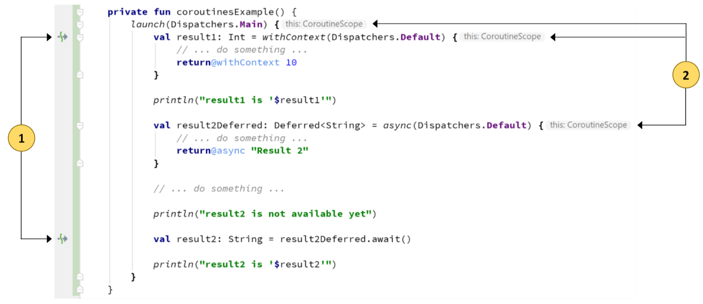
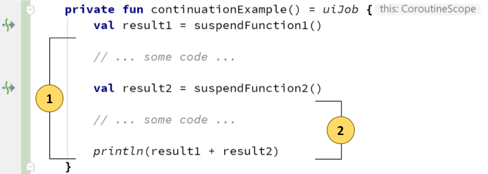

# 코루틴

## Part 1. Introduction

### 코틀린은 무엇인가?

- 코루틴은 비동기 프로그래밍을 간단하게 해주는 강력한 도구
- 순차적인 코드의 간단명료함 + 비동기 프로그래밍의 장점

### RxJava vs Coroutine

- RxJava는 스트림 처리에 좋지만, 스트림을 처리하듯이 모든 것을 작성해야 함으로 코드가 복잡해진다

- 코루틴은 순차적인 코드를 작성하기에 유연하며, 선호하는 방식으로 스트림을 처리할 수 있다

- RxJava는 결과를 처리하기 위한 콜백이 필요한 반면, 코루틴은 콜백이 필요없다

  

## Part 2. The basics

### CoroutineScope

- 기존 비동기 프로그래밍은 여러 독립적인 비동기 코드 블럭들로 구성된다
- CoroutineScope를 이용하여 코루틴들을 부모-자식 관계로 구성할 수 있다
- 독립적인 비동기 코드 블럭들은 일일이 취소해야 하는 반면, 코루틴은 취소하면 자식 코루틴도 모두 취소된다
- CoroutineScope는 대게 생명주기가 있는 객체(ViewModel, Presenter)에 의해 구현된다

```kotlin
class MyViewModel : ViewModel(), CoroutineScope {

    private val job = Job()

    override val coroutineContext: CoroutineContext
        get() = Dispatchers.Main + job
}
```

#### Dispatcher

- 코루틴이 어떤 스레드에서 실행될 지 결정하는 컴포넌트
- Main : UI 스레드
- IO : 백그라운드 스레드, 외부에서 디스크 또는 네트워크 I/O를 실행하도록 최적화되어 있는 스레드
- Default : 백그라운드 스레드, CPU를 많이 사용하는 작업을 실행하도록 최적화되어 있는 스레드
- Unconfined : 테스트용 스레드, 여러 스레드에 분산시키지 않고 같은 스레드에서 테스트하기 위한 스레드

#### Job

- 코루틴에 의해 처리되는 작업 단위
- Coroutine Builder에 의해 생성되고 코루틴의 상태를 추적하고 코루틴을 취소할 수 있다

### Coroutine Builders

- 새로운 코루틴을 생성하는 메서드
- 기본적으로 메서드를 호출한 CoroutineScope의 컨텍스트를 상속 받고, 인자로 받은 컨텍스트가 있다면 override한다

#### launch

- 새로운 코루틴을 생성하고 Job을 반환하는 메서드

```kotlin
val job: Job = launch(coroutineContext) {
(1) ... coroutine code ...
}
(2) ... other code ...
```

1. launch()가 즉시 Job을 반환하고, (2)의 코드가 실행된다
2. (1)과 (2)의 코드는 같은 시간에 병렬적으로 실행된다

#### async

- 새로운 코루틴을 생성하고 Deferred를 반환하는 메서드
- Deferred는 Job을 확장한 인터페이스, 코루틴의 결과를 기다리도록 하는 await()를 가지고 있다

```kotlin
val deferred: Deferred<T> = async(coroutineContext) {
(1) ... code that returns a result of type T...
(2) return@async result
}
(3) ... other code ...
(4) val resultValue: T = deferred.await()
(5) ... use resultValue ...
```

1. async()가 즉시 Deferred를 반환하고, (3)의 코드가 실행된다

2. (1)과 (3)의 코드가 같은 시간에 병렬적으로 실행된다

3. await()가 async()에 의해 시작된 코루틴의 끝나기를 기다리고 결과를 반환한다

4. (5)의 코드가 실행된다

#### withContext

- 부모의 컨텍스트를 인자로 받은 컨텍스트로 overriding하는 메서드
- 주로 스레드를 변경할 때 사용된다

```kotlin
// 기본 스레드 : Main
val resultValue: T = withContext(Dispatchers.IO) { // 블록 내에 있는 코드는 IO 스레드에서 실행된다
(1) ... code that returns a result of type T...
(2) return@withContext result
}
(3) ... other code that uses resultValue ... // Main 스레드에서 실행된다
```

1. (1)의 코드가 실행되고 결과가 반환된다
2. (3)의 코드가 실행된다

### *Suspend* Function

- suspend 함수는 코루틴이나 다른 suspend 함수 내에서만 사용된다
- suspend 함수의 결과가 반환될 때까지 해당 함수를 호출한 코루틴을 중지시킨다
- 코루틴을 중지시키는 것은 코루틴이 실행되는 스레드를 차단하는 것이 아니다(다른 스레드들이 해당 스레드를 사용할 수 있게 한다)


## Part 3. Coroutines in Android Studio



- (1)의 아이콘은 suspend 함수 호출이 있는 라인을 나타낸다
- (2)의 코드 블럭은 CoroutineScope 내에서 실행된다

### What happens to the coroutine scope in this example?

- 클래스는 CoroutineScope 인터페이스를 구현하여, 클래스 내에 모든 것은 coroutine scope를 이용할 수 있다
- launch(), async(), withContext()는 새로운 context를 가진 scope를 가진다
- 모든 scope들은 부모-자식관계를 가진다(context의 Job을 기준으로)
- launch()
  - CoroutineContext : coroutineContext + Dispatchers.Main
  - 부모 context : coroutineContext
- withContext()
  - CoroutineContext : launch()의 context + Dispatchers.Default
  - 부모 context : launch()의 context
- async()
  - CoroutineContext : launch()의 context + Dispatchers.Default
  - 부모 context : launch()의 context

### Sequence of steps in the main Android UI thread

1. launch()는 메인 스레드에서 새 코루틴을 시작한다
2. withContext()는 launch() 코루틴을 중지시키고, 코드 블럭을 백그라운드 스레드에서 실행시킨다
   결과를 반환하고 중지한 코루틴을 재개한다
3. async()는 즉시 결과를 반환하고, 백그라운드 스레드에서 코드 블럭을 실행한다(launch()와 async() 병렬 실행)
4. await()는 launch() 코루틴을 중지시키고, async()가 완료되기를 기다린다
5. async()가 반환한 결과를 변수에 할당한고, launch() 코루틴을 재개한다


## Part 4. Running coroutines sequentially or in parallel

### Sequentially

- 순차 처리는 다른 작업을 실행하기 전에 실행중인 작업의 완료를 기다리는 것이다
- 주로 다른 작업의 결과를 필요로 할 때 사용된다 

```kotlin
val result1: Int = withContext(Dispatchers.Default) {
(1) // ... do something ...
    return@withContext value1
}
val result2: Int = withContext(Dispatchers.Default) {
(2) // ... do something with result1 ...
    return@withContext value2
}
... other code in the parent coroutine ...
```

- withContext()를 사용하면 순차적으로 작업을 처리하는데 용이하다
- withContext()는 suspend 함수여서, 결과를 반환하기까지 withContext()를 호출한 코루틴을 중지시킨다
- (1)의 코드가 실행되어 반환한 값을 result1에 할당하고, (2)의 코드가 실행되어 반환한 값을 result2에 할당한다

### Parallel

- 병렬 처리는 여러 CPU 코어를 사용하여 스레드들을 동시에 실행하는 것이다
- 다른 작업의 결과를 기다릴 필요가 없어서 더 빠른 처리능력을 가진다

```kotlin
val result1Deferred: Deferred<Int> = async(Dispatchers.Default) {
(1) // ... do something ...
    return@async value1
}
val result2Deferred: Deferred<Int> = async(Dispatchers.Default) {
(2) // ... do something ...
    return@async value2
}
val result1: Int = result1Deferred.await()
val result2: Int = result2Deferred.await()
... other code in the parent coroutine ...
```

- async()를 사용하면 병렬적으로 작업을 처리하는데 용이하다
- (1)의 코드와 (2)의 코드가 병렬적으로 실행된다
- await()는 async()의 결과를 기다리는 suspend 함수여서 순차적으로 처리된다 


## Part 5. Coroutine cancellation

- launch()는 Job, async()는 Deferred를 반환한다(Deferred는 Job을 확장한 객체)
- Job은 코루틴을 취소하는 cancel() 함수를 가진다

```kotlin
val job: Job = launch(...) { ... }
...
job.cancel()
val deferred: Deferred = async(...) { ... }
...
deferred.cancel()
```

### Cancellation Exception

- Canellation Exception은 cancel()을 호출했을 때 해당 코루틴뿐 아니라 모든 자식 코루틴을 취소시킬 수 있게 해준다
- Canellation Exception을 발생시키면, 다른 예외발생처럼 코드 실행에 인터럽트가 생긴다
- 다른 예외와 차이점은 개발자가 예외를 잡지 않으면 앱은 충돌하지 않는다

### Cancellation through CoroutineContext

```ko
coroutineContext.cancel()
coroutineContext.cancelChildren()
```

- cancel() 
  - 함수를 호출한 컨텍스트를 포함하여 모든 자식 코루틴의 Job을 취소시킨다
  - 더 이상 컨텍스트를 사용하여 코루틴을 실행할 수 없다
- cancelChildren() 
  - 함수를 호출한 컨텍스트를 제외하고 모든 자식 코루틴의 Job을 취소시킨다
  - 계속해서 컨텍스트를 사용하여 코루틴을 실행할 수 있다

### Cancellation points

- 코루틴의 중지시점이 Cancellation Exception을 발생시키는 시점이다
- 모든 suspend 함수는 Cancellation Exception을 발생시킬 후보자이다

```kotlin
val deferred: Deferred = async(...) { ... }
...
deferred.await() // <--- CancellationException can be thrown here
```

### Catching CancellationException

- Cancellation Exception을 처리하고 다시 예외를 발생시키지 않으면, 부모 코루틴의 취소가 중지된다

```kotlin
// 코루틴 취소 시 코드 블럭을 실행하고, 다시 예외를 발생시켜 다른 코루틴 취소를 진행한다
try {
    ...
} catch (e: CancellationException) {
    ... do something to handle the cancellation...
    throw e
}
```

```kotlin
// 다시 예외를 발생시키지 않아서 다른 코루틴 취소가 중지된다
try {
    ...
} catch (e: CancellationException) {
    ... do something to handle the cancellation...
}
```

```kotlin
// Cancellation Exception이라면 다시 예외를 발생시켜 다른 코루틴 취소를 진행한다
try {
    ...
} catch (e: Exception) {
    if (e is CancellationException) {
        throw e
    }
    ... handle other exceptions ...
}
```

### Cancellation is cooperative

- 기본적으로 코루틴 라이브러리에 있는 suspend 함수들은 cancellable이다
- 개발자가 직접 작성한 suspend 함수는 cancellable로 만들어야 한다

- (1), (2)의 함수가 모두 cancellable이므로 execute()도 cancellable이 된다

```kotlin
suspend fun execute(...) {
    ...
(1) aSuspendFunction()
    ...
(2) anotherSuspendFunction()
    ...
}
```

- isActive 프로퍼티를 이용하여 cancellable로 만든다

```kotlin
suspend fun execute(...) {
    while (isActive && ...) {
        ... long computation steps ...
    }
    
    if (!isActive) {
        throw CancellationException()
    }
    ... other code after the long computation ...
}
```

### Cancellation in Android

- Presenter와 ViewModel은 CoroutineScope 인터페이스를 구현한다
- Presenter와 ViewModel의 CoroutineScope를 취소하면 그들의 생명주기 안에서 실행된 모든 코루틴을 취소할 수 있다

#### Presenter in MVP

- Presenter와 연결된 액티비티가 onStop()을 호출할 때마다 모든 코루틴을 취소한다
- Presenter 인스턴스가 destroy되지 않을 경우 CoroutineScope를 재사용할 수 있게 cancelChildren()을 사용한다

``` kotlin
abstract class BasePresenter : CoroutineScope {
    ...
    fun cancelCoroutines() {
        coroutineContext.cancelChildren()
    }
}
```

#### ViewModel in MVVM

- ViewModel이 onCleared()를 호출할 때 모든 코루틴을 취소한다
- ViewModel은 콜백 메서드 호출 후 destroy되기 때문에 cancel()도 사용할 수 있다

```kotlin
abstract class BaseViewModel : ViewModel(), CoroutineScope {
    ...
    override fun onCleared() {
        coroutineContext.cancelChildren()
      	coroutineContext.cancel()
        super.onCleared()
    }
}
```


## Part 6: Exception propagation

### Catching exceptions thrown by coroutines

- suspend 함수는 코루틴에서 발생하는 예외를 발생시키거나 처리할 수 있다

- join()은 Job의 완료를 기다리는 suspend 함수이자, 코루틴에서 발생한 예외를 콜 스택에 전달하는 지점이다

```kotlin
val job: Job = launch(coroutineContext) {
    ... coroutine code that throws an exception ...
}
try {
    job.join()
} catch (e: MyException) {
    ... handle the exception ...
}
```

- await()는 비동기 작업의 결과를 기다리는 suspend 함수이자, 비동기 작업에 의해 발생한 오류를 처리되는 지점이다

```kotlin
val deferred: Deferred<T> = async(coroutineContext) {
    ... coroutine code that throws an exception ...
    return@async result
}
try {
    val resultValue: T = deferred.await()
    ...
} catch (e: MyException) {
    ... handle the exception ...
}
```

- 다른 suspend 함수 역시 예외를 처리할 수 있다

```kotlin
suspend fun execute(...) {
    ...
    throw MyException()
    ...
}
try {
    execute(...)
    ...
} catch (e: MyException) {
    ... handle the exception ...
}
```

### Catching exceptions thrown by async coroutines

- supervisorScope : suspend 함수, 블럭 안에서 생성된 자식 코루틴의 실패가 부모 코루틴의 실패로 이어지지 않게 한다

```kotlin
launch(...) { // (1)
    supervisorScope { // 예외로 인해 (2), (3), (4)가 실패하여도 (1)은 계속 실행된다
        ...
        async(...) { // (2)
            return@async supervisorScope {
                ...
                return@supervisorScope result
            }
        }
        ...
        async(...) { // (3)
            return@async supervisorScope { // 예외로 인해 (4)가 실패하여도 (3)은 계속 실행된다
                ...
                launch(...) { // (4)
                    supervisorScope {
                        ...
                    }
                }
                ...
                return@supervisorScope result
            }
        }
        ...
    }
}
```


## Part 7: A small DSL for Android apps development

### The key features of our coroutines DSL

- 사용하기 쉽다
- 명확한 용어
- 대부분의 코루틴 사용 시나리오에 사용될 수 있다
- DSL로 해결할 수 없는 특정한 시나리오에는 일반 코루틴 메서드를 사용하여 해결할 수 있다
- 간결한 코드
- 테스트에 용이하다

### Terminology

- job : Presenter 와 ViewModel에 있는 메서드들은 job을 실행시킬 수 있다
- task : job은 다양한 task로 구성된다
- sub-task : task는 다양한 sub-task를 갖는다

```kotlin
job 1 {
    task 1.1 {}
    task 1.2 {
        task 1.2.1 {}
    }
    task 1.3 {}
}
job 2 {
    task 2.1 {
        task 2.1.1 {
            task 2.1.1.1 {}
            task 2.1.1.2 {}
        }
    }
}
```

### DSL helpers

- helper 메서드는 job과 task를 나타낸다
- task의 처리 방식(순차, 병렬), dispatcher(Main, IO, Default)를 구분한다
- 코루틴 취소와 예외 전달을 처리한다

- 모든 메서드는 CoroutineContext를 인자로 받는다(주로 dispatcher를 지정하는데 사용한다)
- startJob()과 startTaskAsync()는 parent scope를 인자로 받아 부모-자식 관계를 설정한다
  각 코루틴 메서드가 적절한 scope에서 실행되고 취소와 예외 전달을 정확하게 다룰 수 있다

```kotlin
// 다양한 task로 구성된 job을 실행한다
fun startJob(
    parentScope: CoroutineScope,
    coroutineContext: CoroutineContext,
    block: suspend CoroutineScope.() -> Unit
) {
    parentScope.launch(coroutineContext) {
        supervisorScope {
            block()
        }
    }
}
// task가 실행되고 반환될 때까지 부모 job 이나 task를 중지시키는 순차적인 task를 실행한다
suspend fun <T> startTask(
    coroutineContext: CoroutineContext,
    block: suspend CoroutineScope.() -> T
): T {
    return withContext(coroutineContext) {
        return@withContext block()
    }
}
// 병렬 task를 실행하고 Deferred 객체를 반환한다
// Deferred 객체를 반환하는 함수명에 'Async'를 붙인다
fun <T> startTaskAsync(
    parentScope: CoroutineScope,
    coroutineContext: CoroutineContext,
    block: suspend CoroutineScope.() -> T
): Deferred<T> {
    return parentScope.async(coroutineContext) {
        return@async supervisorScope {
            return@supervisorScope block()
        }
    }
}
```

### DSL methods

- DSL 메서드는 helper 메서드를 이용하고 dispatcher를 명시적으로 지정한다
- 코루틴 코드가 알맞는 dispatcher에서 실행되는지 분명하게 알 수 있다(함수 이름이 dispatcher를 나타낸다)
- 두 코루틴이 같은 dispatcher를 공유한다면, 코루틴 머신이 컨텍스트 스위칭 없이 같은 스레드에서 실행시킨다

```kotlin
fun CoroutineScope.uiJob(block: suspend CoroutineScope.() -> Unit) {
    startJob(this, Dispatchers.Main, block)
}

fun CoroutineScope.backgroundJob(block: suspend CoroutineScope.() -> Unit) {
    startJob(this, Dispatchers.Default, block)
}

fun CoroutineScope.ioJob(block: suspend CoroutineScope.() -> Unit) {
    startJob(this, Dispatchers.IO, block)
}

suspend fun <T> uiTask(block: suspend CoroutineScope.() -> T): T {
    return startTask(Dispatchers.Main, block)
}

suspend fun <T> backgroundTask(block: suspend CoroutineScope.() -> T): T {
    return startTask(Dispatchers.Default, block)
}

suspend fun <T> ioTask(block: suspend CoroutineScope.() -> T): T {
    return startTask(Dispatchers.IO, block)
}

fun <T> CoroutineScope.uiTaskAsync(block: suspend CoroutineScope.() -> T): Deferred<T> {
    return startTaskAsync(this, Dispatchers.Main, block)
}

fun <T> CoroutineScope.backgroundTaskAsync(block: suspend CoroutineScope.() -> T): Deferred<T> {
    return startTaskAsync(this, Dispatchers.Default, block)
}

fun <T> CoroutineScope.ioTaskAsync(block: suspend CoroutineScope.() -> T): Deferred<T> {
    return startTaskAsync(this, Dispatchers.IO, block)
}
```

### DSL in action

- DSL은 코루틴을 사용하는 코드를 간결하고 직관적이게 해준다
- 코루틴 코드를 상세하게 작성하는 것 대신 개발업무의 요구사항에 집중하게 도와준다

```kotlin
class MyViewModel : ViewModel(), CoroutineScope {
    ...
    
    override fun aMethod() = uiJob {
        ... do something on the UI thread ...
        val taskResult = backgroundTask {
            ... do something on a background thread ...
            return@backgroundTask result
        }
        ... use taskResult on the UI thread ...
    }
    override fun anotherMethod() = uiJob {
        ... do something on the UI thread ...
        val taskDeferred = ioTaskAsync {
            ... do something on a IO thread ...
            return@ioTaskAsync result
        }
        ... do something on the UI thread while the task runs ...
        val taskResult = taskDeferred.await()
        ... use taskResult on the UI thread ...
    }
    
    ...
}
```


## Part 8: MVP and MVVM with Clean Architecture

### Usecases

- Usecase : 비즈니스 로직을 작은 작업 단위로 나눈 것
- 각 usecase를 태스크로 구현한다

- Sequential Task

```kotlin
class SequentialTaskUseCase {

    suspend fun execute(...): T = backgroundTask {
        ... do something on a background thread ...

        return@backgroundTask result
    }
}
```

- ParallelTask

```kotlin
class ParallelTaskWithRepositoryUseCase
@Inject constructor(
    private val remoteRepository: RemoteRepository
) {

    fun executeAsync(
        parentScope: CoroutineScope,
        ...
    ): Deferred<T> = parentScope.backgroundTaskAsync {
        ... do something on a background thread ...
        val fetchedData = ioTask { remoteRepository.fetchData() } // sub-task

        ... use fetchedData on a background thread ...

        return@backgroundTaskAsync result
    }
}
```

### Presenter and ViewModel

- Presenter와 ViewModel의 메서드는 Job을 실행한다
- Job은 여러 task로 구성되어 있다(= 비즈니스 로직은 여러 usecase로 구성된다)

```kotlin
class MyViewModel : ViewModel(), CoroutineScope {
    ...
    
    override fun aMethod() = uiJob {
        ...

        val task1Result: T = sequentialTask.execute(...)

        ...
        val task2Deferred: Deferred<T> = parallelTask
            .executeAsync(this, ...)

        ...
        val task2Result: T = task2Deferred.await()
        ...
    }
    ...
}
```


## Part 9: Combining multiple tasks with the operators on collections

- 코틀린은 컬렉션에 대한 좋은 API가 있다
- RxJava에서 스트림을 처리하듯이, 컬렉션에 있는 아이템을 처리하는데 편리하다

```kotlin
// T : repository1.fetchData()의 반환타입
// R : repository2.fetchData()의 반환타입
val result = myCollection 
    .map { ioTaskAsync { repository1.fetchData(it) } } // (1) Deferred<T> Collection
    .map { it.await() } // (2) <T> Collection
    .map { ioTask { repository2.fetchData(it) } } // (3) <R> Collection
    .sum() // (4) Sum of <R> Collection
```

1. 각각의 데이터를 인자로 넘겨 repository1로부터 데이터를 받는다(병렬처리)
2. 모든 데이터를 받을 때까지 기다리고, 받은 데이터의 컬렉션을 반환한다
3. 다시 각각의 데이터를 인자로 넘겨 repository2로부터 받은 데이터의 컬렉션을 반환한다(순차처리)
4. 컬렉션의 합을 계산하고 반환한다


## Part 10: Handling callbacks

- 코루틴의 장점 중의 하나는 콜백이 없는 것이다
- 콜백이 있는 기존 코드나 라이브러리 역시 코루틴을 이용하여 사용할 수 있다

- executeAction()은 성공, 에러, 취소에 대한 콜백을 인자로 받는다

```kotlin
class ExecutorWithCallback {
    ...
    fun executeAction(
        ...,
        successCallback: (T) -> Unit,
        cancelCallback: () -> Unit,
        errorCallback: () -> Unit
    ) {
        when (...) {
            ... -> successCallback(...)
            ... -> cancelCallback()
            else -> errorCallback()
        }
    }
    ...
}
```

- suspendCancellableCoroutine()은 CancellableContinuation의 인스턴스를 제공한다
- CancellableContinuation의 인스턴스를 이용하여 액션이 성공했을 때 결과를 반환하며 코루틴을 재개하고, 에러가 생겼을 때 예외를 던지고, 취소되었을 때 코루틴을 취소할 수 있다

```kotlin
suspend fun execute(...): T = backgroundTask {
    return@backgroundTask suspendCancellableCoroutine<T> {
        continuation -> // CancellableContinuation의 인스턴스
        ExecutorWithCallback().executeAction(...,
            { result -> successCallback(result, continuation) },
            { cancelCallback(continuation) },
            { errorCallback(continuation) })
    }
}

private fun successCallback(
    result: T,
    continuation: CancellableContinuation<T>
) {
    continuation.resume(result) // 코루틴 재개
}

private fun cancelCallback(
    continuation: CancellableContinuation<T>
) {
    continuation.cancel() // 코루틴 취소
}

private fun errorCallback(
    continuation: CancellableContinuation<T>
) {
    continuation.resumeWithException(CustomTaskException()) // 예외 던짐
}
```

- 콜백을 내부적으로 처리하기 때문에 액션이 성공했을 때 결과를 반환 받고, 에러가 생겼을 때 예외처리를 해주고, 취소됐을 때 CancellationException을 처리하면 된다

```kotlin
fun runCallbackTask() = uiJob {
    try {
        val taskResult = callbackTaskUseCase.execute(...)
        ... handle the result ...
    } catch (e: CustomTaskException) {
        ... handle the exception ...
    } catch (e: CancellationException) {
        ... handle the cancellation ...
    }
}
```

### Continuation

- Continuation : 코루틴이 중지된 시점 이후에 남은 코루틴 코드
- CancellableContinuation : 코루틴을 취소할 수 있는 Continuation



- (1)은 suspendFunction1()의 Continuation
- (2)는 suspendFunction2()의 Continuation


## Part 11: Channels

- 채널은 코루틴끼리 서로 통신할 수 있게 해준다

### Simple Channel

#### Usecase

- executeAsync()는 SendChannel 인터페이스를 구현한 채널을 인자로 받는다
- send()는 cancellable suspend 함수여서 executeAsync()도 cancellable이다
- 더 이상 보낼 아이템이 없으면 채널을 닫는다

```kotlin
// Sender Coroutine
fun executeAsync(
    parentScope: CoroutineScope,
    ...,
    itemsChannel: SendChannel<T>
): Deferred<Unit> = parentScope.backgroundTaskAsync {
    ...

    while (...) {
        ...
        itemsChannel.send(item) // 채널을 통해 아이템을 보낸다
    }

    itemsChannel.close() // 채널을 닫는다
    return@backgroundTaskAsync
}
```

#### Presenter / ViewModel

- T 타입의 채널을 생성하고 채널을 통해 아이템을 전달한다
- for 구문을 이용하여 새로운 아이템을 받아 처리한다
- for 구문이 suspend 함수여서 처리할 새 아이템이 있을 때까지 코루틴을 중지한다
- 채널이 닫힐 때 for 구문이 종료된다

```kotlin
// Receiver Coroutine
fun runChannelTask() = uiJob {
    val channel = Channel<T>() // T 타입 채널을 생성한다
    val taskResult: Deferred<Unit> = channelTask.executeAsync( // 채널을 통해 아이템을 보낸다
        this,
        ...,
        channel)

    for (receivedItem in channel) { // for 문을 이용하여 받은 아이템을 처리한다
        ... process receivedItem ... // suspend function
    }

    taskResult.await() // 채널을 통한 아이템 주고받기가 완료될 때까지 기다린다
    
    ...
}
```

### Backpressure

#### Usecase

- receiver 코루틴은 받을 아이템이 없으면 중지된다
- sender 코루틴은 receiver 코루틴이 아이템을 아직 처리하지 못했다면 중지된다
- 아이템을 보내는 속도가 받아서 처리하는 속도보다 많이 빠를 때 select()를 사용한다
- select()는 기본 채널의 버퍼가 아이템을 수용할 수 있다면 기본 채널을 선택하고, 없다면 보조 채널을 선택한다 
- 모든 채널의 버퍼가 가득찼다면, select()는 이용할 수 있는 채널이 생길 때까지 sender 코루틴을 중지한다

```kotlin
// Sender Coroutine
fun executeAsync(
    parentScope: CoroutineScope,
    ...,
    itemsChannel: SendChannel<T>, // 기본 채널
    backupChannel: SendChannel<T> // 보조 채널
): Deferred<Unit> = parentScope.backgroundTaskAsync {
    ...

    while (...) {
        ...
        select<Unit> { // 상황에 따라 채널을 선택한다
            itemsChannel.onSend(item) { }
            backupChannel.onSend(item) { }
        }
    }

    itemsChannel.close()
    backupChannel.close()
    return@backgroundTaskAsync
}
```

#### Presenter / ViewModel

- primaryChannel은 처리하기 원하는 아이템을 다룬다
- backpressureChannel은 처리속도에 비해 빨리 받은 아이템을 다룬다(버리거나 다른 방식으로 다룰 수 있다)
- 두 채널은 다른 백그라운드 스레드에서 동작되어 서로에게 영향을 주지 않는다

```kotlin
// Receiver Coroutine
fun runChannelTask() = uiJob {
    val primaryChannel = Channel<T>() // 기본 채널
    val backpressureChannel = Channel<T>() // 보조 채널
    val taskResult: Deferred<Unit> = channelTask.executeAsync(
        this,
        ...,
        primaryChannel,
        backpressureChannel)

    val primaryHandler = backgroundTaskAsync {
        for (receivedItem in primaryChannel) {
            ... process receivedItem ... // 기본 채널로부터 받은 아이템을 처리한다
        }
    }

    val backpressureHandler = backgroundTaskAsync {
        for (receivedItem in backpressureChannel) {
            ... discard or handle receivedItem ... // 보조 채널로부터 받은 아이템을 처리한다
        }
    }

    primaryHandler.await()
    backpressureHandler.await()
    taskResult.await()
    
    ...
}
```


## Part 12: Testing

### Dispatcher 설정

- 코루틴을 테스트할 때 Dispatchers.Unconfined를 사용한다
- Unconfined dispatcher는 특정 스레드 풀에서 실행할 필요 없이 현재 스레드를 이용하여 코루틴을 실행한다

```kotlin
companion object {
    @BeforeClass
    @JvmStatic
    fun beforeClass() {
        with (AppCoroutinesConfiguration) {
            uiDispatcher = Dispatchers.Unconfined
            backgroundDispatcher = Dispatchers.Unconfined
            ioDispatcher = Dispatchers.Unconfined
        }
    }
}
```

### CoroutineScope 설정

```kotlin
class TestAppCoroutineScope : CoroutineScope {

    private val job = Job()

    override val coroutineContext: CoroutineContext
        get() = Dispatchers.Unconfined + job
}
```

### Suspend 함수 호출

- runBlocking() : 메인 스레드에서 실행되는 코루틴을 생성하는 Coroutine Builder
- runBlocking()은 모든 함수 호출을 순차적이게 하여 테스트에 용이하다
- runBlocking()은 suspend 함수 호출을 해야할 때 필요하다

```kotlin
private fun whenExecuteWith(...) = runBlocking {
    actualExecuteResult = subject.execute(...) // suspend function
}
```

- CompletableDeferred는 지정한 결과값을 가지고 완료된 Deferred 객체이다
- CompletableDeferred는 이미 완료돼서 기다릴 필요가 없다
- anyObj()는 any()를 사용하고 null이 아닌 값을 반환한다

```kotlin
given(
    mockUseCase.executeAsync(
        anyObj<CoroutineScope>(testAppCoroutineScope),
        ...
    )
).willReturn(CompletableDeferred(givenResult))
```

```kotlin
inline fun <reified T> anyObj(obj: T): T {
    any(T::class.java) // 해당 클래스의 아무 인스턴스를 생성한다
    return obj
}
```

### 테스트 예시

- 원격 저장소로부터 데이터를 받는 usecase를 테스트한다
- TestAppCoroutineScope의 인스턴스를 parent coroutine scope로 사용한다
- 저장소로부터 받은 데이터와 usecase로부터 반환된 데이터가 같은지 확인한다
- await()가 suspend 함수이므로, runBlocking()을 사용한다

```kotlin
@Mock
private lateinit var mockRemoteRepository: RemoteRepository

private lateinit var subject: ParallelTaskUseCase

private lateinit var actualExecuteAsyncResult: Deferred<T>

@Before
fun before() {
    subject = ParallelTaskUseCase(mockRemoteRepository)
}
@Test
fun executeAsync_executesTask() {
    givenFetchedDataIs(100)
    whenExecuteAsync()
    thenResultIs(100)
}
private fun givenFetchedDataIs(result: T) {
    given(mockRemoteRepository.fetchData(...)).willReturn(result) // result를 무조건 반환한다
}

private fun whenExecuteAsync() {
    actualExecuteAsyncResult = subject // usecase 실행 결과
        .executeAsync(testAppCoroutineScope, ...)
}

private fun thenResultIs(result: T) = runBlocking {
    // usecase 실행 결과와 result가 같은지 확인한다
    assertThat(actualExecuteAsyncResult.await()).isEqualTo(result)
}
```

