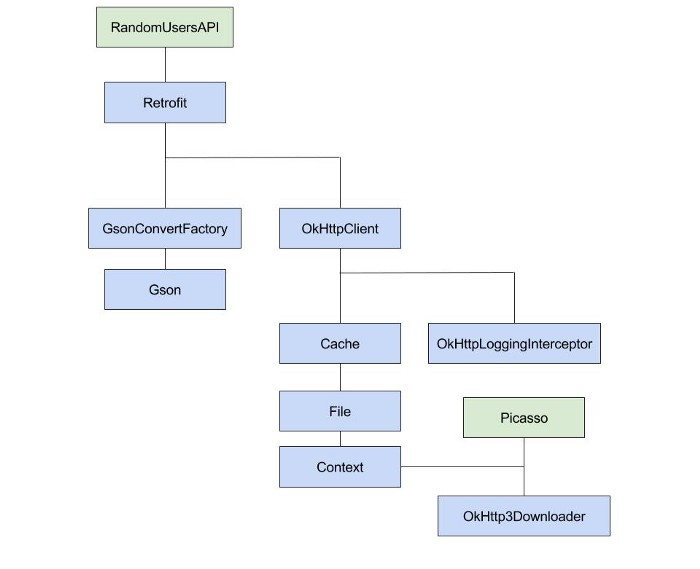

# Dagger

- Fully-static, Compile-time Dependency Injection Framework


## What is Dependency?

- B 클래스를 사용하는 A 클래스에 대해, A 클래스가 B 클래스를 의존한다고 말한다
- A 클래스를 dependent, B 클래스를 dependency라고 한다

```java
class Targaryens { // Dependant
  
        public Targaryens() {
                Dragons dragons = new Dragons(); // Dependency
                dragons.callForWar();
        }
}
```


## Why dependencies are bad?

- 재사용이 어렵다
- 테스트를 하기 어렵다
- 프로젝트가 커질 때 코드의 유지보수가 어렵다


## Types of Dependencies

### Class Dependency

- 생성자 메서드에서 dependency를 사용한다

### Interface Dependency

- 인터페이스의 dependency

```java
public Result executePlan(WarStrategy strategy) {
  //WarStrategy is implemented by all the houses
}
```

### Method/Field Dependency

- 객체의 메서드나 필드에 대한 dependency

```java
public String extractName(HouseClass house) {
  return house.getKing();
  //getting the king name of any house
}
```

### Direct and Indirect Dependency

- A 클래스가 B 클래스를 의존하고, B 클래스가 C 클래스를 의존한다
- 이 때, A 클래스는 직접적으로 B 클래스를 의존하고, 간접적으로 C 클래스를 의존한다


## What is dependency injection?

- Dependency Injection(DI)는 dependency 문제를 해결하기 위한 방법이다
- DI는 한 객체가 다른 객체의 dependency를 제공해주는 기술이다
- DI는 Inversion of Control 개념에 기반하여, 어떤 클래스도 dependency를 인스턴스화할 수 없고 다른 클래스로부터 받아야 한다


## Annotation Processors

### Annotations

- Annotation은 클래스, 메서드, 필드, 다른 annotation에 대한 메타데이터이다
- 런타임 동안 리플렉션을 이용하여 annotation에 접근할 수 있다

### Annotation Processors

- Annotation Processors는 컴파일 동안 코드를 생성하여 상용구를 제거해준다
- 컴파일 동안 진행되므로 성능에 영향을 주지 않는다


## Dagger 2 Annotations

### @Inject

- @Inject annotation은 의존성 주입을 요청한다
- 컴포넌트가 모듈로부터 객체를 생성하여 전달한다

### @Component

- 모듈을 이용하여 dependency를 생성하고, @Inject로 의존성 주입을 요청한 곳에 dependency의 인스턴스를 전달한다
- Dependency를 요청 받고 중비하는 Dagger의 주된 역할을 담당한다

### @Subcomponent

- 컴포넌트는 계층 관계를 형성할 수 있다
- @Inject로 주입을 요청 받으면 Subcomponent에서 먼저 dependency를 찾고, 없으면 부모 컴포넌트에서 찾는다

### @Module

- 컴포넌트에 연결되어 dependency를 생성한다

### @Provides

- 모듈 안에서 dependency를 생성하는 메서드를 나타낸다

### @Scope

- 컴포넌트와 연결된 객체의 생명주기 범위이다
- 안드로이드에서는 주로 액티비티, 프래그먼트 등 화면의 생명주기와 맞추어 사용한다
- 객체의 생명주기 동안 인스턴스를 유지한다(보통은 주입할 때마다 인스턴스를 생성한다)


## Example

```java
public interface House {

    void prepareForWar();

    void reportForWar();

}
```

```java
public class Starks implements House {

    @Override
    public void prepareForWar() {
        //do something
        System.out.println(this.getClass().getSimpleName()+" prepared for war");
    }

    @Override
    public void reportForWar() {
        //do something
        System.out.println(this.getClass().getSimpleName()+" reporting..");
    }
}
```

```java
public class Boltons implements House {
    @Override
    public void prepareForWar() {
        //do something
        System.out.println(this.getClass().getSimpleName()+" prepared for war");
    }

    @Override
    public void reportForWar() {
        //do something
        System.out.println(this.getClass().getSimpleName()+" reporting..");
    }
}
```


### Without Dependency Injection

```java
public class War { // Dependant

    private Starks starks; // Dependency

    private Boltons boltons; // Dependency

    public War(){
        starks = new Starks();
        boltons = new Boltons();

        starks.prepareForWar();
        starks.reportForWar();
        boltons.prepareForWar();
        starks.reportForWar();
    }

}
```


### With Dependency Injection

```java
public class War {

    private Starks starks;
    private Boltons boltons;
    
    //DI - getting dependencies from else where via constructor
    public War(Starks starks, Boltons bolton){
        this.starks = starks;
        this.boltons = bolton;
    }

    public void prepare(){
        starks.prepareForWar();
        boltons.prepareForWar();
    }

    public void report(){
        starks.reportForWar();
        boltons.reportForWar();
    }

}
```

```kotlin
public class BattleOfBastards {

    public static void main(String[] args){

        Starks starks = new Starks();
        Boltons boltons = new Boltons();

        War war = new War(starks,boltons); // Dependency Injection
        war.prepare();
        war.report();
    }
}
```


### Adding @Inject, @Component Annotation

```java
public class Boltons implements House {

   @Inject
   public Boltons(){
    }

    @Override
    public void prepareForWar() {
        System.out.println(this.getClass().getSimpleName()+" prepared for war");
    }

    @Override
    public void reportForWar() {
        System.out.println(this.getClass().getSimpleName()+" reporting..");
    }
}
```

```java
public class Starks implements House {

    @Inject //Dagger 2
    public Starks(){
    }

    @Override
    public void prepareForWar() {
        System.out.println(this.getClass().getSimpleName()+" prepared for war");
    }

    @Override
    public void reportForWar() {
        System.out.println(this.getClass().getSimpleName()+" reporting..");
    }
}
```

```java
public class War {

    private Starks starks;

    private Boltons boltons;

    @Inject
    public War(Starks starks, Boltons bolton){
        this.starks = starks;
        this.boltons = bolton;
    }

    public void prepare(){
        starks.prepareForWar();
        boltons.prepareForWar();
    }

    public void report(){
        starks.reportForWar();
        boltons.reportForWar();
    }

}
```

```java
@Component
interface BattleComponent {
    War getWar();
}
```

```java
public class BattleOfBastards {

    public static void main(String[] args){
//        Mannual DI
//        Starks starks = new Starks();
//        Boltons boltons = new Boltons();
//        War war = new War(starks,boltons);
//        war.prepare();
//        war.report();

//      Using Dagger 2
        BattleComponent component = DaggerBattleComponent.create();
        War war = component.getWar();
        war.prepare();
        war.report();

    }
}
```


### Adding @Inject, @Component Annotation

```java
public class Cash {
    public Cash(){
        //do something
    }
}
```

```java
public class Soldiers {
    public Soldiers(){
      //do something
    }
}
```

```java

@Module //The module
public class BraavosModule {
    Cash cash;
    Soldiers soldiers;

    public BraavosModule(Cash cash, Soldiers soldiers){
        this.cash=cash;
        this.soldiers=soldiers;
    }

    @Provides //Provides cash dependency
    Cash provideCash(){
        return cash;
    }

    @Provides //provides soldiers dependency
    Soldiers provideSoldiers(){
        return soldiers;
    }

}
```

```java
@Component(modules = BraavosModule.class)
interface BattleComponent {
    War getWar();
    Cash getCash();
    Soldiers getSoldiers();
}
```

```java
public class BattleOfBastards {
    public static void main(String[] args){

        Cash cash = new Cash();
        Soldiers soldiers = new Soldiers();

        BattleComponent component = DaggerBattleComponent
                .builder().braavosModule(new BraavosModule(cash, soldiers)).build();
        War war = component.getWar();
        war.prepare();
        war.report();
        //using cash and soldiers
        component.getCash();
        component.getSoldiers();

    }
}
```


## Kickstarter Project

### Dependency Graph

- 초록색으로 칠해진 클래스가 Top-Level Dependency이다




### All Components and Modules

- 프로젝트에 사용되는 모든 컴포넌트와 모듈의 그래프


### MainActivity

```java
@Override
    protected void onCreate(Bundle savedInstanceState) {
        super.onCreate(savedInstanceState);
        setContentView(R.layout.activity_main);
        initViews();

        GsonBuilder gsonBuilder = new GsonBuilder();
        Gson gson = gsonBuilder.create();

        Timber.plant(new Timber.DebugTree());

        File cacheFile = new File(this.getCacheDir(), "HttpCache");
        cacheFile.mkdirs();

        Cache cache = new Cache(cacheFile, 10 * 1000 * 1000); //10 MB

        HttpLoggingInterceptor httpLoggingInterceptor = new
                HttpLoggingInterceptor(new HttpLoggingInterceptor.Logger() {
            @Override
            public void log(@NonNull String message) {
                Timber.i(message);
            }
        });

        httpLoggingInterceptor.setLevel(HttpLoggingInterceptor.Level.BODY);


        OkHttpClient okHttpClient = new OkHttpClient()
                .newBuilder()
                .cache(cache)
                .addInterceptor(httpLoggingInterceptor)
                .build();

        OkHttp3Downloader okHttpDownloader = new OkHttp3Downloader(okHttpClient);

        picasso = new Picasso.Builder(this).downloader(okHttpDownloader).build();

        retrofit = new Retrofit.Builder()
                .client(okHttpClient)
                .baseUrl("https://randomuser.me/")
                .addConverterFactory(GsonConverterFactory.create(gson))
                .build();

        populateUsers();

    }
```


### Step 1: Setup Dagger

```groovy
dependencies {
    implementation 'com.google.dagger:dagger:2.13'
    annotationProcessor 'com.google.dagger:dagger-compiler:2.13'
}
```


### Step 2: Creating Component

- 컴포넌트는 Top-Level dependency를 전달한다

#### RandomUserComponent

```java
@Component
public interface RandomUserComponent {
    RandomUsersApi getRandomUserService();
    Picasso getPicasso();
}
```


### Step 3: Creating Modules

- 모듈은 Top-Level dependency에 필요한 dependency를 전달한다

#### RandomUsersModule

```java
@Module
public class RandomUsersModule {

    @Provides
    public RandomUsersApi randomUsersApi(Retrofit retrofit){
        return retrofit.create(RandomUsersApi.class);
    }

    @Provides
    public Retrofit retrofit(OkHttpClient okHttpClient,
                             GsonConverterFactory gsonConverterFactory, Gson gson){
        return new Retrofit.Builder()
                .client(okHttpClient)
                .baseUrl("https://randomuser.me/")
                .addConverterFactory(gsonConverterFactory)
                .build();
    }

    @Provides
    public Gson gson(){
        GsonBuilder gsonBuilder = new GsonBuilder();
        return gsonBuilder.create();
    }

    @Provides
    public GsonConverterFactory gsonConverterFactory(Gson gson){
        return GsonConverterFactory.create(gson);
    }


}
```


#### PicassoModule

```java
@Module
public class PicassoModule {

    @Provides
    public Picasso picasso(Context context, OkHttp3Downloader okHttp3Downloader){
        return new Picasso.Builder(context).
                downloader(okHttp3Downloader).
                build();
    }

    @Provides
    public OkHttp3Downloader okHttp3Downloader(OkHttpClient okHttpClient){
        return new OkHttp3Downloader(okHttpClient);
    }

}
```


#### OkHttpClientModule

```java
@Module
public class OkHttpClientModule {

    @Provides
    public OkHttpClient okHttpClient(Cache cache, HttpLoggingInterceptor httpLoggingInterceptor){
        return new OkHttpClient()
                .newBuilder()
                .cache(cache)
                .addInterceptor(httpLoggingInterceptor)
                .build();
    }

    @Provides
    public Cache cache(File cacheFile){
        return new Cache(cacheFile, 10 * 1000 * 1000); //10 MB
    }

    @Provides
    public File file(Context context){
        File file = new File(context.getCacheDir(), "HttpCache");
        file.mkdirs();
        return file;
    }

    @Provides
    public HttpLoggingInterceptor httpLoggingInterceptor(){
        HttpLoggingInterceptor httpLoggingInterceptor = new HttpLoggingInterceptor(new HttpLoggingInterceptor.Logger() {
            @Override
            public void log(String message) {
                Timber.d(message);
            }
        });
        httpLoggingInterceptor.setLevel(HttpLoggingInterceptor.Level.BODY);
        return httpLoggingInterceptor;
    }

}
```


#### ContextModule

```java
@Module
public class ContextModule {

    Context context;

    public ContextModule(Context context){
        this.context = context;
    }

    @Provides
    public Context context(){ return context.getApplicationContext(); }
}
```


### Step 4: Connecting all Modules

- RandomUserModule은 OkHttpClientModule이 필요하다
- OkHttpClientModule은 ContextModule이 필요하다
- PicassoModule은 OkHttpClientModule과 ContextModule이 필요하다(OkHttpClientModule에 ContextModule이 포함되어 있다)

```java
//in RandomUsersModule.java
@Module(includes = OkHttpClientModule.class)
public class RandomUsersModule { ... }

//in OkHttpClientModule.java
@Module(includes = ContextModule.class)
public class OkHttpClientModule { ... }

//in PicassoModule.java
@Module(includes = OkHttpClientModule.class)
public class PicassoModule { ... }
```


### Step 5: Educating Component

- 컴포넌트와 모듈을 연결시켜준다

```java
@Component(modules = {RandomUsersModule.class, PicassoModule.class})
public interface RandomUserComponent {
    RandomUsersApi getRandomUserService();
    Picasso getPicasso();
}
```


### Step 6: Build it

```java
public class MainActivity extends AppCompatActivity {
  RandomUsersApi randomUsersApi;
  Picasso picasso;
  ....
  @Override
    protected void onCreate(Bundle savedInstanceState) {
        super.onCreate(savedInstanceState);
        setContentView(R.layout.activity_main);
        ...
        RandomUserComponent daggerRandomUserComponent = DaggerRandomUserComponent.builder()
                .contextModule(new ContextModule(this))
                .build();
        picasso = daggerRandomUserComponent.getPicasso();
        randomUsersApi = daggerRandomUserComponent.getRandomUserService();
        populateUsers();
        ...
    }
  ...
}
```


#### @Scope Annotation

- Picasso와 Retrofit의 인스턴스를 여러번 생성하지 않고 하나의 인스턴스로 사용하게 한다

```java
@Scope
@Retention(RetentionPolicy.CLASS)
public @interface RandomUserApplicationScope {}
```

```java
@RandomUserApplicationScope
@Component(modules = {RandomUsersModule.class, PicassoModule.class})
public interface RandomUserComponent { ...}

@Module(includes = OkHttpClientModule.class)
public class PicassoModule {
  ...
    @RandomUserApplicationScope
    @Provides
    public Picasso picasso(Context context, OkHttp3Downloader okHttp3Downloader){
        return new Picasso.Builder(context).
                downloader(okHttp3Downloader).
                build();
    }
  ...
}

@Module(includes = OkHttpClientModule.class)
public class RandomUsersModule {
  ...
    @RandomUserApplicationScope
    @Provides
    public Retrofit retrofit(OkHttpClient okHttpClient,
                             GsonConverterFactory gsonConverterFactory, Gson gson){
        return new Retrofit.Builder()
                .client(okHttpClient)
                .baseUrl("https://randomuser.me/")
                .addConverterFactory(gsonConverterFactory)
                .build();
    }
    ...
}
```


#### @Qualifier Annotation

- 같은 타입의 인스턴스를 반환하는 @Provides 메서드가 여러 개일 때 구분할 수 있게 해준다

```java
@Qualifier
public @interface ApplicationContext {}

@Qualifier
public @interface ActivityContext {}
```

```java

@Module
public class ContextModule {
....
    @ApplicationContext
    @RandomUserApplicationScope
    @Provides
    public Context context(){ return context.getApplicationContext(); }
}
```

```java
@Module(includes = ContextModule.class)
public class OkHttpClientModule {
...
    @Provides
    @RandomUserApplicationScope
    public File file(@ApplicationContext Context context){
        File file = new File(context.getCacheDir(), "HttpCache");
        file.mkdirs();
        return file;
    }
....
}

@Module(includes = OkHttpClientModule.class)
public class PicassoModule {

    @RandomUserApplicationScope
    @Provides
    public Picasso picasso(@ApplicationContext Context context, OkHttp3Downloader okHttp3Downloader){
        return new Picasso.Builder(context).
                downloader(okHttp3Downloader).
                build();
    }
  ....
}
```


### Step 7: Creating Activity level scope

```java
@Scope
public @interface MainActivityScope {}
```


### Step 8: Creating Component for MainActivity

```java
@Component(modules = MainActivityModule.class, dependencies = RandomUserComponent.class)
@MainActivityScope
public interface MainActivityComponent {

    RandomUserAdapter getRandomUserAdapter();

    RandomUsersApi getRandomUserService();

}
```


### Step 9: Creating MainActivity Module

```java
@Module
public class MainActivityModule {

    private final MainActivity mainActivity;

    public MainActivityModule(MainActivity mainActivity) {
        this.mainActivity = mainActivity;
    }

    @Provides
    @MainActivityScope
    public RandomUserAdapter randomUserAdapter(Picasso picasso){
        return new RandomUserAdapter(mainActivity, picasso);
    }
}
```


### Step 10: Creating Application Class

```java
public class RandomUserApplication extends Application {

    //add application name in Manifest file
    private RandomUserComponent randomUserApplicationComponent;

    public static RandomUserApplication get(Activity activity){
        return (RandomUserApplication) activity.getApplication();
    }

    @Override
    public void onCreate() {
        super.onCreate();
        Timber.plant(new Timber.DebugTree());

        randomUserApplicationComponent = DaggerRandomUserComponent.builder()
                .contextModule(new ContextModule(this))
                .build();
    }

    public RandomUserComponent getRandomUserApplicationComponent(){
        return randomUserApplicationComponent;
    }
}
```


### Step 11: Modifying MainActivity

```java
public class MainActivity extends AppCompatActivity {
...
  @Override
  protected void onCreate(Bundle savedInstanceState) {
    ....
    MainActivityComponent mainActivityComponent = DaggerMainActivityComponent.builder()
               .mainActivityModule(new MainActivityModule(this))
               .randomUserComponent(RandomUserApplication.get(this).getRandomUserApplicationComponent())
               .build();
    randomUsersApi = mainActivityComponent.getRandomUserService();
    mAdapter = mainActivityComponent.getRandomUserAdapter();
    ....
  }

}
```


### Step 12: Using @Inject Annotation

#### Modifying MainActivityComponent

```java
@Component(modules = MainActivityModule.class, dependencies = RandomUserComponent.class)
@MainActivityScope
public interface MainActivityComponent {
  
  	// RandomUserAdapter getRandomUserAdapter();
    // RandomUsersApi getRandomUserService();
    void injectMainActivity(MainActivity mainActivity);

}
```


#### Modifying MainActivity

```java
public class MainActivity extends AppCompatActivity {
  ....
    @Inject
    RandomUsersApi randomUsersApi;

    @Inject
    RandomUserAdapter mAdapter;
  ....
    
    @Override
    protected void onCreate(Bundle savedInstanceState) {
        super.onCreate(savedInstanceState);
        setContentView(R.layout.activity_main);
        .....
        MainActivityComponent mainActivityComponent = DaggerMainActivityComponent.builder()
                .mainActivityModule(new MainActivityModule(this))
                .randomUserComponent(RandomUserApplication.get(this).getRandomUserApplicationComponent())
                .build();
    		// randomUsersApi = mainActivityComponent.getRandomUserService();
    		// mAdapter = mainActivityComponent.getRandomUserAdapter();
        mainActivityComponent.injectMainActivity(this);
        ....
  }
}
```


