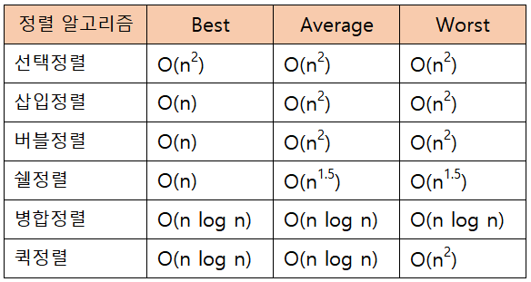

# 자료구조
 1. [List](#List)
 2. [Stack](#Stack)
 3. [Queue](#Queue)
 4. [Deque](#Deque)
 5. [Set](#Set)
 6. [Map](#Map)
 7. [Tree](#Tree)
 8. [Sorting](#Sorting)
 9. [Searching](#Searching)

## [List](#자료구조)
 - 순서가 있는 데이터의 집합
 - 데이터의 중복을 허용한다

### ArrayList vs LinkedList
 - 순차적으로 추가/삭제하는 경우에는 ArrayList가 더 빠르다
 - 중간 데이터를 추가/삭제하는 경우에는 LinkedList가 더 빠르다
 - 데이터 접근시간은 ArrayList가 더 빠르다
 - 메모리 효율성은 LinkedList가 더 좋다

### Interface
```java
import java.util.Iterator;

public interface ListIterator<T> extends List<T>, Iterable<T> {
    Iterator<T> getIterator();
}

public interface List<T> {
    void add(T newEntry);                       // ArrayList : O(1), LinkedList : O(n)
    void add(int newPosition, T newEntry);      // ArrayList : O(n), LinkedList : O(n)
    T remove(int givenPosition);                // ArrayList : O(n), LinkedList : O(n)
    void clear();                               // ArrayList : O(1), LinkedList : O(1)
    T replace(int givenPosition, T newEntry);   // ArrayList : O(1), LinkedList : O(n)
    T get(int givenPosition);                   // ArrayList : O(1), LinkedList : O(n)
    boolean contains(T anEntry);                // ArrayList : O(n), LinkedList : O(n)
    int size();                                 // ArrayList : O(1), LinkedList : O(1)
    boolean isEmpty();                          // ArrayList : O(1), LinkedList : O(1)
    T[] toArray();                              // ArrayList : O(n), LinkedList : O(n)
}
```
### ArrayList
```java
import java.util.Arrays;
import java.util.Iterator;
import java.util.NoSuchElementException;

public class ArrayList<T> implements ListIterator<T> {

    private T[] list;
    private int numberOfEntries;
    private int initialCapacity;
    private boolean initialized = false;
    private static final int DEFAULT_INITIAL_CAPACITY = 25;
    private static final int MAX_CAPACITY = 10000;

    public ArrayList() {
        this(DEFAULT_INITIAL_CAPACITY);
    }

    public ArrayList(int initialCapacity) {
        if(initialCapacity < DEFAULT_INITIAL_CAPACITY)
            initialCapacity = DEFAULT_INITIAL_CAPACITY;
        else
            checkCapacity(initialCapacity);

        initializeDataFields(initialCapacity);
    }

    private void initializeDataFields(int initialCapacity) {
        @SuppressWarnings("unchecked")
        T[] tempList = (T[]) new Object[initialCapacity];
        list = tempList;
        numberOfEntries = 0;
        this.initialCapacity = initialCapacity;
        initialized = true;
    }

    @Override
    public void add(T newEntry) {
        checkInitialization();
        list[numberOfEntries] = newEntry;
        numberOfEntries++;
        ensureCapacity();
    }

    @Override
    public void add(int newPosition, T newEntry) {
        checkInitialization();
        if(newPosition >= 0 && newPosition <= numberOfEntries) {
            if(newPosition < numberOfEntries)
                makeRoom(newPosition);
            list[newPosition] = newEntry;
            numberOfEntries++;
            ensureCapacity();
        }
    }

    @Override
    public T remove(int givenPosition) {
        checkInitialization();
        if(givenPosition >= 0 && givenPosition < numberOfEntries) {
            assert !isEmpty();
            T result = list[givenPosition];

            if(givenPosition < numberOfEntries - 1)
                removeGap(givenPosition);
            numberOfEntries--;
            return result;
        } else
            throw new IndexOutOfBoundsException(
                    "Illegal position given to remove operation.");
    }

    @Override
    public void clear() {
        initializeDataFields(initialCapacity);
    }

    @Override
    public T replace(int givenPosition, T newEntry) {
        checkInitialization();
        if(givenPosition >= 0 && givenPosition < numberOfEntries) {
            assert !isEmpty();
            T originalEntry = list[givenPosition];
            list[givenPosition] = newEntry;
            return originalEntry;
        } else
            throw new IndexOutOfBoundsException(
                    "Illegal position given to replace operation.");
    }

    @Override
    public T get(int givenPosition) {
        checkInitialization();
        if(givenPosition >= 0 && givenPosition < numberOfEntries) {
            assert !isEmpty();
            return list[givenPosition];
        } else
            throw new IndexOutOfBoundsException(
                    "Illegal position given to getEntry operation.");
    }

    @Override
    public boolean contains(T anEntry) {
        checkInitialization();
        boolean found = false;
        int index = 0;
        while(!found && index < numberOfEntries) {
            if(anEntry.equals(list[index]))
                found = true;
            index++;
        }
        return found;
    }

    @Override
    public int size() {
        return numberOfEntries;
    }

    @Override
    public boolean isEmpty() {
        return numberOfEntries == 0;
    }

    @Override
    public T[] toArray() {
        checkInitialization();

        @SuppressWarnings("unchecked")
        T[] result = (T[]) new Object[numberOfEntries];
        for(int index = 0; index < numberOfEntries; index++)
            result[index] = list[index];

        return result;
    }

    private void checkInitialization() {
        if(!initialized)
            throw new SecurityException(
                    "ArrayList object is not initialized properly");
    }

    private void checkCapacity(int capacity) {
        if(capacity > MAX_CAPACITY)
            throw new IllegalStateException(
                    "Attempt to create a list whose capacity exceeds allowed maximum of "
                            + MAX_CAPACITY);
    }

    private void ensureCapacity() {
        int capacity = list.length;
        if(numberOfEntries >= capacity) {
            int newCapacity = 2 * capacity;
            checkCapacity(newCapacity);
            list = Arrays.copyOf(list, 2 * list.length);
        }
    }

    private void makeRoom(int newPosition) {
        assert newPosition >= 0 && newPosition < numberOfEntries;
        int newIndex = newPosition;
        int lastIndex = numberOfEntries - 1;

        for(int index = lastIndex; index >= newIndex; index--) {
            list[index + 1] = list[index];
        }
    }

    private void removeGap(int givenPosition) {
        assert givenPosition >= 0 && givenPosition < numberOfEntries - 1;
        int removedIndex = givenPosition;
        int lastIndex = numberOfEntries - 1;
        for(int index = removedIndex; index < lastIndex; index++)
            list[index] = list[index + 1];
    }

    @Override
    public Iterator<T> getIterator() {
        return iterator();
    }

    @Override
    public Iterator<T> iterator() {
        return new ArrayListIterator();
    }

    private class ArrayListIterator implements Iterator<T> {

        private int nextIndex;

        private ArrayListIterator() {
            nextIndex = 0;
        }

        @Override
        public boolean hasNext() {
            return nextIndex <= numberOfEntries;
        }

        @Override
        public T next() {
            if(hasNext()) {
                T entry = list[nextIndex];
                nextIndex++;
                return entry;
            } else
                throw new NoSuchElementException("Illegal call to next(); " +
                        "iterator is after end of list.");
        }
    }
}
```
### LinkedList
```java
import java.util.Iterator;
import java.util.NoSuchElementException;

public class LinkedList<T> implements ListIterator<T> {

    private Node firstNode;
    private Node lastNode;
    private int numberOfEntries;

    public LinkedList() {
        initializeDataFields();
    }

    private void initializeDataFields() {
        firstNode = null;
        lastNode = null;
        numberOfEntries = 0;
    }

    @Override
    public void add(T newEntry) {
        Node newNode = new Node(newEntry);
        if(isEmpty()) {
            firstNode = newNode;
        } else {
            lastNode.setNextNode(newNode);
        }
        lastNode = newNode;
        numberOfEntries++;
    }

    @Override
    public void add(int newPosition, T newEntry) {
        if(newPosition >= 0 && newPosition <= numberOfEntries) {
            Node newNode = new Node(newEntry);
            if(isEmpty()) {
                firstNode = newNode;
                lastNode = newNode;
            } else if(newPosition == 0) {
                newNode.setNextNode(firstNode);
                firstNode = newNode;
            } else if(newPosition == numberOfEntries) {
                lastNode.setNextNode(newNode);
                lastNode = newNode;
            } else {
                Node nodeBefore = getNodeAt(newPosition - 1);
                Node nodeAfter = nodeBefore.getNextNode();
                newNode.setNextNode(nodeAfter);
                nodeBefore.setNextNode(newNode);
            }
            numberOfEntries++;
        } else
            throw new IndexOutOfBoundsException(
                    "Illegal position given to add operation");
    }

    @Override
    public T remove(int givenPosition) {
        T result = null;
        if(givenPosition >= 0 && givenPosition < numberOfEntries) {
            assert !isEmpty();
            if(givenPosition == 0) {
                result = firstNode.getData();
                firstNode = firstNode.getNextNode();
                if(numberOfEntries == 1)
                    lastNode = null;
            } else if(givenPosition == numberOfEntries - 1) {
                Node nodeBefore = getNodeAt(givenPosition - 1);
                nodeBefore.setNextNode(null);
                result = lastNode.getData();
                lastNode = nodeBefore;
            } else {
                Node nodeBefore = getNodeAt(givenPosition - 1);
                Node nodeToRemove = nodeBefore.getNextNode();
                Node nodeAfter = nodeToRemove.getNextNode();
                nodeBefore.setNextNode(nodeAfter);
                result = nodeToRemove.getData();
            }
            numberOfEntries--;

            return result;
        } else
            throw new IndexOutOfBoundsException(
                    "Illegal position given to remove operation");
    }

    @Override
    public void clear() {
        initializeDataFields();
    }

    @Override
    public T replace(int givenPosition, T newEntry) {
        if(givenPosition >= 0 && givenPosition < numberOfEntries) {
            assert !isEmpty();
            Node desiredNode = getNodeAt(givenPosition);
            T originalEntry = desiredNode.getData();
            desiredNode.setData(newEntry);
            return originalEntry;
        } else
            throw new IndexOutOfBoundsException(
                    "Illegal position given to replace operation");
    }

    @Override
    public T get(int givenPosition) {
        if(givenPosition >= 0 && givenPosition < numberOfEntries) {
            assert !isEmpty();
            return getNodeAt(givenPosition).getData();
        } else
            throw new IndexOutOfBoundsException(
                    "Illegal position given to getEntry operation");
    }

    @Override
    public boolean contains(T anEntry) {
        boolean found = false;
        Node currentNode = firstNode;
        while(!found && currentNode != null) {
            if(currentNode.getData().equals(anEntry))
                found = true;
            else
                currentNode = currentNode.getNextNode();
        }
        return found;
    }

    @Override
    public int size() {
        return numberOfEntries;
    }

    @Override
    public boolean isEmpty() {
        boolean result;
        if(numberOfEntries == 0) {
            assert firstNode == null;
            result = true;
        } else {
            assert firstNode != null;
            result = false;
        }
        return result;
    }

    @Override
    public T[] toArray() {
        @SuppressWarnings("unchecked")
        T[] result = (T[]) new Object[numberOfEntries];

        int index = 0;
        Node currentNode = firstNode;
        while(index < numberOfEntries && currentNode != null) {
            result[index] = currentNode.getData();
            currentNode = currentNode.getNextNode();
            index++;
        }

        return result;
    }

    private Node getNodeAt(int givenPosition) {
        assert firstNode != null && givenPosition >= 0 && givenPosition < numberOfEntries;
        Node currentNode = firstNode;

        for(int counter = 0; counter < givenPosition; counter++)
            currentNode = currentNode.getNextNode();

        assert currentNode != null;
        return currentNode;
    }

    @Override
    public Iterator<T> getIterator() {
        return iterator();
    }

    @Override
    public Iterator<T> iterator() {
        return new LinkedListIterator();
    }

    private class LinkedListIterator implements Iterator<T> {

        private Node nextNode;

        private LinkedListIterator() {
            nextNode = firstNode;
        }

        @Override
        public boolean hasNext() {
            return nextNode != null;
        }

        @Override
        public T next() {
            if(hasNext()) {
                Node node = nextNode;
                nextNode = nextNode.getNextNode();
                return node.getData();
            } else
                throw new NoSuchElementException("Illegal call to next(); " +
                        "iterator is after end of list.");
        }
    }

    private class Node {
        private T data;
        private Node next;

        private Node(T dataPortion) {
            this(dataPortion, null);
        }

        private Node(T dataPortion, Node nextNode) {
            data = dataPortion;
            next = nextNode;
        }

        T getData() {
            return data;
        }

        void setData(T newData) {
            data = newData;
        }

        Node getNextNode() {
            return next;
        }

        void setNextNode(Node nextNode) {
            next = nextNode;
        }
    }
}
```

## [Stack](#자료구조)
 - 마지막에 저장한 데이터를 가장 먼저 꺼내게 되는 LIFO(Last In First Out) 구조
 - 활용 예시
    - JVM의 호출 스택
    - 웹 브라우저 방문기록
    - 실행취소(undo)
    - 역순 문자열 만들기
    - 수식의 괄호 검사
    - 후위표기법(postfix) 계산

### Interface
```java
public interface Stack<T> {
    void push(T newEntry); // O(1)
    T pop();               // O(1)
    T peek();              // O(1)
    boolean isEmpty();     // O(1)
    void clear();          // O(1)
    int size();            // O(1)
}
```

### VectorStack
```java
import java.util.EmptyStackException;
import java.util.Vector;

public class VectorStack<T> implements Stack<T> {

    private final Vector<T> stack;
    private final boolean initialized;
    private static final int DEFAULT_INITIAL_CAPACITY = 50;
    private static final int MAX_CAPACITY = 10000;

    public VectorStack() {
        this(DEFAULT_INITIAL_CAPACITY);
    }

    public VectorStack(int initialCapacity) {
        checkCapacity(initialCapacity);
        stack = new Vector<>(initialCapacity);
        initialized = true;
    }

    @Override
    public void push(T newEntry) {
        checkInitialization();
        stack.add(newEntry);
    }

    @Override
    public T pop() {
        checkInitialization();
        if(isEmpty())
            throw new EmptyStackException();
        else
            return stack.remove(stack.size() - 1);
    }

    @Override
    public T peek() {
        checkInitialization();
        if(isEmpty())
            throw new EmptyStackException();
        else
            return stack.lastElement();
    }

    @Override
    public boolean isEmpty() {
        return stack.isEmpty();
    }

    @Override
    public void clear() {
        stack.clear();
    }

    @Override
    public int size() {
        return stack.size();
    }

    private void checkInitialization() {
        if(!initialized)
            throw new SecurityException(
                    "VectorStack object is not initialized properly");
    }

    private void checkCapacity(int capacity) {
        if(capacity > MAX_CAPACITY)
            throw new IllegalStateException(
                    "Attempt to create a stack whose capacity exceeds allowed maximum of "
                            + MAX_CAPACITY);
    }
}
```

## [Queue](#자료구조)
 - 처음에 저장한 데이터를 가장 먼저 꺼내게 되는 FIFO(First In First Out) 구조
 - 활용 예시
    - 프로세스 관리
    - 우선순위가 같은 작업 예약
    - 은행 업무
    - 너비 우선 탐색(BFS)

### Interface
```java
public interface Queue<T> {
    void enqueue(T newEntry);  // O(1)
    T dequeue();               // O(1)
    T getFront();              // O(1)
    boolean isEmpty();         // O(1)
    void clear();              // O(1)
    int size();                // O(1)
}
```

### LinkedQueue
```java
import java.util.NoSuchElementException;

public class LinkedQueue<T> implements Queue<T> {

    private Node firstNode;
    private Node lastNode;
    private int size;

    public LinkedQueue() {
        firstNode = null;
        lastNode = null;
        size = 0;
    }

    @Override
    public void enqueue(T newEntry) {
        Node newNode = new Node(newEntry, null);
        if(isEmpty())
            firstNode = newNode;
        else
            lastNode.setNextNode(newNode);
        lastNode = newNode;
        size++;
    }

    @Override
    public T dequeue() {
        T front = getFront();
        assert firstNode != null;
        firstNode = firstNode.getNextNode();

        if(firstNode == null)
            lastNode = null;

        size--;
        return front;
    }

    @Override
    public T getFront() {
        if(isEmpty())
            throw new NoSuchElementException();
        else
            return firstNode.getData();
    }

    @Override
    public boolean isEmpty() {
        return firstNode == null && lastNode == null;
    }

    @Override
    public void clear() {
        firstNode = null;
        lastNode = null;
        size = 0;
    }

    @Override
    public int size() {
        return size;
    }

    private class Node {
        private T data;
        private Node next;

        private Node(T dataPortion) {
            this(dataPortion, null);
        }

        private Node(T dataPortion, Node nextNode) {
            data = dataPortion;
            next = nextNode;
        }

        T getData() {
            return data;
        }

        void setData(T newData) {
            data = newData;
        }

        Node getNextNode() {
            return next;
        }

        void setNextNode(Node nextNode) {
            next = nextNode;
        }
    }
}
```

## [Deque](#자료구조)
 - Queue의 변형으로, 양쪽 끝에 추가/삭제가 가능하다

### Interface
```java
public interface Deque<T> {
    void addToFront(T newEntry);  // O(1)
    T removeFront();              // O(1)
    void addToBack(T newEntry);   // O(1)
    T removeBack();               // O(1)
    T getFront();                 // O(1)
    T getBack();                  // O(1)
    boolean isEmpty();            // O(1)
    void clear();                 // O(1)
    int size();                   // O(1)
}
```

### LinkedDeque
```java
import java.util.NoSuchElementException;

public class LinkedDeque<T> implements Deque<T> {

    private Node firstNode;
    private Node lastNode;
    private int size;

    public LinkedDeque() {
        firstNode = null;
        lastNode = null;
        size = 0;
    }

    @Override
    public void addToFront(T newEntry) {
        Node newNode = new Node(newEntry, firstNode, null);
        if(isEmpty())
            lastNode = newNode;
        else
            firstNode.setPreviousNode(newNode);

        firstNode = newNode;
        size++;
    }

    @Override
    public T removeFront() {
        T front = getFront();
        assert firstNode != null;
        firstNode = firstNode.getNextNode();

        if(firstNode == null)
            lastNode = null;
        else
            firstNode.setPreviousNode(null);

        size--;
        return front;
    }

    @Override
    public void addToBack(T newEntry) {
        Node newNode = new Node(newEntry, null, lastNode);
        if(isEmpty())
            firstNode = newNode;
        else
            lastNode.setNextNode(newNode);

        lastNode = newNode;
        size++;
    }

    @Override
    public T removeBack() {
        T back = getBack();
        assert lastNode != null;
        lastNode = lastNode.getPreviousNode();

        if(lastNode == null)
            firstNode = null;
        else
            lastNode.setNextNode(null);

        size--;
        return back;
    }

    @Override
    public T getFront() {
        if(isEmpty())
            throw new NoSuchElementException();
        else
            return firstNode.getData();
    }

    @Override
    public T getBack() {
        if(isEmpty())
            throw new NoSuchElementException();
        else
            return lastNode.getData();
    }

    @Override
    public boolean isEmpty() {
        return firstNode == null && lastNode == null;
    }

    @Override
    public void clear() {
        firstNode = null;
        lastNode = null;
        size = 0;
    }

    @Override
    public int size() {
        return size;
    }

    private class Node {
        private T data;
        private Node next;
        private Node previous;

        private Node(T dataPortion) {
            this(dataPortion, null, null);
        }

        private Node(T dataPortion, Node nextNode, Node previousNode) {
            data = dataPortion;
            next = nextNode;
            previous = previousNode;
        }

        T getData() {
            return data;
        }

        void setData(T newData) {
            data = newData;
        }

        Node getNextNode() {
            return next;
        }

        void setNextNode(Node nextNode) {
            next = nextNode;
        }

        Node getPreviousNode() {
            return previous;
        }

        void setPreviousNode(Node previous) {
            this.previous = previous;
        }
    }
}
```

## [Set](#자료구조)
 - 순서를 유지하지 않는 데이터의 집합
 - 데이터의 중복을 허용하지 않는다

### Interface
```java
import java.util.Iterator;

public interface Set<T> {
    void add(T value);
    T remove(T value);
    boolean contains(T value);
    Iterator<T> iterator();
    boolean isEmpty();
    int size();
    void clear();
}
```

### HashSet
```java
import java.util.Iterator;
import java.util.NoSuchElementException;

public class HashSet<T> implements Set<T> {

    private int numberOfEntries;
    private static final int DEFAULT_CAPACITY = 5;
    private static final int MAX_CAPACITY = 10000;

    private T[] hashTable;
    private int tableSize;
    private static final int MAX_SIZE = 2 * MAX_CAPACITY;
    private boolean initialized = false;
    private static final double MAX_LOAD_FACTOR = 0.5;

    public HashSet() {
        this(DEFAULT_CAPACITY);
    }

    public HashSet(int initialCapacity) {
        checkCapacity(initialCapacity);

        int tableSize = getNextPrime(initialCapacity);
        checkSize(tableSize);

        initializeDataFields(tableSize);
    }

    private int getNextPrime(int number) {
        int prime = number;
        while (true) {
            boolean finish = true;
            for(int i = 2; i * i <= prime; i++) {
                if(prime % i == 0) {
                    finish = false;
                    break;
                }
            }

            if(finish)
                break;
            else
                prime++;
        }
        return prime;
    }

    private void initializeDataFields(int tableSize) {
        @SuppressWarnings("unchecked")
        T[] tempTable = (T[]) new Object[tableSize];
        hashTable = tempTable;
        numberOfEntries = 0;
        this.tableSize = tableSize;
        initialized = true;
    }

    private boolean isHashSetTooFull() {
        return ((double) numberOfEntries / hashTable.length) >= MAX_LOAD_FACTOR;
    }

    private void enlargeHashSet() {
        T[] oldTable = hashTable;
        int oldSize = hashTable.length;
        int newSize = getNextPrime(oldSize * 2);

        @SuppressWarnings("unchecked")
        T[] tempTable = (T[]) new Object[newSize];
        hashTable = tempTable;
        numberOfEntries = 0;

        for(int index = 0; index < oldSize; index++) {
            if(oldTable[index] != null) {
                add(oldTable[index]);
            }
        }
    }

    private int getHashIndex(T value) {
        return Math.abs(value.hashCode() % hashTable.length);
    }

    private int locate(int index, T value) {
        boolean found = false;
        while (!found && (hashTable[index] != null)) {
            if(value.equals(hashTable[index]))
                found = true;
            else
                index = (index + 1) % hashTable.length;
        }

        return found ? index : -1;
    }


    @Override
    public void add(T value) {
        checkInitialization();
        if((value == null))
            throw new IllegalArgumentException();
        else {
            int index = locate(getHashIndex(value), value);

            assert (index >= 0) && (index < hashTable.length);
            if(hashTable[index] == null) {
                hashTable[index] = value;
                numberOfEntries++;
            }
        }

        if(isHashSetTooFull())
            enlargeHashSet();
    }

    @Override
    public T remove(T value) {
        checkInitialization();
        T result = null;
        int index = locate(getHashIndex(value), value);

        if(index != -1) {
            result = hashTable[index];
            hashTable[index] = null;
            numberOfEntries--;
        }
        return result;
    }

    @Override
    public boolean contains(T value) {
        checkInitialization();
        int index = locate(getHashIndex(value), value);
        return index != -1;
    }

    @Override
    public Iterator<T> iterator() {
        return new SetIterator();
    }

    @Override
    public boolean isEmpty() {
        return numberOfEntries == 0;
    }

    @Override
    public int size() {
        return numberOfEntries;
    }

    @Override
    public void clear() {
        initializeDataFields(tableSize);
    }

    private void checkInitialization() {
        if(!initialized)
            throw new SecurityException(
                    "HashMap object is not initialized properly");
    }

    private void checkCapacity(int capacity) {
        if(capacity > MAX_CAPACITY)
            throw new IllegalStateException(
                    "Attempt to create a map whose capacity exceeds allowed maximum of "
                            + MAX_CAPACITY);
    }

    private void checkSize(int size) {
        if(size > MAX_SIZE)
            throw new IllegalStateException(
                    "Attempt to create a map whose size exceeds allowed maximum of "
                            + MAX_SIZE);
    }

    private class SetIterator implements Iterator<T> {

        private int currentIndex;
        private int numberLeft;

        private SetIterator() {
            currentIndex = 0;
            numberLeft = numberOfEntries;
        }

        @Override
        public boolean hasNext() {
            return numberLeft > 0;
        }

        @Override
        public T next() {
            if(hasNext()) {
                while(hashTable[currentIndex] == null)
                    currentIndex++;

                T result = hashTable[currentIndex];
                currentIndex++;
                numberLeft--;
                return result;
            } else
                throw new NoSuchElementException("Illegal call to next(); " +
                        "iterator is after end of set.");
        }
    }
}
```

## [Map](#자료구조)
 - 키(key)와 값(value)의 쌍으로 이루어진 데이터의 집합
 - 순서를 유지하지 않는 데이터의 집합
 - 키는 중복을 허용하지 않고, 값은 중복을 허용한다

### Interface
```java
import java.util.Iterator;

public interface Map<K, V> {
    void put(K key, V value);
    V remove(K key);
    V get(K key);
    boolean contains(K key);
    Iterator<K> keyIterator();
    Iterator<V> valueIterator();
    boolean isEmpty();
    int size();
    void clear();
}
```

### HashMap
```java
import java.util.Iterator;
import java.util.NoSuchElementException;

public class HashMap<K, V> implements Map<K, V> {

    private int numberOfEntries;
    private static final int DEFAULT_CAPACITY = 5;
    private static final int MAX_CAPACITY = 10000;

    private Entry<K, V>[] hashTable;
    private int tableSize;
    private static final int MAX_SIZE = 2 * MAX_CAPACITY;
    private boolean initialized = false;
    private static final double MAX_LOAD_FACTOR = 0.5;

    public HashMap() {
        this(DEFAULT_CAPACITY);
    }

    public HashMap(int initialCapacity) {
        checkCapacity(initialCapacity);

        int tableSize = getNextPrime(initialCapacity);
        checkSize(tableSize);

        initializeDataFields(tableSize);
    }

    private int getNextPrime(int number) {
        int prime = number;
        while (true) {
            boolean finish = true;
            for(int i = 2; i * i <= prime; i++) {
                if(prime % i == 0) {
                    finish = false;
                    break;
                }
            }

            if(finish)
                break;
            else
                prime++;
        }
        return prime;
    }

    private void initializeDataFields(int tableSize) {
        @SuppressWarnings("unchecked")
        Entry<K, V>[] tempTable = (Entry<K, V>[]) new Entry[tableSize];
        hashTable = tempTable;
        numberOfEntries = 0;
        this.tableSize = tableSize;
        initialized = true;
    }

    private boolean isHashTableTooFull() {
        return ((double) numberOfEntries / hashTable.length) >= MAX_LOAD_FACTOR;
    }

    private void enlargeHashTable() {
        Entry<K, V>[] oldTable = hashTable;
        int oldSize = hashTable.length;
        int newSize = getNextPrime(oldSize * 2);

        @SuppressWarnings("unchecked")
        Entry<K, V>[] tempTable = (Entry<K, V>[]) new Entry[newSize];
        hashTable = tempTable;
        numberOfEntries = 0;

        for(int index = 0; index < oldSize; index++) {
            if((oldTable[index] != null) && oldTable[index].isIn()) {
                put(oldTable[index].getKey(), oldTable[index].getValue());
            }
        }
    }

    @Override
    public void put(K key, V value) {
        checkInitialization();
        if((key == null) || (value == null))
            throw new IllegalArgumentException();
        else {
            int index = probe(getHashIndex(key), key);

            assert (index >= 0) && (index < hashTable.length);
            if((hashTable[index] == null) || hashTable[index].isRemoved()) {
                hashTable[index] = new Entry<>(key, value);
                numberOfEntries++;
            } else {
                hashTable[index].setValue(value);
            }
        }

        if(isHashTableTooFull())
            enlargeHashTable();
    }

    @Override
    public V remove(K key) {
        checkInitialization();
        V result = null;
        int index = locate(getHashIndex(key), key);

        if(index != -1) {
            result = hashTable[index].getValue();
            hashTable[index].setToRemoved();
            numberOfEntries--;
        }

        return result;
    }

    private int getHashIndex(K key) {
        return Math.abs(key.hashCode() % hashTable.length);
    }

    private int locate(int index, K key) {
        boolean found = false;
        while (!found && (hashTable[index] != null)) {
            if(hashTable[index].isIn() &&
                    key.equals(hashTable[index].getKey()))
                found = true;
            else
                index = (index + 1) % hashTable.length;
        }

        return found ? index : -1;
    }

    private int probe(int index, K key) {
        boolean found = false;
        int removedStateIndex = -1;
        while (!found && (hashTable[index] != null)) {
            if(hashTable[index].isIn()) {
                if(key.equals(hashTable[index].getKey())) {
                    found = true;
                } else {
                    index = (index + 1) % hashTable.length;
                }
            } else {
                if(removedStateIndex == -1)
                    removedStateIndex = index;

                index = (index + 1) % hashTable.length;
            }
        }

        if(found || (removedStateIndex == -1))
            return index;
        else
            return removedStateIndex;
    }

    @Override
    public V get(K key) {
        checkInitialization();
        V result = null;
        int index = locate(getHashIndex(key), key);

        if(index != -1)
            result = hashTable[index].getValue();

        return result;
    }

    @Override
    public boolean contains(K key) {
        checkInitialization();
        int index = locate(getHashIndex(key), key);
        return index != -1;
    }

    @Override
    public Iterator<K> keyIterator() {
        return new KeyIterator();
    }

    @Override
    public Iterator<V> valueIterator() {
        return new ValueIterator();
    }

    @Override
    public boolean isEmpty() {
        return numberOfEntries == 0;
    }

    @Override
    public int size() {
        return numberOfEntries;
    }

    @Override
    public void clear() {
        initializeDataFields(tableSize);
    }

    private void checkInitialization() {
        if(!initialized)
            throw new SecurityException(
                    "HashMap object is not initialized properly");
    }

    private void checkCapacity(int capacity) {
        if(capacity > MAX_CAPACITY)
            throw new IllegalStateException(
                    "Attempt to create a map whose capacity exceeds allowed maximum of "
                            + MAX_CAPACITY);
    }

    private void checkSize(int size) {
        if(size > MAX_SIZE)
            throw new IllegalStateException(
                    "Attempt to create a map whose size exceeds allowed maximum of "
                            + MAX_SIZE);
    }

    private static class Entry<S, T> {
        private S key;
        private T value;
        private States state;
        private enum States {CURRENT, REMOVED}

        private Entry(S key, T value) {
            this.key = key;
            this.value = value;
            state = States.CURRENT;
        }

        private S getKey() {
            return key;
        }

        private T getValue() {
            return value;
        }

        private void setValue(T newValue) {
            value = newValue;
        }

        private boolean isIn() {
            return state == States.CURRENT;
        }

        private boolean isRemoved() {
            return state == States.REMOVED;
        }

        private void setToIn() {
            state = States.CURRENT;
        }

        private void setToRemoved() {
            state = States.REMOVED;
        }
    }

    private class KeyIterator implements Iterator<K> {

        private int currentIndex;
        private int numberLeft;

        private KeyIterator() {
            currentIndex = 0;
            numberLeft = numberOfEntries;
        }

        @Override
        public boolean hasNext() {
            return numberLeft > 0;
        }

        @Override
        public K next() {
            if(hasNext()) {
                while((hashTable[currentIndex] == null) ||
                        hashTable[currentIndex].isRemoved())
                    currentIndex++;

                K result = hashTable[currentIndex].getKey();
                numberLeft--;
                currentIndex++;
                return result;
            } else
                throw new NoSuchElementException("Illegal call to next(); " +
                        "iterator is after end of map.");
        }
    }

    private class ValueIterator implements Iterator<V> {

        private int currentIndex;
        private int numberLeft;

        private ValueIterator() {
            currentIndex = 0;
            numberLeft = numberOfEntries;
        }

        @Override
        public boolean hasNext() {
            return numberLeft > 0;
        }

        @Override
        public V next() {
            if(hasNext()) {
                while((hashTable[currentIndex] == null) ||
                        hashTable[currentIndex].isRemoved())
                    currentIndex++;

                V result = hashTable[currentIndex].getValue();
                numberLeft--;
                currentIndex++;
                return result;
            } else
                throw new NoSuchElementException("Illegal call to next(); " +
                        "iterator is after end of map.");
        }
    }
}
```

## [Tree](#자료구조)

 - 노드로 이루어진 비선형 자료구조로 계층적 관계를 표현하는데 사용한다
 - 사이클이 없는 하나의 연결 그래프
 - 트리는 하나의 루트 노드를 갖는다
 - 노드는 0개 이상의 자식 노드를 갖는다

### 이진 탐색 트리(Binary Search Tree)
 - 이진 트리 기반의 탐색을 위한 자료구조
 - 모든 노드의 키는 유일하다
 - 왼쪽 서브 트리의 키들은 루트의 키보다 작다
 - 오른쪽 서브 트리의 키들은 루트의 키보다 크다

#### AVL 트리
 - 이진 트리 높이의 균형을 유지하는 이진 탐색 트리
 - 트리의 두 서브트리(왼쪽, 오른쪽)의 높이 차가 최대 1을 넘지 않는다

```java
public class AVLTree<T extends Comparable<? super T>>
        extends BinarySearchTree<T> {

    public AVLTree() {
        super();
    }

    public AVLTree(T rootEntry) {
        super(rootEntry);
    }

    private BinaryNode rotateRight(BinaryNode rootNode) {
        BinaryNode leftChild = rootNode.getLeftChild();
        rootNode.setLeftChild(leftChild.getRightChild());
        leftChild.setRightChild(rootNode);
        return leftChild;
    }

    private BinaryNode rotateLeft(BinaryNode rootNode) {
        BinaryNode rightChild = rootNode.getRightChild();
        rootNode.setRightChild(rightChild.getLeftChild());
        rightChild.setLeftChild(rootNode);
        return rightChild;
    }

    private BinaryNode rotateRightLeft(BinaryNode rootNode) {
        BinaryNode rightChild = rootNode.getRightChild();
        rootNode.setRightChild(rotateRight(rightChild));
        return rotateLeft(rootNode);
    }

    private BinaryNode rotateLeftRight(BinaryNode rootNode) {
        BinaryNode leftChild = rootNode.getLeftChild();
        rootNode.setLeftChild(rotateLeft(leftChild));
        return rotateRight(rootNode);
    }

    private BinaryNode rebalance(BinaryNode rootNode) {
        if(rootNode != null) {
            int heightDifference = getHeightDifference(rootNode);
            if (heightDifference > 1) {
                if (getHeightDifference(rootNode.getLeftChild()) > 0)
                    rootNode = rotateRight(rootNode);
                else
                    rootNode = rotateLeftRight(rootNode);
            } else if (heightDifference < -1) {
                if (getHeightDifference(rootNode.getRightChild()) < 0)
                    rootNode = rotateLeft(rootNode);
                else
                    rootNode = rotateRightLeft(rootNode);
            }
        }
        return rootNode;
    }

    private int getHeightDifference(BinaryNode rootNode) {
        int leftHeight = rootNode.hasLeftChild() ? rootNode.getLeftChild().getHeight() : 0;
        int rightHeight = rootNode.hasRightChild() ? rootNode.getRightChild().getHeight() : 0;

        return leftHeight - rightHeight;
    }

    @Override
    public T add(T newEntry) {
        T result = null;
        if(isEmpty())
            setRootNode(new BinaryNode(newEntry));
        else {
            result = addEntry(getRootNode(), newEntry);
            setRootNode(rebalance(getRootNode()));
        }

        return result;
    }

    protected T addEntry(BinaryNode rootNode, T newEntry) {
        assert rootNode != null;
        T result = null;
        int comparison = newEntry.compareTo(rootNode.getData());
        if(comparison == 0) {
            result = rootNode.getData();
            rootNode.setData(newEntry);
        } else if(comparison < 0) {
            if(rootNode.hasLeftChild()) {
                BinaryNode leftChild = rootNode.getLeftChild();
                result = addEntry(leftChild, newEntry);
                rootNode.setLeftChild(rebalance(leftChild));
            } else
                rootNode.setLeftChild(new BinaryNode(newEntry));
        } else {
            if(rootNode.hasRightChild()) {
                BinaryNode rightChild = rootNode.getRightChild();
                result = addEntry(rightChild, newEntry);
                rootNode.setRightChild(rebalance(rightChild));
            } else
                rootNode.setRightChild(new BinaryNode(newEntry));
        }
        return result;
    }

    @Override
    public T remove(T entry) {
        ReturnObject oldEntry = new ReturnObject(null);
        BinaryNode newRoot = removeEntry(getRootNode(), entry, oldEntry);
        setRootNode(newRoot);
        return oldEntry.getData();
    }

    protected BinaryNode removeEntry(BinaryNode rootNode, T entry, ReturnObject oldEntry) {
        if(rootNode != null) {
            T rootData = rootNode.getData();
            int comparison = entry.compareTo(rootData);
            if(comparison == 0) {
                oldEntry.setData(rootData);
                rootNode = removeFromRoot(rootNode);
            } else if(comparison < 0) {
                BinaryNode leftChild = rootNode.getLeftChild();
                rootNode.setLeftChild(removeEntry(leftChild, entry, oldEntry));
            } else {
                BinaryNode rightChild = rootNode.getRightChild();
                rootNode.setRightChild(removeEntry(rightChild, entry, oldEntry));
            }
        }
        return rebalance(rootNode);
    }

    private BinaryNode removeFromRoot(BinaryNode rootNode) {
        if(rootNode.hasRightChild() && rootNode.hasLeftChild()) {
            BinaryNode leftChild = rootNode.getLeftChild();
            BinaryNode largestNode = findLargest(leftChild);

            rootNode.setData(largestNode.getData());
            rootNode.setLeftChild(removeLargest(leftChild));
        } else if(rootNode.hasRightChild())
            rootNode = rootNode.getRightChild();
        else
            rootNode = rootNode.getLeftChild();
        return rootNode;
    }

    private BinaryNode findLargest(BinaryNode rootNode) {
        if(rootNode.hasRightChild())
            rootNode = findLargest(rootNode.getRightChild());
        return rootNode;
    }

    private BinaryNode removeLargest(BinaryNode rootNode) {
        if(rootNode.hasRightChild()) {
            BinaryNode rightChild = rootNode.getRightChild();
            rootNode.setRightChild(removeLargest(rightChild));
        } else
            rootNode = rootNode.getLeftChild();
        return rootNode;
    }
}
```

### B-트리(B-Tree)
 - 자식 노드가 m개(2개 이상)인 트리
 - B-트리는 공백이거나, 높이가 1 이상인 m-원 탐색 트리
 - 루트는 0 또는 2에서 m개 사이의 서브트리를 가진다
 - 루트를 제외한 모든 내부 노드는 최소 m / 2개, 최대 m개의 서브트리를 가진다
 - 리프가 아닌 노드에 있는 키 값의 수는 그 노드의 서브트리 수 보다 하나 적다
 - 모든 리프는 같은 레벨이다
```java
import java.util.ArrayList;
import java.util.List;

public class BTree<T extends Comparable<? super T>> {

    private final int M;
    private final int mid;
    private final int min;
    private BTreeNode root;

    public BTree(int M) {
        this.M = M;
        mid = M / 2;
        min = (int) Math.ceil(((double) M / 2)) - 1;
    }

    public void inorder() {
        inorder(root);
    }

    private void inorder(BTreeNode p) {
        if (!p.isLeaf()) {
            for (int i = 0; i < p.length(); i++) {
                inorder(p.getPointer(i));
                System.out.print(p.getKey(i) + " ");
            }
            inorder(p.getPointer(p.length()));
        } else {
            for (int i = 0; i < p.length(); i++)
                System.out.print(p.getKey(i) + " ");
        }
    }

    private int findIndex(BTreeNode p, T newKey) {
        int index = p.length();
        for (int i = 0; i < p.length(); i++) {
            if (newKey.compareTo(p.getKey(i)) <= 0) {
                index = i;
                break;
            }
        }
        return index;
    }

    private BTreeNode splitBT(BTreeNode p) {
        BTreeNode parent;
        BTreeNode q = new BTreeNode();

        for (int i = mid + 1; i < M; i++) { // 중간값보다 큰값 새 노드에 담기
            q.addKey(p.removeKey(mid + 1));
        }

        T centerKey = p.removeKey(mid); // 중간값
        if (p.isRoot()) { // 루트노드일 때
            parent = new BTreeNode();
            int index = findIndex(parent, centerKey);
            parent.addKey(centerKey, index);
            parent.addPointer(p);
            parent.addPointer(q);
            p.setParent(parent);
            q.setParent(parent);
            root = parent;
        } else { // 내부노드 또는 리프일 때
            parent = p.getParent();
            int index = findIndex(parent, centerKey);
            parent.addKey(centerKey, index);
            parent.addPointer(q, index + 1);
            q.setParent(parent);
            if (parent.isOverflow()) { // 부모노드가 overflow일 때
                BTreeNode newParent = splitBT(parent);
                for (int i = mid; i < M; i++) { // 포인터 재배치 및 부모노드 재조정
                    BTreeNode newChild = parent.removePointer(mid + 1);
                    newChild.setParent(newParent);
                    newParent.addPointer(newChild);
                }
            }
        }
        return q;
    }

    public boolean searchBT(T searchKey) {
        if(root == null) {
            return false;
        } else {
            return searchBT(root, searchKey);
        }
    }

    private boolean searchBT(BTreeNode p, T searchKey) {
        int index = findIndex(p, searchKey);
        if (index < p.length() && p.getKey(index).equals(searchKey)) {
            return true;
        } else if(!p.isLeaf()) {
            return searchBT(p.getPointer(index), searchKey);
        } else {
            return false;
        }
    }

    private void insertBT(BTreeNode p, T newKey) {
        int index = findIndex(p, newKey);
        if (p.isLeaf()) { // 리프노드일 때
            p.addKey(newKey, index);
            if (p.isOverflow()) { // 리프노드에 키를 삽입하여 오버플로우가 되었을 때
                splitBT(p);
            }
        } else { // 리프노드가 아닐 때
            insertBT(p.getPointer(index), newKey);
        }
    }

    public void insertBT(T newKey) {
        if (root == null) {
            root = new BTreeNode();
            root.addKey(newKey);
        } else {
            insertBT(root, newKey);
        }
    }

    private BTreeNode findNextNode(BTreeNode p, int index) { // 후행키를 갖고 있는 노드 찾기
        p = p.getPointer(index + 1);
        while (!p.isLeaf()) {
            p = p.getPointer(0);
        }
        return p;
    }

    private BTreeNode findSibling(BTreeNode p) { // 키를 최소값보다 많이 가진 형제노드 찾기
        BTreeNode sibling = null;
        BTreeNode parent = p.getParent();
        if (parent != null) {
            int index = parent.getPointerIndex(p);
            if (index - 1 >= 0 && parent.getPointer(index - 1).length() > min) // 왼쪽 형제
                sibling = parent.getPointer(index - 1);
            else if (index + 1 <= parent.length() && parent.getPointer(index + 1).length() > min) // 오른쪽 형제
                sibling = parent.getPointer(index + 1);
            return sibling;
        } else
            return null;
    }

    private void redistributeBT(BTreeNode sibling, BTreeNode p) { // 형제노드 이용해서 키 재분배
        BTreeNode parent = p.getParent();
        int sindex = parent.getPointerIndex(sibling);
        int pindex = parent.getPointerIndex(p);

        if (sindex < pindex) { // 형제노드가 왼쪽에 있을 때
            parent.addKey(sibling.removeKey(sibling.length() - 1), sindex);
            p.addKey(parent.removeKey(sindex + 1), 0);
            if (!sibling.isLeaf()) {
                BTreeNode newChild = sibling.removePointer(sibling.length() + 1);
                p.addPointer(newChild, 0);
                newChild.setParent(p);
            }
        } else { // 형제노드가 오른쪽에 있을 때
            parent.addKey(sibling.removeKey(0), sindex);
            p.addKey(parent.removeKey(sindex - 1));
            if (!sibling.isLeaf()) {
                BTreeNode newChild = sibling.removePointer(0);
                p.addPointer(newChild);
                newChild.setParent(p);
            }

        }
    }

    private void mergeBT(BTreeNode p) {
        BTreeNode parent = p.getParent();
        BTreeNode mergeNode;
        int index = parent.getPointerIndex(p);
        parent.removePointer(index);
        if (index != 0) {
            T key = parent.removeKey(index - 1);
            mergeNode = parent.getPointer(index - 1);
            mergeNode.addKey(key);
            if (min > 1) { // M이 5 이상일 때 underflow인 노드의 키 옮기기
                for (int i = 0; i < min - 1; i++)
                    mergeNode.addKey(p.removeKey(0));
            }

            if (!p.isLeaf()) { // underflow인 노드의 자식노드 옮기기
                for (int i = 0; i < min; i++) {
                    BTreeNode newChild = p.removePointer(0);
                    mergeNode.addPointer(newChild);
                    newChild.setParent(mergeNode);
                }
            }
        } else {
            T key = parent.removeKey(0);
            mergeNode = parent.getPointer(0);
            mergeNode.addKey(key, 0);
            if (min > 1) { // M이 5 이상일 때 underflow인 노드의 키 옮기기
                for (int i = min - 1; i > 0; i--)
                    mergeNode.addKey(p.removeKey(i - 1), 0);
            }

            if (!p.isLeaf()) { // underflow인 노드의 자식노드 옮기기
                for (int i = min; i > 0; i--) {
                    BTreeNode newChild = p.removePointer(i - 1);
                    mergeNode.addPointer(newChild, 0);
                    newChild.setParent(mergeNode);
                }
            }
        }

        if (parent.isUnderflow()) { // 합병했는데 부모노드가 언더플로우가 되었을 때
            if (parent.getParent() != null) {
                BTreeNode sibling = findSibling(parent);
                if (sibling != null)
                    redistributeBT(sibling, parent);
                else
                    mergeBT(parent);
            } else {
                if (parent.length() == 0) { // root의 키가 하나도 없을 때
                    mergeNode.setParent(null);
                    root = mergeNode;
                }
            }
        }
    }

    private void deleteBT(BTreeNode p, T deleteKey) {
        int index = findIndex(p, deleteKey);

        if (index < p.length() && p.getKey(index).equals(deleteKey)) {
            if (p.isLeaf()) { // 리프노드일 때
                p.removeKey(index);
                if (p.isUnderflow() && p != root) { // 삭제하여 언더플로우가 되었을 때
                    BTreeNode sibling = findSibling(p);
                    if (sibling != null)
                        redistributeBT(sibling, p);
                    else
                        mergeBT(p);
                }
            } else { // 내부노드일 때
                BTreeNode nextNode = findNextNode(p, index);
                T temp = p.getKey(index);
                p.setKey(nextNode.getKey(0), index);
                nextNode.setKey(temp, 0);
                deleteBT(nextNode, deleteKey);
            }
        } else if (!p.isLeaf())
            deleteBT(p.getPointer(index), deleteKey);
    }

    public void deleteBT(T deleteKey) {
        if (root.isLeaf() && root.length() == 1 && root.getKey(0).equals(deleteKey))
            root = null;
        else
            deleteBT(root, deleteKey);
    }
}
```

## [Sorting](#자료구조)


### 선택정렬
 1. 인덱스의 맨 앞에서부터 시작하여, 이를 포함한 그 이후의 배열값 중 가장 작은 값(min)을 찾는다
 2. 가장 작은 값(min)을 찾으면, 그 값을 시작한 인덱스의 값(a[i])과 바꿔준다
```java
public static <T extends Comparable<? super T>> void selectionSort(T[] a, int start, int end) {
    for(int i = start; i < end; i++) {
        int min = i; // 아직 정렬되지 않은 부분에서 가장 작은 요소의 인덱스를 기록한다
        for(int j = i + 1; j <= end; j++) {
            if(a[j].compareTo(a[min]) < 0)
                min = j;
        }
        swap(a, i, min); // 아직 정렬되지 않은 부분의 첫 요소와 가장 작은 요소를 교환한다
    }
}
```

### 삽입정렬
 1. 두번째 인덱스부터 시작하여, 시작한 인덱스(i)의 값을 별도의 변수(temp)에 저장한다
 2. 변수에 저장한 값(temp)을 시작한 인덱스보다 앞에 있는 인덱스의 값(a[j - 1])과 비교한다(역순)
 3. temp < a[j - 1], 비교 인덱스의 값을 뒤로 옮기고 계속 진행한다
 4. temp > a[j - 1], 비교 인덱스의 뒤에 변수에 저장한 값을 삽입한다
```java
public static <T extends Comparable<? super T>> void insertionSort(T[] a, int start, int end) {
    for(int i = start + 1; i <= end; i++) {
        int j;
        T temp = a[i];
        for(j = i; j > start && a[j - 1].compareTo(temp) > 0; j--) // 시작한 인덱스의 값과 앞에 있는 인덱스의 값을 비교한다
            a[j] = a[j - 1]; // 비교 인덱스의 값을 뒤로 옮긴다
        a[j] = temp; // 비교 인덱스의 뒤에 시작한 인덱스의 값을 삽입한다
    }
}
```

### 버블정렬
 1. 마지막 인덱스부터 시작하여, 현재 인덱스 값(a[i])과 바로 앞의 인덱스 값(a[i - 1])을 비교한다(역순)
 2. a[i - 1] > a[i], 현재 인덱스 값과 바꿔주고 변수(k)에 현재 인덱스의 값을 저장한다
 3. 변수(k)의 값이 n-1이면 정렬을 마친다

```java
public static <T extends Comparable<? super T>> void bubbleSort(T[] a, int start, int end) {
    int k = start; // k보다 앞쪽은 정렬을 마친 상태
    while(k < end) {
        int last = end; // 마지막으로 요소를 교환한 위치
        for(int i = end; i > k; i--) {
            if(a[i - 1].compareTo(a[i]) > 0) {
                swap(a, i - 1, i);
                last = i;
            }
        }
        k = last;
    }
}
```

### 쉘정렬
 - 삽입 정렬이 어느 정도 정렬 되어 있는 배열에 대해서는 대단히 빠르다는 점을 이용해 만든 알고리즘
 1. gap 값으로 간격을 주어 부분 리스트를 만들고, 각 부분 리스트를 삽입 정렬을 이용하여 정렬한다
 2. gap 값이 1이 될 때까지 반복한다

```java
public static <T extends Comparable<? super T>> void shellSort(T[] a, int start, int end) {
    int h = 1; // gap
    while(h < (end - start + 1) / 9)
        h = h * 3 + 1; // h의 초기값 구하기

    while(h > 0) {
        for (int i = h; i <= end; i++) { // 부분리스트를 삽입정렬을 이용하여 정렬한다
            int j;
            T temp = a[i];
            for (j = i - h; j >= start && a[j].compareTo(temp) > 0; j -= h)
                a[j + h] = a[j];
            a[j + h] = temp;
        }
        h /= 3;
    }
}
```

### 합병정렬
 - 분할정복 알고리즘으로 설계된 정렬방법
 1. 현재 배열을 반으로 나눈다
 2. 배열의 크가가 0이나 1이 될 때까지 반복한다
 3. 왼쪽 배열을 버퍼에 담는다
 4. 버퍼와 오른쪽 배열을 비교하여 더 작은 값을 배열에 담는다
 5. 버퍼의 값이 남아있을 경우 나머지 값을 배열에 담는다
```java
public static <T extends Comparable<? super T>> void mergeSort(T[] a, int start, int end) {
    @SuppressWarnings("unchecked")
    T[] buffer = (T[]) new Comparable[(end - start + 1)];
    mergeSort(a, buffer, start, end);
}

private static <T extends Comparable<? super T>> void mergeSort(T[] a, T[] buffer, int start, int end) {
    if(start < end) {
        int center = (start + end) / 2;

        int p = 0; // 버퍼(왼쪽 배열)의 길이
        int j = 0; // 버퍼 인덱스
        int i = start; // 오른쪽 배열 인덱스
        int k = start; // 배열 인덱스

        mergeSort(a, buffer, start, center);
        mergeSort(a, buffer, center + 1, end);

        // 왼쪽 배열을 버퍼에 담는다
        while(i <= center)
            buffer[p++] = a[i++];

        // 왼쪽 배열과 오른쪽 배열을 비교하여 더 작은 값을 배열에 담는다
        while(i <= end && j < p)
            a[k++] = (buffer[j].compareTo(a[i]) <= 0) ? buffer[j++] : a[i++];

        // 버퍼(왼쪽 배열)의 요소가 남아있을 경우 나머지 요소를 배열에 담는다
        while (j < p)
            a[k++] = buffer[j++];
    }
}
```

### 퀵정렬
 - 분할정복 알고리즘으로 설계된 정렬방법
 - pivot을 기준으로 작은 값은 왼쪽, 큰 값은 오른쪽으로 옮기는 방식이다
 1. 배열의 처음, 중간, 마지막 값을 정렬하고 중간값을 pivot으로 설정한다
 2. 배열의 왼쪽 시작 인덱스를 pl, 배열의 오른쪽 시작 인덱스를 pr로 지정한다
 3. pivot보다 큰 값이 나올 때까지 pl을 증가시키고, pivot보다 작은 값이 나올 때까지 pr을 감소시킨다
 4. pl < pr일 때, pl 인덱스의 값과, pr 인덱스의 값을 바꾼다
 5. pivot의 왼쪽에 있는 배열을 퀵정렬하고, pivot의 오른쪽에 있는 배열을 퀵정렬한다

```java
private static <T extends Comparable<? super T>> int sort3Elem(T[] x, int a, int b, int c) {
    if (x[b].compareTo(x[a]) < 0)
        swap(x, b, a);
    if (x[c].compareTo(x[b]) < 0)
        swap(x, c, b);
    if (x[b].compareTo(x[a]) < 0)
        swap(x, b, a);
    return b;
}

private static final int MIN_SIZE = 5;

private static <T extends Comparable<? super T>> void quickSort(T[] a, int start, int end) {
    if(end - start + 1 < MIN_SIZE)
        insertionSort(a, start, end);
    else {
        int pivotIndex = partition(a, start, end);

        quickSort(a, start, pivotIndex - 1);
        quickSort(a, pivotIndex + 1, end);
    }
}

private static <T extends Comparable<? super T>> int partition(T[] a, int start, int end) {
    int m = sort3Elem(a, start, (start + end) / 2, end);
    T pivot = a[m];

    swap(a, m, end - 1);
    int pl = start + 1;
    int pr = end - 2;

    while(pl < pr) {
        while(a[pl].compareTo(pivot) < 0) pl++;
        while(a[pr].compareTo(pivot) > 0) pr--;
        if(pl < pr)
            swap(a, pl++, pr--);
    }

    swap(a, pl, end - 1);
    return pl;
}
```
## [Searching](#자료구조)

### 선형검색
 - 무작위로 저장된 데이터의 집합을 검색한다
 - 데이터를 순차적으로 검색해야 한다
 - 시간복잡도 : O(n)
```java
public static <T extends Comparable<? super T>> int seqSearch(T[] a, T key) {
    for (int i = 0; i < a.length; i++) {
        if (a[i].equals(key))
            return i;
    }
    return -1;
}
```

### 이진검색
 - 정렬된 데이터의 집합을 검색한다
 - 검색하는 값을 배열의 중간값과 비교하여, 작으면 좌측 배열 크면 우측배열로 이동하여 검색한다
 - 시간복잡도 : O(log n)
```java
public static <T extends Comparable<? super T>> int binSearch(T[] a, T key) {
    int start = 0;
    int end = a.length - 1;

    while (start <= end) {
        int mid = (start + end) / 2;

        if (a[mid].compareTo(key) == 0)
            return mid;
        else if (a[mid].compareTo(key) < 0)
            start = mid + 1;
        else if (a[mid].compareTo(key) > 0)
            end = mid - 1;
    }

    return -1;
}
```

### 해싱(Hashing)
 - 원래 데이터의 값 : 키(key) -> 데이터의 값 : 해시값(hash value) 매핑하는 것
 - 인덱스에 해시값을 사용함으로써 모든 데이터를 살피지 않아도 검색, 삽입, 삭제를 빠르게 수행할 수 있다
 - 시간복잡도(검색, 삽입, 삭제) : O(1)
 - 체인법
    - 같은 해시 값의 데이터를 선형 리스트로 연결하는 방법
 - 오픈주소법
    - 데이터를 위한 해시값이 충돌할때 재해시하는 방법
