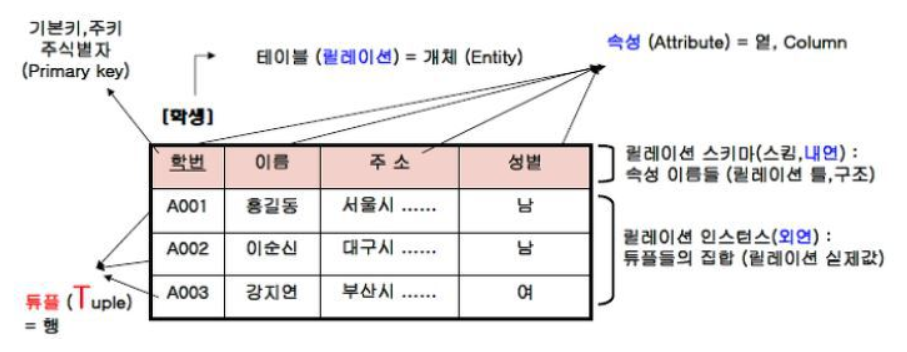

# 데이터베이스
 - 조직에서 여러 사람이 공유하여 사용할 목적으로 체계화하여 통합, 관리하는 데이터의 집합

## 데이터베이스 정의
 1. 통합된 데이터
  - 중복된 데이터를 배제하여 각 데이터의 일관성을 유지함으로 자원을 효율적으로 사용할 수 있다

 2. 저장된 데이터
  - 컴퓨터가 접근할 수 있는 저장 매체에 저장된다

 3. 운영 데이터
  - 조직을 운영하는 데 반드시 필요한 데이터를 관리한다

 4. 공용 데이터
  - 조직에서 여러 응용 프로그램이 공동으로 소유, 유지 가능하다


## 데이터베이스 특성
 1. 실시간 접근성
  - 수시로 접근하는 사용자 요구를 즉시 처리할 수 있어야 한다

 2. 계속적인 변화
  - 새로운 데이터의 삽입, 삭제, 갱신으로 항상 최신의 데이터를 유지해야 한다

 3. 동시 공유
  - 서로 다른 목적으로 사용되기에 동시에 여러 사람이 접근할 수 있어야 한다

 4. 내용에 의한 참조
  - 데이터를 참조할 때 사용자가 요구하는 데이터 내용으로 데이터를 찾을 수 있어야 한다

## 데이터베이스 구성 요소
 1. 개체(Entity)
  - 데이터로 표현하고자 하는 현실 세계의 대상체(개념, 정보의 단위)
  - 개체는 하나 이상의 속성으로 구성된다

 2. 속성(Attribute)
  - 데이터베이스를 구축하는 가장 작은 논리적 단위
  - 개체의 특성 및 상태를 나타낸다

 3. 관계(Relation)
  - 2개 이상의 개체 간의 관계
  - 1:1 관계 ex) 개체로 구분되는 사람과 그 사람의 주민등록번호의 관계
  - 1:n 관계 ex) 한 음식점과 음식점 메뉴의 관계
  - n:m 관계 ex) 여러 전공들과 여러 학생들의 관계

## DBMS
 - 데이터와 응용 프로그램 사이에 존재하여 서로를 중재한다

### DBMS 발전 과정
 - 계층 -> 네트워크 -> 관계 -> 객체지향 -> 객체관계

#### 계층 DBMS
 - 트리 구조를 기반으로 하는 계층 데이터 모델

#### 네트워크 DBMS
 - 레코드를 노드로, 레코드 사이의 관계가 간선으로 표현되는 그래프를 기반으로 하는 데이터 모델

#### 관계 DBMS
 - 테이블을 기반으로 하는 데이터 모델

#### 객체지향 DBMS
 - 객체 지향 프로그래밍 패러다임을 기반으로 하는 데이터 모델

#### 객체관계 DBMS
 - 관계 DBMS에 객체 지향 개념을 통합한 객체 관계 데이터 모델

### DBMS 기능
 1. 정의 : 데이터베이스에 저장될 데이터 타입과 구조에 대한 정의, 이용 방식, 제약 조건 등을 명시하는 기능
 2. 조작 : 데이터 검색, 갱신, 삽입, 삭제 등을 체계적으로 처리하기 위해 데이터 접근 수단 등을 정하는 기능
 3. 제어 : 데이터 정확성과 안정성을 유지하기 위한 무결성, 보안 및 권한 검사, 병행 수행 제어 등의 기능을 정하는 기능

## 관계형 데이터 모델


### 관계형 데이터 모델의 용어
 - 릴레이션(Relation): 데이터들을 2차원 테이블의 구조로 저장한 것
 - 속성(Attribute): 릴레이션의 열(=Column), 개체를 구성하는 속성들을 나타냅니다.
 - 튜플(Tuple): 릴레이션의 행(=Row). 속성들의 집합이며 레코드(Record)라고도 부릅니다.
 - 차수(Degree): 릴레이션을 구성하는 속성의 수
 - 카디널리티(Cardinality): 릴레이션에 입력된 튜플의 수
 - 도메인(Domain): 하나의 속성이 가질 수 있는 값들의 범위
 - 널(Null): 정보 부재를 나타내기 위해 사용되는 특수한 데이터 값
 - 릴레이션 스키마(Relation Schema): 릴레이션의 이름과 속성 이름의 집합(=릴레이션 스킴 =릴레이션 내포)
 - 릴레이션 인스턴스(Relation Instance): 릴레이션의 어느 시점까지 입력된 튜플들의 집합(=릴레이션 외연)

### 키
 - 슈퍼키(Super Key): 튜플을 유일하게 구분할 수 있는 하나 이상의 속성들로 구성된 키(유일성)
 - 후보키(Candidate Key): 튜플을 유일하게 구분하는데 필요한 최소한의 속성으로 구성된 키(유일성, 최소성)
 - 기본키(Primary Key): 후보키들 중에서 선택된 하나의 키(유일성, 최소성)
 - 대체키(Alternate Key): 후보키 중에서 기본키를 제외한 후보키(유일성, 최소성)
 - 외래키(Foreign Key):  한 릴레이션에서 다른 릴레이션을 참조할 때, 참조의 기준이 되는 속성(참조하는 릴레이션의 기본키와 동일)

### 무결성 제약조건
 - 개체 무결성: 기본키는 NULL이 될 수 없으며, 기본키를 구성하는 어떠한 속성값이라도 중복값이나 NULL값을 가질 수 없다
 - 참조 무결성: 참조 릴레이션의 기본키와 외래키가 일치해야 한다
 - 도메인 무결성: 각 속성값은 반드시 정의된 도메인(하나의 속성이 가질 수 있는 값들의 범위)만을 가져야 한다

### 정규화
 - 제1정규형: 한 릴레이션을 구성하는 모든 도메인이 원자값으로 된 정규형
 - 제2정규형: 릴레이션에 존재하는 부분 함수적 종속을 제거하여, 모든 속성이 기본키에 완전 함수 종속이 되도록 만들어진 정규형
 - 제3정규형: 릴레이션을 구성하는 속성들 간의 이행적 종속관계를 분해하여 속성들이 비이행적 함수 종속관계를 만족하도록 만들어진 정규형
 - 보이스코드: 릴레이션의 모든 결정자가 후보키가 되도록 하는 정규형
 - 제4정규형: 릴레이션에서 다치 종속 관계를 제거한 정규형
 - 제5정규형: 후보키를 통하지 않은 조인종속(Join Dependency)을 제거한 정규형

### 역정규화
 - 정규화를 통해 분리되었던 릴레이션에서 중복을 허용하고 다시 통합하거나 분할하여 구조를 재조정하는 과정
 - 데이터의 중복과 종속을 피하기 위해 릴레이션이 분리되어 있기 때문에 외래키를 이용해 참조해야하는 상황이 많아진다
   -> 데이터베이스에 있는 데이터를 검색하는 시간이 증가되어 성능이 저하될 수 있다
 - 따라서, 데이터베이스의 물리적 설계 과정에서 성능을 향상시키기 위해 역정규화를 실행한다

#### 릴레이션 역정규화
 - 릴레이션 병합: 잦은 참조로 성능이 저하될 경우 두 릴레이션을 병합한다
 - 릴레이션 분할: 자주 사용하는 속성이나 튜플을 분해하여 성능을 향상시킨다
  + 수직분할: 자주 사용하는 속성을 구분해서 분할
  + 수평분할: 자주 사용하는 튜플을 구분해서 분할

#### 속성 역정규화
 - 릴레이션의 성능을 향상시키기 위해 속성 또는 파생속성을 추가한다

### 인덱스
 - 데이터의 주소를 기억하고 관리하는 인덱스 파일(Index File)과 실제 데이터를 기억하는 데이터 파일(Data File)로 구성된다
 - 먼저 인덱스 파일에서 찾고자하는 데이터가 저장된 주소를 찾고 그 뒤 찾은 주소값을 통해 데이터 파일에서 데이터를 찾는다
 - 인덱스는 저장공간을 차지할뿐더러 정렬상태를 유지해야하기 때문에 튜플의 값이 변경되거나 수정, 삭제가 되면 인덱스도 재정렬을 해야 한다
 - 인덱스를 많이 사용하면 성능이 저하돼서 필요한 속성에만 지정해야 한다

### 트랜잭션
 - 데이터베이스 내에서 한꺼번에 모두 수행해야 할 연산들의 집합
 - 하나의 작업 처리를 위한 논리적인 단위
 - COMMIT: 결과를 데이터베이스에 영구적으로 반영한다
 - ROLLBACK: 오류가 발생했을 경우에는 수행 작업을 취소하고 이전 상태로 되돌린다

#### 트랜잭션의 특성
 - 원자성(Atomicity): 트랜잭션 내의 연산은 반드시 모두 반영되거나 아니면 전혀 반영되지 않아야 한다
 - 일관성(Consistency): 트랜잭션이 실행을 성공적으로 완료했다면, 언제나 일관성을 유지해야하며 결과에 모순이 없어야 한다
 - 독립성(Isolation): 하나의 트랜잭션이 수행되고 있을때 다른 트랜잭션이 접근할 수 없다
 - 지속성(Durability): 트랜잭션이 성공적으로 완료되면 그 결과는 영구적으로 반영되어야 한다

## SQL

### 데이터 정의어(DDL)
  - 데이터베이스의 구조, 데이터의 형태, 접근방식을 정의, 수정, 삭제한다
  - CREATE: 데이터를 저장할 테이블을 생성하는 명령어
```sql
CREATE TABLE Persons (
    PersonID int,
    LastName varchar(255),
    FirstName varchar(255),
    Address varchar(255),
    City varchar(255)
);
```
  - ALTER: 데이터를 저정한 테이블의 구조를 변경하는 명령어
```sql
ALTER TABLE Persons
ADD Email varchar(255);
MODIFY City varchar(255);
DROP COLUMN Email;
```
  - DROP: 데이터가 저정된 테이블을 삭제하는 명령어
```sql
DROP TABLE Persons;
```

### 데이터 조작어(DML)
 - 데이터베이스 내에 자료들을 검색하거나 삽입, 수정, 삭제한다
 - SELECT: 원하는 조건에 따른 데이터를 검색하는 명령어
```sql
SELECT * FROM Persons
```
 - INSERT: 데이터베이스에 데이터를 저장하는 명령어
```sql
INSERT INTO Persons (LastName, FirstName, Address, City)
VALUES ('Jeong', 'Inkwon', 'Nowon', 'Seoul')
```
 - UPDATE: 저장된 데이터를 갱신하는 명령어
```sql
UPDATE Persons
SET LastName = 'Jieun', FirstName = 'Kim'
WHERE PersonID = 1;
```
 - DELETE: 저장된 데이터를 삭제하는 명령어
```sql
DELETE FROM Persons WHERE PersonID = 1;
```

### 데이터 제어어(DCL)
 - 데이터의 정확성과 안전성을 유지하기 위해, 무결성 유지, 회복, 병행 제어, 보안, 권한 기능을 수행한다
 - COMMIT: 한 트랜잭션에서 데이터 조작이 정상적으로 완료되었으면, 그 결과를 데이터베이스에 반영하는 명령어
 - ROLLBACK: 트랜잭션 내에서 데이터를 수정하는 도중 이상이 생겼을때, 변경하기 이전으로 돌아가는 명령어
 - GRANT: 사용자에게 권한을 부여하는 명렁어
 - REVOKE: 부여된 권한을 취소하는 명령어
