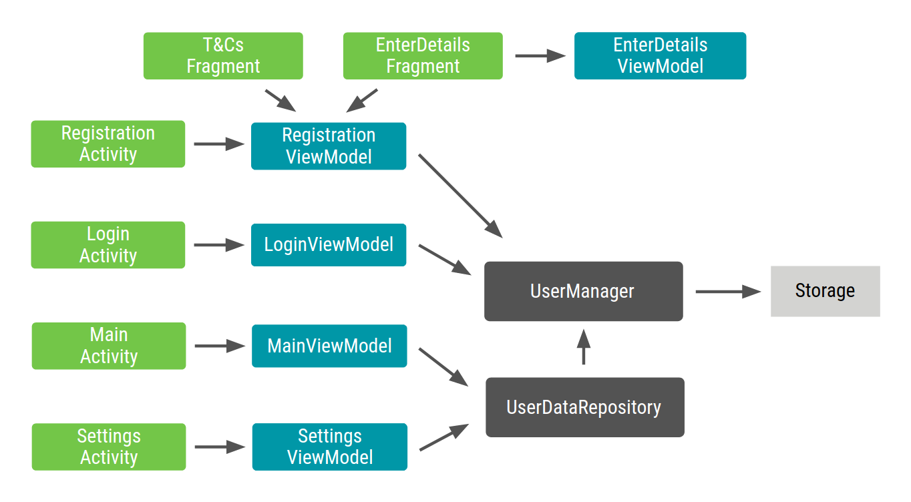

# Dagger

- 완전 정적, 컴파일 타임 Dependency Injection 프레임워크


## Annotation Processors

### Annotations

- Annotation은 클래스, 메서드, 필드, 다른 annotation에 대한 메타데이터이다
- 런타임 동안 리플렉션을 이용하여 annotation에 접근할 수 있다

### Annotation Processors

- Annotation Processors는 컴파일 동안 코드를 생성하여 상용구를 제거해준다
- 컴파일 동안 진행되므로 성능에 영향을 주지 않는다


## Dagger 2 Annotations

### @Inject

#### Class Constructor

- @Inject 주석이 지정된 타입의 인스턴스를 어떻게 생성할 지 Dagger에 알려준다
- 인스턴스를 생성하기 위해 필요한 dependency가 무엇인지 Dagger에 알려준다

```kotlin
class Repository @Inject constructor(
    private val localDataSource: LocalDataSource,
    private val remoteDataSource: RemoteDataSource
)
```

#### Class Field

- @Inject 주석이 지정된 타입의 인스턴스를 생성하여 필드에 주입한다

```kotlin
class MainActivity : AppCompatActivity() {
    @Inject lateinit var viewModel: ViewModel
    ...
}
```

### @Component

- 컴포넌트는 컴파일 시 그래프를 생성하는데 필요한 정보를 Dagger에게 준다
- 컴포넌트의 파라미터가 있는 메서드는 어떤 클래스가 주입을 요청하는지 나타낸다
- 컴포넌트의 반환값이 있는 메서드는 해당 타입의 인스턴스를 생성한다


```kotlin
@Component
interface AppComponent {
    fun inject(activity: MainActivity)
    fun userManager(): UserManager
}
```

### @Subcomponent

- 서브 컴포넌트는 부모 컴포넌트의 그래프를 상속받는다
- 따라서, 부모 컴포넌트가 제공하는 모든 객체를 서브 컴포넌트 역시 제공한다
- 서브 컴포넌트의 객체는 부모 컴포넌트의 객체를 의존할 수 있다

```kotlin
@Subcomponent
interface ActivityComponent {
    @Subcomponent.Factory
    interface Factory {
      fun create(): ActivityComponent
    }
}

@Module(subcomponents = ActivityComponent::class)
class SubcomponentsModule

@Component(modules = SubcomponentsModule::class)
interface AppComponent {
    fun activityComponent(): ActivityComponent.Factory
}
```

### @Module

- 모듈은 해당 타입의 인스턴스를 어떻게 제공하는지 Dagger에 알려준다
- @Inject로 주입할 수 없는 인스턴스(인터페이스, 외부 라이브러리 클래스)를 제공하기 위해 주로 사용된다
- @Provides와 @Binds 주석을 이용하여 인스턴스를 제공한다

```kotlin
@Module
abstract class NetworkModule {
    @Binds
    abstract fun remoteDataSource(dataSource: RemoteDataSource): DataSource
  
    @Provides
    fun retrofit(): Retrofit {
        return Retrofit.Builder()
            .baseUrl(BASE_URL)
            .addConverterFactory(GsonConverterFactory.create())
            .build()
    }
}
```

### @Provides

- 주로 외부 라이브러리 클래스의 인스턴스를 제공하는데 사용된다

### @Binds

- 주로 인터페이스의 인스턴스를 제공하는데 사용된다
- @Binds 주석이 지정된 메서드는 abstract 메서드여야 한다

### @BindsInstance

- 그래프 외부에서 생성된 객체를 제공하는데 사용된다
- 주로 Context 객체를 제공하는데 사용된다

```kotlin
@Component
interface AppComponent {
    @Component.Factory
    interface Factory {
        fun create(@BindsInstance context: Context): AppComponent
    }
}
```

### @Scope

- 컴포넌트와 연결된 객체의 생명주기 범위이다
- 안드로이드에서는 주로 액티비티, 프래그먼트 등 화면의 생명주기와 맞추어 사용한다
- 객체의 생명주기 동안 인스턴스를 유지한다(보통은 주입할 때마다 인스턴스를 생성한다)

```kotlin
@Scope
@MustBeDocumented
@Retention(value = AnnotationRetention.RUNTIME)
annotation class ActivityScope

@ActivityScope
@Subcomponent
interface ActivityComponent { ... }

@ActivityScope
class ViewModel @Inject constructor() { ... }
```

### @Qualifier

- Dagger는 여러 구현이 있는 타입의 주입을 요청할 때 어떻게 제공해야 하는지 알지 못한다
- @Qualifier는 Dagger가 어떤 구현을 가지고 인스턴스를 제공해야 하는지 알려준다

```kotlin
@Retention(AnnotationRetention.BINARY)
@Qualifier
annotation class LocalDataSource

@Retention(AnnotationRetention.BINARY)
@Qualifier
annotation class RemoteDataSource

@Module
abstract class DataSourceModule {
    @Binds
    @LocalDataSource
    abstract fun localDataSource(dataSource: LocalDataSource): DataSource
  
    @Binds
    @RemoteDataSource
    abstract fun remoteDataSource(dataSource: RemoteDataSource): DataSource
}
```


## Dagger Dependency Injection

### Application Graph


### @Inject Annotation

```kotlin
// UserRepository
class UserRepository @Inject constructor(
    private val localDataSource: DataSource,
    private val remoteDataSource: DataSource
) { ... }

// UserLocalDataSource
class UserLocalDataSource @Inject constructor(
    private val context: Context
) : DataSource { ... }

// UserRemoteDataSource
class UserRemoteDataSource @Inject constructor(
    private val loginService: LoginRetrofitService
) : DataSource { ... }

// LoginViewModel
class LoginViewModel @Inject constructor(
    private val userRepository: UserRepository
) { ... }

// LoginActivity
class LoginActivity: Activity() {
    @Inject lateinit var loginViewModel: LoginViewModel
    ...
}

// LoginViewModel
class LoginViewModel(
    @Inject private val userRepository: UserRepository
) { ... }
```


### @Module Annotation

```kotlin
@Module
abstract class DataModule {
    @Provides
    fun retrofit(): Retrofit {
        return Retrofit.Builder()
            .baseUrl("https://example.com")
            .build()
            .create(LoginService::class.java)
    }
  
    @Binds
    abstract fun userLocalDataSoruce(dataSource: UserLocalDataSource): DataSource
  
    @Binds
    abstract fun userRemoteDataSoruce(dataSource: UserRemoteDataSource): DataSource
}
```


### @Component Annotation

```kotlin
@Component(modules = [DataModule::class])
interface AppComponent {
    @Component.Factory
    interface Factory {
        fun create(@BindsInstance context: Context): AppComponent
    }
    
    fun inject(activity: LoginActivity)
}
```


### Injecting the graph into an Activity

```kotlin
class MyApplication : Application() {
    val appComponent: AppComponent by lazy {
        DaggerAppComponent.factory().create(applictionContext)
    }
}
```

```kotlin
class LoginActivity: Activity() {
    @Inject lateinit var loginViewModel: LoginViewModel
    
    override fun onCreate(savedInstanceState: Bundle?) {
        (application as MyApplication).appComponent.inject(this)
        super.onCreate(savedInstanceState)
        setContentView(R.layout.activity_login)
        ...
    }
}
```


### Using Scopes

```kotlin
@Singleton
@Component(modules = [DataModule::class])
interface AppComponent { ... }
```

```kotlin
@Singleton
class UserRepository @Inject constructor(
    private val localDataSource: DataSource,
    private val remoteDataSource: DataSource
) { ... }
```


### Subcomponents

```kotlin
@Subcomponent
interface LoginComponent {
    @Subcomponent.Factory
    interface Factory {
        fun create(): LoginComponent
    }
    
    fun inject(activity: LoginActivity)
}
```

```kotlin
@Module(subcomponents = [LoginComponent::class])
class AppSubcomponents
```

```kotlin
@Singleton
@Component(modules = [DataModule::class, AppSubcomponents::class])
interface AppComponent {
    @Component.Factory
    interface Factory {
        fun create(@BindsInstance context: Context): AppComponent
    }
    
//    fun inject(activity: LoginActivity)
    fun loginComponent(): LoginComponent.Factory
}
```

```kotlin
class LoginActivity: Activity() {
    @Inject lateinit var loginViewModel: LoginViewModel
    
    override fun onCreate(savedInstanceState: Bundle?) {
        (application as MyApplication).appComponent.loginComponent().create().inject(this)
        super.onCreate(savedInstanceState)
        setContentView(R.layout.activity_login)
        ...
    }
}
```


### Scoping Subcomponents

```kotlin
@Scope
@MustBeDocumented
@Retention(value = AnnotationRetention.RUNTIME)
annotation class ActivityScope
```

```kotlin
@ActivityScope
@Subcomponent
interface LoginComponent { ... }
```

```kotlin
@ActivityScope
class LoginViewModel @Inject constructor(
    private val userRepository: UserRepository
) { ... }
```


### @Qualifier Annotation

```kotlin
@Retention(AnnotationRetention.BINARY)
@Qualifier
annotation class UserLocalDataSource

@Retention(AnnotationRetention.BINARY)
@Qualifier
annotation class UserRemoteDataSource
```

```kotlin
@Module
abstract class DataModule {  
    ...
  
    @UserLocalDataSource
    @Binds
    abstract fun userLocalDataSoruce(dataSource: UserLocalDataSource): DataSource
  
    @UserRemoteDataSource
    @Binds
    abstract fun userRemoteDataSoruce(dataSource: UserRemoteDataSource): DataSource
}
```

```kotlin
@Singleton
class UserRepository @Inject constructor(
    @UserLocalDataSource private val localDataSource: DataSource,
    @UserRemoteDataSource private val remoteDataSource: DataSource
) { ... }
```


## CodeLab

### Dependency Graph




### Installation

```groovy
apply plugin: 'com.android.application'
apply plugin: 'kotlin-android'
apply plugin: 'kotlin-android-extensions'
apply plugin: 'kotlin-kapt'

...

dependencies {
    ...
    def dagger_version = "2.27"
    implementation "com.google.dagger:dagger:$dagger_version"
    kapt "com.google.dagger:dagger-compiler:$dagger_version"
}
```


### @Inject Annotation

```kotlin
// Storage
class SharedPreferencesStorage @Inject constructor(
  context: Context
) : Storage { ... }

// UserManager
class UserManager @Inject constructor(
  private val storage: Storage
) { ... }

// UserRepository
class UserDataRepository @Inject constructor(
  private val userManager: UserManager
) { ... }

// RegistrationViewModel
class RegistrationViewModel @Inject constructor(
  val userManager: UserManager
) { ... }

// LoginViewModel
class LoginViewModel @Inject constructor(
  private val userManager: UserManager
) { ... }
  
// MainViewModel
class MainViewModel @Inject constructor(
  private val userDataRepository: UserDataRepository
) { ... }

// SettingsViewModel
class SettingsViewModel @Inject constructor(
  private val userDataRepository: UserDataRepository,
  private val userManager: UserManager
) { ... }

// EnterDetailsViewModel
class EnterDetailsViewModel @Inject constructor() { ... }

// RegistrationActivity
class RegistrationActivity : AppCompatActivity() {
  @Inject lateinit var registrationViewModel: RegistrationViewModel
  ...
}

// LoginActivity
class LoginActivity : AppCompatActivity() {
  @Inject lateinit var loginViewModel: LoginViewModel
  ...
}

// MainActivity
class MainActivity : AppCompatActivity() {
  @Inject lateinit var mainViewModel: MainViewModel
  ...
}
  
// SettingsActivity
class SettingsActivity : AppCompatActivity() {
  @Inject lateinit var settingsViewModel: SettingsViewModel
  ...
}

// EnterDetailsFragment
class EnterDetailsFragment : Fragment() {
  @Inject lateinit var registrationViewModel: RegistrationViewModel
  @Inject lateinit var enterDetailsViewModel: EnterDetailsViewModel
  ...
}

// TermsAndConditionsFragment
class TermsAndConditionsFragment : Fragment() {
  @Inject lateinit var registrationViewModel: RegistrationViewModel
  ...
}
```


### @Component Annotation

```kotlin
@Component
interface AppComponent {
  fun inject(activity: RegistrationActivity)
  fun inject(activity: LoginActivity)
  fun inject(activity: MainActivity)
  fun inject(activity: SettingsActivity)
  fun inject(fragment: EnterDetailsFragment)
  fun inject(fragment: TermsAndConditionsFragment)
}
```


### @Module, @Binds, @BindsInstance Annotation

```kotlin
@Module
abstract class StorageModule {
  @Binds
  abstract fun provideStorage(storage: SharedPreferencesStorage): Storage
}
```

```kotlin
@Component(modules = StorageModule::class)
interface AppComponent {
  @Component.Factory
  interface Factory {
    fun create(@BindsInstance context: Context): AppComponent
  }
  
  fun inject(activity: RegistrationActivity)
  fun inject(activity: LoginActivity)
  fun inject(activity: MainActivity)
  fun inject(activity: SettingsActivity)
  fun inject(fragment: EnterDetailsFragment)
  fun inject(fragment: TermsAndConditionsFragment)
}
```


### Injecting the graph into an Activity

```kotlin
class MyApplication : Application() {
  val appComponent: AppComponent by lazy {
    DaggerAppComponent.factory().create(applictionContext)
  }
}
```

```kotlin
class RegistrationActivity: AppCompatActivity() {
  @Inject lateinit var registrationViewModel: RegistrationViewModel
  
  override fun onCreate(savedInstanceState: Bundle?) {
    (application as MyApplication).appComponent.inject(this)
    super.onCreate(savedInstanceState)
    setContentView(R.layout.activity_registration)
    ...
  }
}

class EnterDetailsFragment : Fragment() {
  @Inject lateinit var registrationViewModel: RegistrationViewModel
  @Inject lateinit var enterDetailsViewModel: EnterDetailsViewModel
  
  override fun onAttach(context: Context) {
    super.onAttach(context)
    (requireActivity().application as MyApplication).appComponent.inject(this)
  }
  ...
}

class TermsAndConditionsFragment : Fragment() {
  @Inject lateinit var registrationViewModel: RegistrationViewModel
  
  override fun onAttach(context: Context) {
    super.onAttach(context)
    (requireActivity().application as MyApplication).appComponent.inject(this)
  }
  ...
}
```


### Using Scopes

```kotlin
@Singleton
@Component(modules = StorageModule::class)
interface AppComponent { ... }
```

```kotlin
@Singleton
class UserManager @Inject constructor(private val storage: Storage) {
  ...
}
```


### Subcomponents

```kotlin
@Subcomponent
interface RegistrationComponent {
  @Subcomponent.Factory
  interface Factory {
    fun create(): RegistrationComponent
  }
  
  fun inject(activity: RegistrationActivity)
  fun inject(fragment: EnterDetailsFragment)
  fun inject(fragment: TermsAndConditionsFragment)
}
```

```kotlin
@Module(subcomponents = RegistrationComponent::class)
class AppSubcomponents
```

```kotlin
@Singleton
@Component(modules = [StorageModule::class, AppSubcomponents::class])
interface AppComponent { 
  @Component.Factory
  interface Factory {
    fun create(@BindsInstance context: Context): AppComponent
  }
  
  fun registrationComponent(): RegistrationComponent.Factory
  
  fun inject(activity: LoginActivity)
  fun inject(activity: MainActivity)
  fun inject(activity: SettingsActivity)
}
```


### Scoping Subcomponents

```kotlin
@Scope
@MustBeDocumented
@Retention(value = AnnotationRetention.RUNTIME)
annotation class ActivityScope
```

```kotlin
@ActivityScope
@Subcomponent
interface RegistrationComponent { ... }
```

```kotlin
@ActivityScope
class RegistrationViewModel @Inject constructor(val userManager: UserManager) {
  ...
}
```

```kotlin
class RegistrationActivity : AppCompatActivity() {
  @Inject lateinit var registrationViewModel: RegistrationViewModel
  lateinit var registrationComponent: RegistrationComponent

  override fun onCreate(savedInstanceState: Bundle?) {
//    (application as MyApplication).appComponent.inject(this)
    registrationComponent = (application as MyApplication).appComponent.registrationComponent().create() 
    registrationComponent.inject(this)

    super.onCreate(savedInstanceState)
    ...
  }
  ...
}

class EnterDetailsFragment : Fragment() {
  @Inject lateinit var registrationViewModel: RegistrationViewModel
  @Inject lateinit var enterDetailsViewModel: EnterDetailsViewModel
  
  override fun onAttach(context: Context) {
    super.onAttach(context)
//    (requireActivity().application as MyApplication).appComponent.inject(this)
    (activity as RegistraionActivity).registrationComponent.inject(this)
  }
  ...
}

class TermsAndConditionsFragment : Fragment() {
  @Inject lateinit var registrationViewModel: RegistrationViewModel
  
  override fun onAttach(context: Context) {
    super.onAttach(context)
//    (requireActivity().application as MyApplication).appComponent.inject(this)
    (activity as RegistraionActivity).registrationComponent.inject(this)
  }
  ...
}
```


