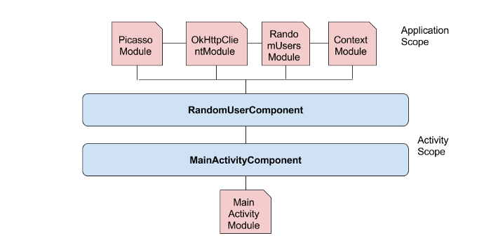

# Dagger

- 완전 정적, 컴파일 타임 Dependency Injection 프레임워크


## Annotation Processors

### Annotations

- Annotation은 클래스, 메서드, 필드, 다른 annotation에 대한 메타데이터이다
- 런타임 동안 리플렉션을 이용하여 annotation에 접근할 수 있다

### Annotation Processors

- Annotation Processors는 컴파일 동안 코드를 생성하여 상용구를 제거해준다
- 컴파일 동안 진행되므로 성능에 영향을 주지 않는다


## Dagger 2 Annotations

### @Inject

- @Inject annotation은 의존성 주입을 요청한다
- 컴포넌트가 모듈로부터 객체를 생성하여 전달한다

### @Component

- 모듈을 이용하여 dependency를 생성하고, @Inject로 의존성 주입을 요청한 곳에 dependency의 인스턴스를 전달한다
- Dependency를 요청 받고 중비하는 Dagger의 주된 역할을 담당한다

### @Subcomponent

- 컴포넌트는 계층 관계를 형성할 수 있다
- @Inject로 주입을 요청 받으면 Subcomponent에서 먼저 dependency를 찾고, 없으면 부모 컴포넌트에서 찾는다

### @Module

- 컴포넌트에 연결되어 dependency를 생성한다

### @Provides

- 모듈 안에서 dependency를 생성하는 메서드를 나타낸다

### @Binds

- 인터페이스를 제공할 때 어떤 구현 클래스가 필요한지를 나타낸다
- abstract 메서드에서만 사용된다

### @BindsInstance

- 컴포넌트 빌더내의 메소드나 컴포넌트 팩토리내의 파라미터로 객체를 전달한다

### @Scope

- 컴포넌트와 연결된 객체의 생명주기 범위이다
- 안드로이드에서는 주로 액티비티, 프래그먼트 등 화면의 생명주기와 맞추어 사용한다
- 객체의 생명주기 동안 인스턴스를 유지한다(보통은 주입할 때마다 인스턴스를 생성한다)


## Example

```kotlin
interface House {
    fun prepareForWar()
    fun reportForWar()
}
```

```kotlin
class Starks : House {

    override fun prepareForWar() {
        //do something
        println(this::class.java.simpleName + " prepared for war")
    }

    override fun reportForWar() {
        //do something
        println(this::class.java.simpleName + " reporting..")
    }
}
```

```kotlin
class Boltons : House {
   
    override fun prepareForWar() {
        //do something
        println(this::class.java.simpleName + " prepared for war")
    }

    override fun reportForWar() {
        //do something
        println(this::class.java.simpleName + " reporting..")
    }
}
```


### Without Dependency Injection

```kotlin
class War { // Dependant

    private val starks: Starks // Dependency
    private val boltons: Boltons // Dependency
  
    init {
        starks = Starks()
        boltons = Boltons()
      
      	starks.prepareForWar()
        starks.reportForWar()
        boltons.prepareForWar()
        starks.reportForWar()
    }
}
```


### With Dependency Injection

```kotlin
class War( // DI - getting dependencies from else where via constructor
    private val starks: Starks,
    private val boltons: Boltons
) {
    fun prepare() {
        starks.prepareForWar()
        boltons.prepareForWar()
    }

    fun report() {
        starks.reportForWar()
        boltons.reportForWar()
    }
}
```

```kotlin
class BattleOfBastards {

    fun main(args: Array<String>) {
        val starks = Starks()
        val boltons = Boltons()

        val war = War(starks, boltons) // Dependency Injection
        war.prepare()
        war.report()
    }
}
```


### Adding @Inject, @Component Annotation

```kotlin
class Boltons @Inject constructor() : House {

    override fun prepareForWar() {
        println(this::class.java.simpleName + " prepared for war")
    }

    override fun reportForWar() {
        println(this::class.java.simpleName + " reporting..")
    }
}
```

```kotlin
class Starks @Inject constructor() : House {

    override fun prepareForWar() {
        println(this::class.java.simpleName + " prepared for war")
    }

    override fun reportForWar() {
        println(this::class.java.simpleName + " reporting..")
    }
}
```

```kotlin
class War @Inject constructor(
    private val starks: Starks,
    private val boltons: Boltons
) {

    fun prepare(){
        starks.prepareForWar()
        boltons.prepareForWar()
    }

    fun report(){
        starks.reportForWar()
        boltons.reportForWar()
    }

}
```

```kotlin
@Component
interface BattleComponent {
    fun getWar(): War
}
```

```kotlin
class BattleOfBastards {

    fun main(args: Array<String>){
//        Mannual DI
//        val starks = Starks()
//        val boltons = Boltons()
//        val war = War(starks, boltons)
//        war.prepare()
//        war.report()

//      Using Dagger 2
        val component = DaggerBattleComponent.create()
        val war = component.getWar()
        war.prepare()
        war.report()
    }
}
```


### Adding @Inject, @Component Annotation

```kotlin
class Cash {
    init {
        // do something
    }
}
```

```kotlin
class Soldiers {
    init {
      	// do something
    }
}
```

```kotlin

@Module //The module
class BraavosModule(
    val cash: Cash,
    val soldiers: Soldiers
) {
    @Provides //Provides cash dependency
    fun provideCash(): Cash {
        return cash
    }

    @Provides //provides soldiers dependency
    fun provideSoldiers(): Soldiers {
        return soldiers
    }

}
```

```kotlin
@Component(modules = BraavosModule::class)
interface BattleComponent {
    fun getWar(): War
    fun getCash(): Cash
    fun getSoldiers(): Soldiers
}
```

```kotlin
class BattleOfBastards {
    fun main(args: Array<String>){

        val cash = Cash()
        val soldiers = Soldiers()

        val component = DaggerBattleComponent
                .builder().braavosModule(BraavosModule(cash, soldiers)).build()
        val war = component.getWar()
        war.prepare()
        war.report()
        //using cash and soldiers
        component.getCash()
        component.getSoldiers()

    }
}
```


## Kickstarter Project

### Dependency Graph

- 초록색으로 칠해진 클래스가 Top-Level Dependency이다


### All Components and Modules

- 프로젝트에 사용되는 모든 컴포넌트와 모듈의 그래프



### MainActivity

```kotlin
override fun onCreate(savedInstanceState: Bundle?) {
    super.onCreate(savedInstanceState)
    setContentView(R.layout.activity_main)
    initViews()

    val gsonBuilder = GsonBuilder()
    val gson = gsonBuilder.create()

    Timber.plant(Timber.DebugTree())

    val cacheFile = File(this.cacheDir, "HttpCache")
    cacheFile.mkdirs();

    val cache = Cache(cacheFile, 10 * 1000 * 1000) //10 MB

    val httpLoggingInterceptor =
        HttpLoggingInterceptor(HttpLoggingInterceptor.Logger { message -> 
            Timber.i(message)
        })

    httpLoggingInterceptor.level = HttpLoggingInterceptor.Level.BODY


    val okHttpClient = OkHttpClient()
            .newBuilder()
            .cache(cache)
            .addInterceptor(httpLoggingInterceptor)
            .build()

    val okHttpDownloader = OkHttp3Downloader(okHttpClient)

    picasso = Picasso.Builder(this).downloader(okHttpDownloader).build()

    retrofit = Retrofit.Builder()
            .client(okHttpClient)
            .baseUrl("https://randomuser.me/")
            .addConverterFactory(GsonConverterFactory.create(gson))
            .build()

    populateUsers()

}
```


### Step 1: Setup Dagger

```groovy
dependencies {
    implementation 'com.google.dagger:dagger:2.13'
    annotationProcessor 'com.google.dagger:dagger-compiler:2.13'
}
```


### Step 2: Creating Component

- 컴포넌트는 Top-Level dependency를 전달한다

#### RandomUserComponent

```kotlin
@Component
interface RandomUserComponent {
  
    fun getRandomUserService(): RandomUsersApi
  
    fun getPicasso(): Picasso
  
}
```


### Step 3: Creating Modules

- 모듈은 Top-Level dependency에 필요한 dependency를 전달한다

#### RandomUsersModule

```kotlin
@Module
class RandomUsersModule {

    @Provides
    fun randomUsersApi(retrofit: Retrofit): RandomUsersApi {
        return retrofit.create(RandomUsersApi::class.java)
    }

    @Provides
    fun retrofit(okHttpClient : OkHttpClient,
                             gsonConverterFactory: GsonConverterFactory, gson: Gson) : Retrofit {
        return Retrofit.Builder()
                .client(okHttpClient)
                .baseUrl("https://randomuser.me/")
                .addConverterFactory(gsonConverterFactory)
                .build()
    }

    @Provides
    fun gson(): Gson {
        val gsonBuilder = GsonBuilder()
        return gsonBuilder.create()
    }

    @Provides
    fun gsonConverterFactory(gson: Gson): GsonConverterFactory {
        return GsonConverterFactory.create(gson)
    }


}
```


#### PicassoModule

```kotlin
@Module
class PicassoModule {

    @Provides
    fun picasso(context: Context, okHttp3Downloader: OkHttp3Downloader): Picasso {
        return Picasso.Builder(context).
                downloader(okHttp3Downloader).
                build()
    }

    @Provides
    fun okHttp3Downloader(okHttpClient: OkHttpClient): OkHttp3Downloader {
        return OkHttp3Downloader(okHttpClient)
    }

}
```


#### OkHttpClientModule

```kotlin
@Module
class OkHttpClientModule {

    @Provides
    fun okHttpClient(cache: Cache, httpLoggingInterceptor: HttpLoggingInterceptor): OkHttpClient {
        return OkHttpClient()
                .newBuilder()
                .cache(cache)
                .addInterceptor(httpLoggingInterceptor)
                .build()
    }

    @Provides
    fun cache(cacheFile: File): Cache {
        return Cache(cacheFile, 10 * 1000 * 1000) //10 MB
    }

    @Provides
    fun file(context: Context): File {
        val file = File(context.cacheDir, "HttpCache")
        file.mkdirs()
        return file
    }

    @Provides
    fun httpLoggingInterceptor(): HttpLoggingInterceptor {
        val httpLoggingInterceptor =
            HttpLoggingInterceptor(HttpLoggingInterceptor.Logger { message -> 
                Timber.i(message)
            })
        httpLoggingInterceptor.level = HttpLoggingInterceptor.Level.BODY
        return httpLoggingInterceptor
    }

}
```


#### ContextModule

```kotlin
@Module
class ContextModule(
    val context: Context
) {
  
    @Provides
    fun context(): Context { return context.applicationContext }
}
```


### Step 4: Connecting all Modules

- RandomUserModule은 OkHttpClientModule이 필요하다
- OkHttpClientModule은 ContextModule이 필요하다
- PicassoModule은 OkHttpClientModule과 ContextModule이 필요하다(OkHttpClientModule에 ContextModule이 포함되어 있다)

```kotlin
//in RandomUsersModule.java
@Module(includes = OkHttpClientModule::class)
class RandomUsersModule { ... }

//in OkHttpClientModule.java
@Module(includes = ContextModule::class)
class OkHttpClientModule { ... }

//in PicassoModule.java
@Module(includes = OkHttpClientModule::class)
class PicassoModule { ... }
```


### Step 5: Educating Component

- 컴포넌트와 모듈을 연결시켜준다

```kotlin
@Component(modules = [RandomUsersModule::class, PicassoModule::class])
interface RandomUserComponent {
    fun getRandomUserService(): RandomUsersApi
    fun getPicasso(): Picasso
}
```


### Step 6: Build it

```kotlin
class MainActivity : AppCompatActivity() {
  
    lateinit var randomUsersApi: RandomUsersApi
    lateinit var picasso: Picasso
  	...
  	
    override fun onCreate(savedInstanceState: Bundle?) {
        super.onCreate(savedInstanceState);
        setContentView(R.layout.activity_main)
        ...
        val daggerRandomUserComponent = DaggerRandomUserComponent.builder()
                .contextModule(ContextModule(this))
                .build()
        picasso = daggerRandomUserComponent.getPicasso()
        randomUsersApi = daggerRandomUserComponent.getRandomUserService()
        populateUsers()
        ...
    }
  ...
}
```


#### @Scope Annotation

- Picasso와 Retrofit의 인스턴스를 여러번 생성하지 않고 하나의 인스턴스로 사용하게 한다

```kotlin
@Scope
@MustBeDocumented
@Retention(value = AnnotationRetention.RUNTIME)
annotation class RandomUserApplicationScope
```

```kotlin
@RandomUserApplicationScope
@Component(modules = [RandomUsersModule::class, PicassoModule::class])
interface RandomUserComponent { ... }

@Module(includes = OkHttpClientModule::class)
class PicassoModule {
  ...
    @RandomUserApplicationScope
    @Provides
    fun picasso(context: Context, okHttp3Downloader: OkHttp3Downloader): Picasso {
        return Picasso.Builder(context).
                downloader(okHttp3Downloader).
                build()
    }
  ...
}

@Module(includes = OkHttpClientModule::class)
class RandomUsersModule {
  ...
    @RandomUserApplicationScope
    @Provides
    fun retrofit(okHttpClient: OkHttpClient,
                             gsonConverterFactory: GsonConverterFactory, gson: Gson): Retrofit{
        return Retrofit.Builder()
                .client(okHttpClient)
                .baseUrl("https://randomuser.me/")
                .addConverterFactory(gsonConverterFactory)
                .build()
    }
    ...
}
```


#### @Qualifier Annotation

- 같은 타입의 인스턴스를 반환하는 @Provides 메서드가 여러 개일 때 구분할 수 있게 해준다

```kotlin
@Retention(AnnotationRetention.BINARY)
@Qualifier
annotation class ApplicationContext

@Retention(AnnotationRetention.BINARY)
@Qualifier
annotation class ActivityContext
```

```kotlin
@Module
class ContextModule {
....
    @ApplicationContext
    @RandomUserApplicationScope
    @Provides
    context(): Context { return context.applicationContext }
}
```

```kotlin
@Module(includes = ContextModule::class)
class OkHttpClientModule {
...
    @Provides
    @RandomUserApplicationScope
    fun file(@ApplicationContext context: Context): File {
        val file = new File(context.cacheDir, "HttpCache")
        file.mkdirs()
        return file
    }
...
}

@Module(includes = OkHttpClientModule::class)
class PicassoModule {

    @RandomUserApplicationScope
    @Provides
    fun picasso(@ApplicationContext context: Context, okHttp3Downloader: OkHttp3Downloader): Picasso {
        return Picasso.Builder(context).
                downloader(okHttp3Downloader).
                build()
    }
  	...
}
```


### Step 7: Creating Activity level scope

```kotlin
@Scope
@MustBeDocumented
@Retention(value = AnnotationRetention.RUNTIME)
annotation class MainActivityScope
```


### Step 8: Creating Component for MainActivity

```kotlin
@Subcomponent(modules = MainActivityModule::class, dependencies = RandomUserComponent::class)
@MainActivityScope
interface MainActivityComponent {
    fun getRandomUserAdapter(): RandomUserAdapter
    fun getRandomUserService(): RandomUsersApi
}
```


### Step 9: Creating MainActivity Module

```kotlin
@Module
class MainActivityModule(
    private val mainActivity: MainActivity
) {

    @Provides
    @MainActivityScope
    fun randomUserAdapter(picasso: Picasso): RandomUserAdapter {
        return RandomUserAdapter(mainActivity, picasso)
    }
}
```


### Step 10: Creating Application Class

```kotlin
class RandomUserApplication : Application() {

    //add application name in Manifest file
    private lateinit var randomUserApplicationComponent: RandomUserComponent
  
    companion object {
      	fun get(activity: Activity): RandomUserApplication {
          	return (activity as RandomUserApplication).application
        }
    }

    override fun onCreate() {
        super.onCreate()
        Timber.plant(Timber.DebugTree())

        randomUserApplicationComponent = DaggerRandomUserComponent.builder()
                .contextModule(ContextModule(this))
                .build()
    }

    fun getRandomUserApplicationComponent(): RandomUserComponent {
        return randomUserApplicationComponent
    }
}
```


### Step 11: Modifying MainActivity

```kotlin
class MainActivity : AppCompatActivity() {
	...
  override fun onCreate(savedInstanceState: Bundle?) {
      val mainActivityComponent = DaggerMainActivityComponent.builder()
          .mainActivityModule(MainActivityModule(this))
          .randomUserComponent(RandomUserApplication.get(this).getRandomUserApplicationComponent())
          .build()
    randomUsersApi = mainActivityComponent.getRandomUserService()
    mAdapter = mainActivityComponent.getRandomUserAdapter()
    ...
  }

}
```


### Step 12: Using @Inject Annotation

#### Modifying MainActivityComponent

```kotlin
@Component(modules = MainActivityModule::class, dependencies = RandomUserComponent::class)
@MainActivityScope
interface MainActivityComponent {
  
    // fun getRandomUserAdapter(): RandomUserAdapter
    // fun getRandomUserService(): RandomUsersApi
    fun injectMainActivity(mainActivity: MainActivity)

}
```


#### Modifying MainActivity

```kotlin
class MainActivity : AppCompatActivity() {
  
    @Inject
    lateinit var randomUsersApi: RandomUsersApi

    @Inject
    lateinit var mAdapter: RandomUserAdapter
  	...
    
    override fun onCreate(savedInstanceState: Bundle?) {
        super.onCreate(savedInstanceState)
        setContentView(R.layout.activity_main)

        val mainActivityComponent = DaggerMainActivityComponent.builder()
                .mainActivityModule(MainActivityModule(this))
                .randomUserComponent(RandomUserApplication.get(this).getRandomUserApplicationComponent())
                .build()
    	// randomUsersApi = mainActivityComponent.getRandomUserService();
    	// mAdapter = mainActivityComponent.getRandomUserAdapter();
        mainActivityComponent.injectMainActivity(this)
        ...
  }
}
```

