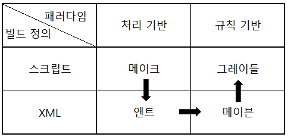
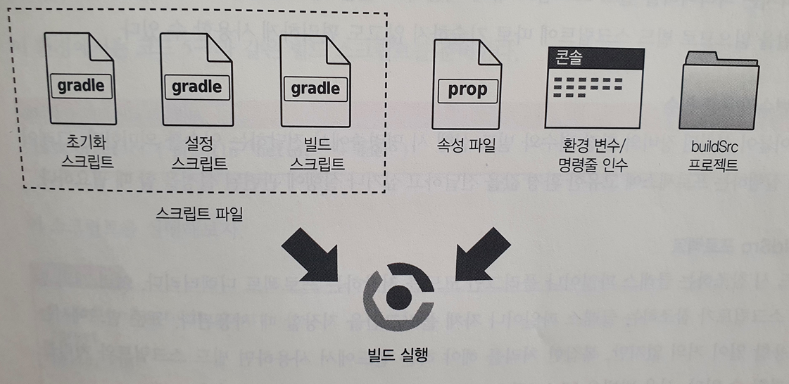
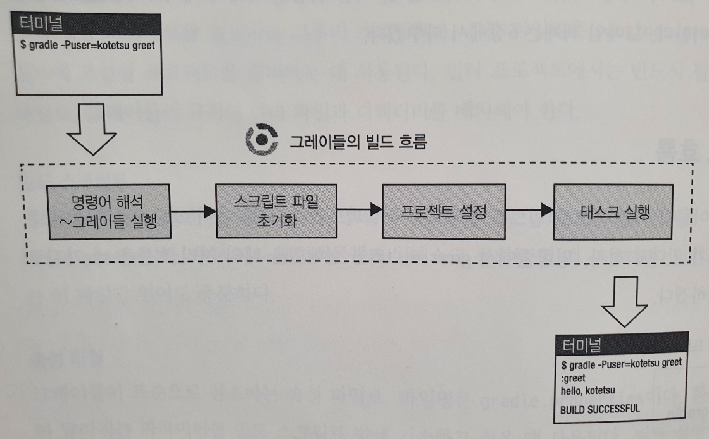
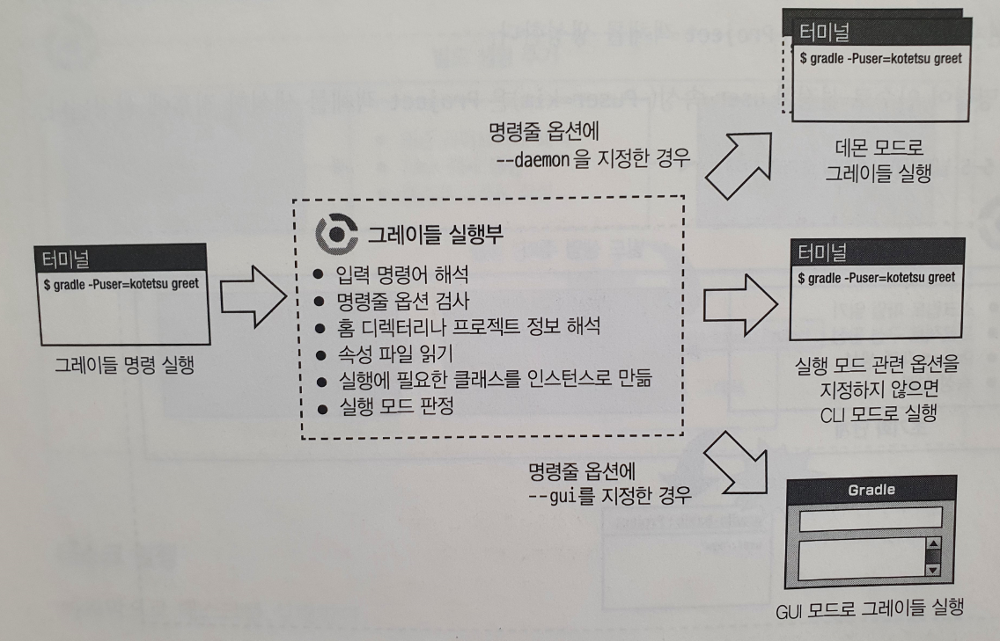
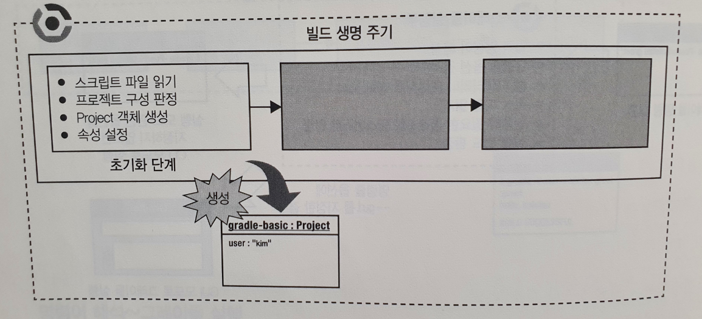
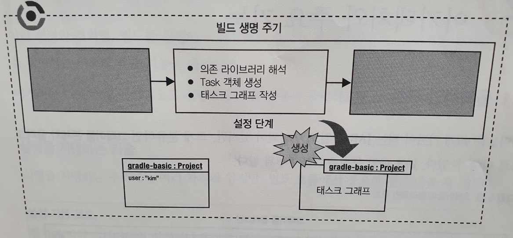
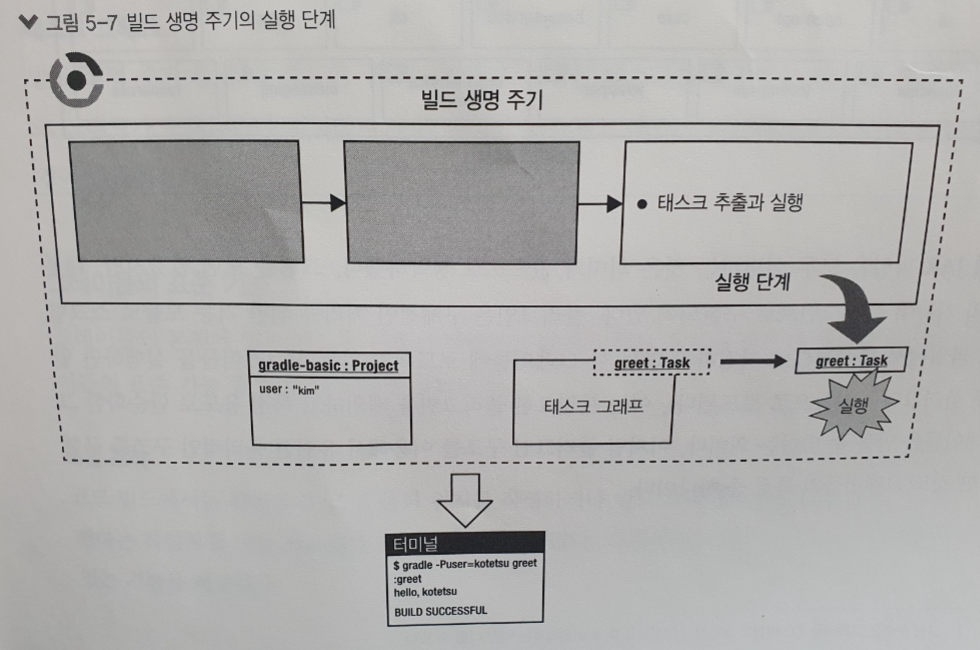
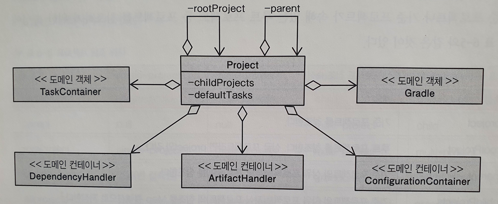

# 그레이들

## 빌드 툴(Build Tool)
 - 개발에서의 정형화된 작업을 자동화하기 위한 소프트웨어
 - 빌드 순서를 '빌드 스크립트'로 작성해서 실행한다

### 빌드툴 발전과정

 1. 메이크 : 빌드 개념을 확립하였다
 2. 앤트 : 범용성을 높였다(= 크로스 플랫폼 대응)
 3. 메이븐 : 빌드 스크립트 작성 효율을 높였다(= 규칙 기반)
 4. 그레이들 : 유연성을 높였다(= 스크립트 언어로 회귀)

## 그레이들의 장점
 1. 빌드 스크립트 생산성이 높다
    - 규칙 기반 빌드 접근법을 사용하여 규칙을 따라 프로젝트 구조를 만들면 빌드 스크립트 내용을 크게 줄일 수 있다
    - JVM 언어인 그루비를 사용하여 그루비의 여러 기능과 DSL을 제공한다

 2. 빌드 순서를 제어하기 쉽다
    - 태스크 의존관계에 따라 빌드 순서가 정해진다
    - 플러그인을 사용해서 기본적인 태스크 의존관계를 구성할 수 있다
    - 변경 가능한 기본 빌드 순서를 제공한다(앤트와 메이븐의 중간에 해당하는 접근법)

 3. 멀티 프로젝트에 대응한다
    - 멀티 프로젝트에 있는 서브 프로젝트를 정의하는 기능
    - 서브 프로젝트에 공통 빌드 스크립트를 집약하는 기능
    - 서브 프로젝트 간 의존관계를 정의하는 기능
    - 의존관계를 고려해서 변경 내역만 빌드하는 기능

 4. 컴포넌트로 만들기 쉽다
    - 빌드 스크립트에서 메서드나 클래스 추출
    - 빌드 스크립트의 분할과 재사용(apply from 이용)
    - 프로젝트에서만 사용할 수 있는 확장 모듈(buildSrc 프로젝트)
    - 여러 프로젝트에서 범용적으로 재사용할 수 있는 라이브러리

 5. 별도로 설치할 필요가 없다
    - 그레이들 래퍼(Gradle Wrapper) 구조 제공
    - 그레이들 래퍼는 프로젝트 안에 그레이들의 부트스트랩을 심어서 지정한 버전의 그레이들을 자동으로 설치해주는 기능이다
    - gradlew 명령을 실행하면 그레이들의 바이너리가 다운로드되면서 빌드가 실행된다

 6. 호환성을 최대한 배려한다
    - 기존 기능을 갑자기 사용할 수 없게 되는 변경은 하지 않는다
    - 기능을 제거해야 한다면 장래에 폐지될 가능성이 있음을 명시하고 단계적으로 제거한다
    - 신기능은 피드백을 충분히 받아서 안정화한 후에 추가한다
    - 단계 : 비공개 -> 실험 -> 공개 -> 폐지

## 그레이들의 빌드
 - 소프트웨어 빌드 : 소스 코드 파일을 컴퓨터에서 실행할 수 있는 독립 소프트웨어 가공물로 변환하는 과정 또는 그 결과
 - 빌드툴에서의 빌드 : 빌드 대상에 어떤 액션을 취하는 것(소프트웨어 빌드, 파일 복사, 어플리케이션 실행 등)


 - 초기화 스크립트
    - 빌드 시 가장 먼저 실행되는 그루비 스크립트(init.gradle)
    - 사용자 정보나 실행 환경 같은 초기 설정을 한다
    - Gradle 객체에 위임된다

 - 설정 스크립트
    - 빌드 대상 프로젝트를 설정하는 그루비 스크립트(settings.gradle)
    - 주로 빌드에 포함될 프로젝트를 정의한다
    - 멀티 프로젝트에서는 반드시 필요한 스크립트 파일로, 루트 프로젝트에 배치한다
    - Settings 객체에 위임된다

 - 빌드 스크립트
    - 빌드 정의를 기술하는 그루비 스크립트(build.gradle)
    - 주로 프로젝트 의존관계나 태스크 정의를 한다
    - Project 객체에 위임된다

 - 속성 파일
    - 그레이들이 표준으로 참조하는 속성 파일(gradle.properties)
    - 환경에 따라 값이 달라지는 파라미터를 빌드 스크립트 밖에 기술하고 싶을 때 사용한다

 - 환경 변수 / 명령줄 인수
    - 그레이들이 설치된 장비의 환경 변수와 빌드 실행 시 명령줄에서 전달하는 인수
    - 프로세스에 고유한 환경 값을 전달하거나 실행에 관련된 설정을 한다

 - buildSrc 프로젝트
    - 빌드 시 참조하는 클래스 파일이나 플러그인 코드를 저장하는 프로젝트 디렉터리
    - 여러 개의 빌드 스크립트가 참조하는 클래스 파일이나 자체 플러그인을 저장한다

### 빌드 흐름


#### 명령어 해석 ~ 그레이들 실행
 - 먼저 gradle 명령의 명령줄 인수를 해석해서 명령줄 옵션이 제대로 지정되었는지 확인한다
 - 명령줄 옵션으로 홈 디렉터리 경로와 프로젝트 디렉터리를 해석하고 속성 파일을 읽는다
 - 마지막으로 명령줄 옵션을 기준으로 적절한 실행모드(CLI, 데몬, GUI)를 판정하고, 실행 환경에 맞는 클래스를 선별해서 인스턴스로 만든다


#### 스크립트 파일 초기화
 - 스크립트 파일을 읽거나 그레이들의 실체인 도메인 객체를 생성하는 단계
 - 싱글 프로젝트인지 멀티 프로젝트인지 명확하게 한 다음, 프로젝트를 나타내는 도메인 객체를 생성한다


#### 프로젝트 설정
 - 프로젝트가 참조하는 의존 라이브러리 해석이나 태스크 생성 같은 빌드 실행을 위한 준비 작업을 한다
 - 정의된 태스크를 조사해서 태스크 간 의존관계를 그래프로 만든 '태스크 그래프'를 작성한다
 - 이 과정을 마치면, 빌드에 필요한 태스크가 추출된다


#### 태스크 실행
 - 태스크 그래프에서 실행 대상 태스크를 추출하여 실행한다


## 그레이들 도메인 객체

### Project 객체
 - 빌드 스크립트에서 위임된다
 - 그레이들의 처리 대상이 되는 하나의 영역을 나타내는 도메인 객체
 - 빌드 스크립트의 모든 도메인을 총괄하는 도메인 객체

#### 구조
 - 상위 프로젝트, 루트 프로젝트, 하위 프로젝트 목록을 관리한다
 - 환경 구성, 의존관계, 태스크, 플러그인 등 고유의 도메인이 있는 것들은 각각의 컨테이너로 관리한다
 - 빌드 스크립트에서 동적으로 추가되는 속성도 전용 컨테이너로 관리한다


#### 주요 API
 - project() : 인수에 프로젝트 경로를 지정해서 대상 Project 객체를 가져온다
```gradle
project(':child') {
    description = '자식 프로젝트의 설명을 설정한다'
}
```

 - task() : 태스크를 정의한다
```gradle
task hello {
    doLast {
        println 'Hello Gradle World!'
    }
}
```

 - beforeEvaluate() : 프로젝트 평가를 시작하기 직전에 호출된다
 - afterEvaluate() : 프로젝트 평가가 종료된 시점에 호출된다
```gradle
gradle.allprojects { project ->
    project.beforeEvaluate {
        println project.name + '프로젝트 평가를 시작한다'
    }
    project.afterEvaluate {
        println project.name + '프로젝트 평가를 끝냈다'
    }
}
```

### Task 객체
 - 대상 작업을 가리키는 도메인 객체
 - 빌드 스크립트에 기술된 태스크 정의가 Project 객체를 거쳐 Task 객체에 위임된다

#### 주요 API
 - doFirst() : 태스크 처리를 actions의 선두에 Action 객체로 추가한다
 - doLast() : 태스크 처리를 actions의 마지막에 Action 객체로 추가한다
```gradle
task myTask {
    doFirst {
        println 'First!'
    }
}

myTask.doLast {
    println'Last!'
}
```

### Gradle 객체
 - 초기화 스크립트에서 위임된다
 - 실행 환경인 그레이들을 나타내는 도메인 객체
 - Project 객체나 Settings 객체가 속성으로 저장되어 있으며, 모든 스크립트 파일에서 접근할 수 있다

#### 주요 API
 - Gradle 객체는 빌드 실행을 담당하므로 빌드 실행 단계에 특정 처리를 할 수 있는 API가 있다
 - addListener() : 이벤트 리스너를 추가한다
```gradle
class MyTaskActionListener implements TaskActionListener {
    void beforeActions(Task task) {
        println '-- ' + task.name + '태스크 액션 실행 전 --'
    }
    void afterActions(Task task) {
        println '-- ' + task.name + '태스크 액션 실행 후 --'
    }
}

gradle.addListener(new MyTaskActionListener())
```
 - 빌드 실행 시에 호출되는 콜백 API
```gradle
settingsEvaluated {
    println '1. settingsEvaluated'
}

projectsLoaded {
    println '2. projectsLoaded'
}

beforeProject {
    println '3. beforeProject'
}

afterProject {
    println '4. afterProject'    
}

projectsEvaluated {
    println '5. projectsEvaluated'
}

buildFinished {
    println '6. buildFinished'    
}
```

### Settings 객체
 - 설정 스크립트에서 위임된다
 - 멀티 프로젝트에 속한 프로젝트를 정의한다

#### 주요 API
 - findProject() : 지정한 디렉터리 또는 파일 경로에 일치하는 Project 객체를 반환한다(없으면 null 반환)
 - project() : 지정한 디렉터리 또는 파일 경로에 일치하는 Project 객체를 반환한다(없으면 예외 발생)
 - include() : 계층형 멀티 프로젝트에 프로젝트를 추가한다
 - includeFlat() : 단층형 멀티 프로젝트에 프로젝트를 추가한다
```gradle
findProject 'child'
find 'child:grandchild'
include 'child'
includeFlat 'child:grandchild'
```

### ExtensionAware 객체
 - 빌드 실행 시에 다른 객체를 이용해서 그레이들 도메인 객체를 확장해주는 객체
 - 확장 속성을 저장하기 위한 extenstions라는 컨테이너가 있다
 - create() : 추가할 속성과 타입을 지정한다(클래스 생성자 인수도 지정할 수 있다)
```gradle
class MutableObject {
	private String property

	String getProperty() { return property; }

	void setProperty(String property) {
	    this.property = property
	}
}

project.extensions.create('mutable', MutableObject) // 속성, 타입
project.mutable.property = 'MutableObject이다'

task showMutableObject << {
    println project.mutable.property
}


class ImmutableObject {
	private String property

	ImmutableObject(String property) {
	    this.property = property
	}

	String getProperty() { return property; }
}

extensions.create('imutable', ImmutableObject, 'ImmutableObject이다') // 속성, 타입, 클래스 생성자 인수

task showImmutableObject << {
	println imutable.property
}
```

### ExtraPropertiesExtenstion 객체
 - Project 객체나 Task 객체에서 ext로 정의된 확장 속성의 실제 클래스
 - 키-값 형태로 임의의 객체를 저장한다
 - has(), set(), get()으로 properties에 지정한 키의 유무를 확인하거나 특정한 키의 값을 변경하거나 가져올 수 있다
```gradle
project.ext.set('property', 'ext에 추가한 속성이다.')

if(project.ext.has('property')) {
    println '확장 속성의 값: ' + project.ext.get('property')
}

// Groovy 속성 참조
project.ext.property = 'ext에 추가한 속성이다.。'
println '확장 속성의 값: ' + project.property

// Map 리터럴 형식
project.ext['property'] = 'ext에 추가한 속성이다.'
println '확장 속성의 값: ' + project.ext['property']

// 클로저를 사용한 설정
project.ext {
    prop1 = 'aaa'
    prop2 = 'bbb'
}
println project.ext.prop1 + project.ext.prop2
```

## 의존관계 관리
 - 의존관계 : '빌드 밖에서 작성된 결과물'을 참조하는 것
 - 환경구성 : 의존 관계를 분류하는 그룹

### 의존관계 해결 자동화
 - 설정을 작성해두면 임의의 위치에서 필요한 파일을 내려받거나 복사해서 프로젝트에 추가한다
```gradle
configurations { // 환경구성 정의
  conf1
  testConf1.extendsFrom conf1 // testConf1은 conf의 의존 관계도 포함한다(상속)
}

repositories {
  mavenCentral() // 메이븐 중앙 저장소
  mavenLocal() // 메이븐 로컬 저장소
  jcenter() // JCenter 메이븐 저장소
  ivy { // Ivy 저장소
    url "http://example.com/ivy-repo"
    layout "maven" ("gradle", "pattern")
  }
  flatDir { // 단순 디렉터리 저장소
        dirs "libs", "doc-repo"
  }
}

dependencies {
  conf1 'org.slf4j:slf4j-api:1.7.+' // 외부 모듈 의존관계
  conf1 files("libs/sample-lib.jar") // 파일 의존관계(특정 파일)
  conf1 fileTree(dir: "libs", include: "**/*.jar") // 파일 의존관계(디렉터리)
  conf1 project(':shared') // 프로젝트 의존관계
  conf1 gradleApi() // 그레이들 API 의존관계
  conf1 localGroovy() // 로컬 그루비 의존관계
}

task showDeps << {
  configurations.conf1.each {
    println it.absolutePath
  }
}
```

### 전이적 의존관계 관리
 - 필요한 외부 파일이 추가로 다른 외부 파일을 필요로 하는지를 파악하거나 관리할 수 있다
 - 전이적 의존관계를 관리할 때 발생하는 문제가 '의존관계 버전 경합'이다

#### 경합 해결
 - Newest 전략 : 버전 경합이 발생하면 가장 최신 버전의 의존관계를 사용한다
 - Fail 전략 : 버전 경합이 발생하면 예외를 발행해서 빌드 실패를 유도한다(환경구성마다 resolutionStrategy 블록을 설정해야 한다)
```gradle
configurations.testConf1 { //
  resolutionStrategy {
    failOnVersionConflict()  // Fail 전략 채택
  }
}
```

#### 전이적 의존관계 제외
 - exclude() : module, group 단위로 의존관계를 제외한다
```gradle
configurations.testConf1 {
  resolutionStrategy {
    failOnVersionConflict()  // Fail 전략 도입
  }
}

dependencies {
  conf1 group: 'org.codehaus.groovy', name: 'groovy-all', version: '2.3.1'
  testConf1(group: 'org.spockframework', name: 'spock-core', version: '0.7-groovy-2.0') {
    exclude module: 'groovy-all' // groovy-all은 무시한다
  }
}
```

#### 사용할 버전 강제 지정
 - force() : resolutionStrategy 블록에서 버전을 강제로 지정한다
 - force : 해당 의존관계를 '강제 버전'으로 표시한다
```gradle
configurations.testConf1 {
  resolutionStrategy {
    failOnVersionConflict()  // Fail 전략 도입
    force 'org.hamcrest:hamcrest-core:1.3' // testConf1에서 Hamcrest가 요구되면 반드시 버전 1.3을 사용한다
  }
}

dependencies {
  conf1(group: 'org.codehaus.groovy', name: 'groovy-all', version: '2.3.1') {
    force = true // 버전이 경합하면 반드시 해당 의존 관계를 사용한다
  }
  testConf1(group: 'org.spockframework', name: 'spock-core', version: '0.7-groovy-2.0')
}
```

#### 클라이언트 모듈 의존관계
 - 보통 외부 저장소에 있는 메타 데이터(POM)를 사용하여 전이적 의존관계를 해결한다
 - 그레이들에서는 빌드 스크립트를 작성해서 해결할 수 있다
 - 빌드 스크립트에 정의된 모듈과 그 의존관계를 '클라이언트 모듈', '클라이언트 모듈 의존관계'라고 한다
 ```gradle
 dependencies {
  conf1 group: 'org.codehaus.groovy', name: 'groovy-all', version: '2.3.1'
  testConf1 module('org.spockframework:spock-core:0.7-groovy-2.0') { // 클라이언트 모듈 설정
    dependency 'org.codehaus.groovy:groovy-all:2.3.1'
    dependency 'org.hamcrest:hamcrest-core:1.3'
    module(group: 'junit', name: 'junit-dep', version: '4.10') {
      dependency  group: 'org.hamcrest', name: 'hamcrest-core', version: '1.3'
    }
  }
}
```

### 의존관계 표시
 - 프로젝트가 특정 외부 파일의 어떤 버전에 의존하는 지를 간단하게 표시할 수 있다
```gradle
gradle dependencies // 의존관계의 계층을 표시한다
```
