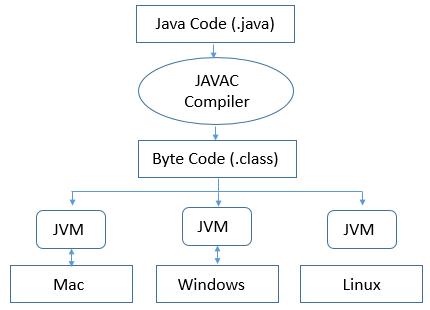
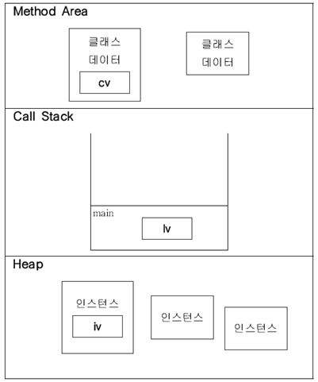
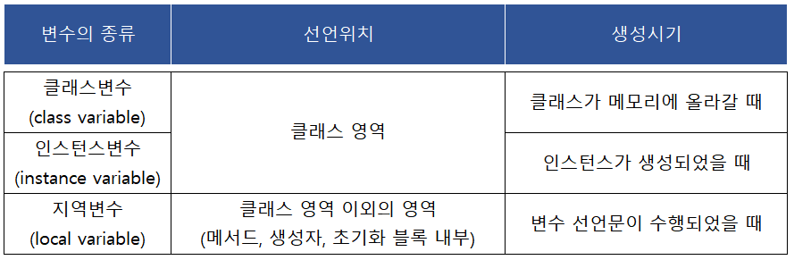

# 자바

## 자바의 특징
 1. 운영체제에 독립적이다
    - 자바 응용 프로그램은 JVM하고만 통신하며, 명령을 JVM이 해당 운영체제가 이해할 수 있도록 변환한다

 2. 객체지향언어이다
    - 객체지향개념의 특징(캡슐화, 추상화, 상속, 다형성)이 잘 적용되어있다

 3. 비교적 배우기 쉽다
    - C++과 스몰톡의 장점은 취하면서 복잡하고 불필요한 부분을 제거하여 단순화하였다

 4. 자동 메모리 관리(Garbage Collection)
    - 가비지컬렉터가 프로그래머가 사용하지 않는 메모리를 체크하고 반환한다

 5. 네트워크와 분산처리를 지원한다
    - 다양한 네트워크 프로그래밍 라이브러리를 제공한다

 6. 멀티쓰레드를 지원한다
    - 시스템과 관계없이 멀티쓰레드를 구현할 수 있으며, 관련된 라이브러리를 제공한다

 7. 동적 로딩을 지원한다
    - 실행 시에 모든 클래스가 로딩되지 않고 필요한 시점에(동적) 클래스를 로딩하여 사용한다

## JVM(Java Virtual Machine)

 - 자바를 실행하기 위한 가상 기계(컴퓨터)
 - 자바 어플리케이션은 JVM에서만 실행된다
 - 자바 컴파일러가 자바 파일을 클래스 파일(바이트코드)로 변환하고 JVM이 해당 운영체제에 맞는 기계어로 변환한다
 - JVM은 인터프리터 방식을 사용하기 때문에 속도가 느리다는 단점이 있지만,
 바이트코드를 기계어로 바로 변환해주는 JIT 컴파일러와 향상된 최적화 기술로 속도의 격차를 많이 줄였다.

### JVM의 메모리 구조

 1. 메서드 영역(Method Area)
    - 프로그램 실행 중 어떤 클래스가 사용되면, JVM은 해당 클래스의 클래스파일을 읽어서 분석하여 클래스에 대한 정보(클래스 데이터)를 이곳에 저장한다
    - 클래스변수도 이 영역에 함께 생성된다

 2. 힙(Heap)
    - 인스턴스가 생성되는 공간
    - 프로그램 실행 중 생성되는 인스턴스는 모두 이곳에 생성된다
    - 인스턴스변수들이 생성되는 공간이다

 3. 호출스택(Call Stack)
    - 메서드가 호출되면, 호출스택에 호출된 메서드를 위한 메모리가 할당된다(스택의 제일 위에 쌓인다)
    - 메서드가 작업을 수행하는 동안 지역변수들과 연산의 중간결과 등을 저장하는데 사용된다
    - 메서드가 작업을 마치면 메모리 공간을 반납한다(스택에서 제거된다)

## JDK(Java Development Kit)
 - 자바 개발도구
 - JRE + 개발에 필요한 실행파일
    - javac.exe : 자바 컴파일러, 자바소스코드를 바이트코드롤 컴파일한다
    - java.exe : 자바 인터프리터, 컴파일러가 생성한 바이트코드를 해석하고 실행한다
    - jar.exe :  압축 프로그램, 클래스 파일과 프로그램의 실행에 관련된 파일을 하나의 jar파일로 압축하거나 압축해제한다

### JRE(Java Runtime Environment)
 - 자바실행환경
 - 자바 응용 프로그램이 실행되기 위한 최소 환경
 - JVM + 클래스 라이브러리(Java API)

## 변수(Variable)
 - 단 하나의 값을 저장할 수 있는 메모리 공간

### 변수의 타입
 1. 기본형
    - 실제 값(data)을 저장한다
    - 논리형(boolean), 문자형(char), 정수형(byte, short, int, long), 실수형(float, double)
        - boolean : 1 byte (true, false)
        - char : 2 byte (unicode)
        - byte : 1 byte
        - short : 2 byte
        - int : 4 byte
        - long : 8 byte
        - float : 4 byte
        - double : 8 byte

 2. 참조형
    - 어떤 값이 저장되어 있는 주소(memory address)를 저장한다
    - 객체의 주소, 8개의 기본형을 제외한 나머지 타입

### 문자 인코딩 & 디코딩
 - 인코딩 : 문자를 코드로 변환하는 것('A' -> 65)
 - 디코딩 : 코드를 문자로 변환하는 것(65 -> 'A')

#### 아스키코드(Ascii Code)
 - 정보교환을 위한 미국 표준 코드
 - 128개의 문자 집합을 제공하는 7 bit 부호

#### 유니코드(Unicode)
 - 전 세계의 모든 문자를 하나의 통일된 문자 집합으로 표현한 코드표
 - 2 byte로 65536개의 문자를 표현할 수 있다
 - UTF : 유니코드를 컴퓨터에 저장하는 방식(인코딩)
    - UTF-8 : 하나의 문자를 1 ~ 4 byte의 가변크기로 표현한다(영어, 숫자 : 1 byte, 한글 : 3 byte)
    - UTF-16 : 모든 문자를 2 byte의 고정크기로 표현한다(자바는 UTF-16을 사용)

### 변수의 종류

 1. 인스턴스변수
    - 클래스의 인스턴스를 생성할 때 만들어진다
    - 인스턴스는 독립적인 저장공간을 가지므로 인스턴스마다 다른 값을 가질 수 있다

 2. 클래스변수
    - 인스턴스변수 앞에 static을 붙이면 된다
    - 모든 인스턴스가 공통된 저장공간(변수)을 공유하게 된다

 3. 지역변수
    - 블럭 내에 선언되어 블럭 내에서만 사용할 수 있다
    - 블럭을 벗어나면 소멸되어 사용할 수 없다

### 변수의 초기화
 1. 명시적 초기화
 2. 생성자
 3. 초기화 블럭
```java
public class Card {
    static int count;
    private int card_number;
    private int point = 0; //  명시적 초기화
    private String owner;

    static { // 클래스 초기화 블럭
        count = 1;
    }

    { // 인스턴스 초기화 블럭
        card_number = count++;
    }

    Card(String owner) { // 생성자
        this.owner = owner;
    }
}
```

#### 초기화 시점 및 순서
 - 클래스변수
    - 시점 : 클래스가 처음 로딩될 때 한번 초기화된다
    - 순서 : 기본값 -> 명시적초기화 -> 클래스 초기화 블럭

 - 인스턴스변수
    - 시점 : 인스턴스가 생성될 때마다 초기화된다
    - 순서 : 기본값 -> 명시적초기화 -> 인스턴스 초기화 블럭 -> 생성자

## 메서드
 - 특정 작업을 수행하는 일련의 문장들을 하나로 묶은 것

### 메서드를 사용하는 이유
 1. 높은 재사용성
 2. 중복된 코드의 제거
 3. 프로그램의 구조화

### 메서드의 구조
 - 선언부 + 구현부
 - 선언부 : 반환타입 + 메서드 이름 + 매개변수
 - 구현부 : 지역변수 + 반환문
```java
public int add(int a, int b) {
    return a + b;
}
```

### 클래스 메서드와 인스턴스 메서드
 1. 클래스를 설계할 때, 멤버변수 중 모든 인스턴스에 공통으로 사용하는 것에 static을 붙인다
 2. 클래스변수는 인스턴스를 생성하지 않아도 사용할 수 있다
 3. 클래스 메서드는 인스턴스변수를 사용할 수 없다
 4. 메서드 내에서 인스턴스변수나 인스턴스 메서드를 사용하지 않는다면, static을 붙이는 것을 고려한다

### 생성자
 - 인스턴스가 생성될 때 호출되는 '인스턴스 초기화 메서드'
 - 생성자의 이름은 클래스의 이름과 같아야 한다
 - 생성자는 반환값이 없다
 - 연산자 new에 의해 생성자가 호출되고, new의 결과로 인스턴스의 주소가 반환된다
```java
Card c = new Card(1001); // 생성자 호출

public class Card {
    static int count; // 클래스변수
    private int card_number; // 멤버변수

    Card() { // 생성자
        this(1001);
    }

    Card(int card_number) { // 생성자
        count++;
        this.card_number = card_number;
    }
}
```

## 추상클래스
 - 하나 이상의 abstract 메서드를 포함하는 클래스
 - abstract 메서드는 선언만 있고 구현부가 없는 함수이다
 - 추상클래스는 인스턴스화할 수 없다
```java
abstract class Animal {
    private String name;

    Animal(String name) {
        this.name = name;
    }

    abstract void move();
    abstract void howl();
}

class Dog extends Animal {
    Dog(String name) {
        super(name);
    }

    @Override
    public void move() {
        System.out.println("팔짝 팔짝");
    }

    @Override
    void howl() {
        System.out.println("멍멍");
    }
}

class Cat extends Animal {
    Cat(String name) {
        super(name);
    }

    @Override
    public void move() {
        System.out.println("살금 살금");
    }

    @Override
    void howl() {
        System.out.println("냐옹");
    }
}
```

## 인터페이스
 - 일종의 추상클래스이지만 추상클래스와 달리 일반 메서드와 멤버변수를 가질 수 없다
 - 추상메서드와 상수만을 멤버로 가질 수 있다
 - 모든 멤버변수는 public static final이어야 하며, 이를 생략할 수 있다
 - 모든 메서드는 public abstract이어야 하며, 이를 생략할 수 있다
 - 메서드의 반환타입이 인터페이스이라는 것은 메서드가 해당 인터페이스를 구현한 클래스의 인스턴스를 반환한다는 의미이다
```java
interface PlayingCard {
    public static final int SPADE = 4;
    final int DIAMOND = 3;
    static int HEART = 2;
    int CLOVER = 1;

    public abstract int getCardNumber();
    String getCardKind();
}
```

### 인터페이스의 장점
 1. 개발시간을 단축시킬 수 있다
    - 메서드를 호출하는 쪽에서 메서드의 구현과 관계없이 선언부만 알면 된다

 2. 표준화가 가능하다
    - 프로젝트의 기본 틀을 인터페이스로 작성한 다음, 개발자들에게 인터페이스를 구현하게 하면 일관되고 정형화된 프로그램 개발이 가능하다

 3. 서로 관계없는 클래스들에게 관계를 맺어줄 수 있다
    - 서로 아무런 관계없는 클래스들을 하나의 인터페이스를 공통적으로 구현하도록 하여 관계를 맺을 수 있다

 4. 독립적인 프로그래밍이 가능하다
    - 클래스의 선언과 구현을 분리시킬 수 있기 때문에 실제 구현에 독립적인 프로그램을 작성하는 것이 가능하다
    - 인터페이스를 구현한 클래스의 변경이 관련된 다른 클래스에 영향을 주지 않는다

## 내부 클래스
 - 클래스 내에 선언된 클래스
 - 내부 클래스에서 외부 클래스의 멤버들을 쉽게 접근할 수 있다
 - 코드의 복잡성을 줄일 수 있다(캡슐화)

### 내부 클래스의 종류와 특징
 1. 인스턴스 클래스
    - 외부 클래스의 멤버변수 선언위치에 선언한다
    - 인스턴스 멤버처럼 사용되며, 외부 클래스의 인스턴스 멤버들과 관련된 작업에 사용된다

 2. 스태틱 클래스
    - 외부 클래스의 멤버변수 선언위치에 선언한다
    - 클래스 멤버처럼 사용되며, 외부 클래스의 클래스 멤버들과 관련된 작업에 사용된다

 3. 지역 클래스
    - 외부 클래스의 메서드나 초기화블럭 안에 선언한다
    - 선언된 블럭 안에서만 사용된다

 4. 익명 클래스
    - 클래스의 선언과 객체의 생성을 동시에 하는 이름 없는 클래스(일회용)

## 객체지향 프로그래밍(Object-Oriented Programming)
 - 실제 세계를 모델링하여 기능(메소드)과 속성(멤버변수)을 가진 객체를 만들고, 객체들간의 상호작용을 통해 로직을 구성하는 프로그래밍 방법

### 장점
 1. 코드의 재사용성이 높다
    - 기존의 클래스를 가져오거나(import) 상속을 통해 확장하여 사용할 수 있다

 2. 유지보수가 용이하다
    - 코드 수정이나 추가 시 해당되는 클래스의 멤버변수, 메소드만 수정하면 된다

 3. 대형 프로젝트에 적합하다
    - 클래스 단위로 캡슐화(모듈화)가 가능하기에 여러 명이 개발 업무를 분담하기 쉽다

### 단점
 1. 실행속도가 상대적으로 느리다(vs 절차지향)
 2. 설계시 많은 시간과 노력이 필요하다
 3. 객체가 많으면 메모리 소모가 커질 수 있다

### 클래스와 인스턴스
 - 클래스 : 객체를 정의한 것(객체의 설계도)
 - 인스턴스 : 클래스의 정의된 내용대로 메모리에 할당된 것(객체의 실체화)

### 추상화
 - 객체의 공통적인 속성과 기능을 추출하여 정의한다

### 캡슐화
 - 기능과 속성을 하나의 캡슐(클래스)로 만든다
 - 접근제어자를 사용하여 외부로부터 데이터와 구조를 숨긴다  


### 상속
 - 기존의 클래스를 재사용하여(상속) 새로운 클래스로 확장한다
 - 부모클래스의 속성과 기능을 그대로 사용할 수 있고, 기능의 수정이 필요한 경우 해당 기능을 재정의(overriding)한다
 - 생성자와 초기화 블럭은 상속되지 않는다

#### 오버라이딩 조건
 1. 이름이 같아야 한다
 2. 매개변수가 같아야 한다
 3. 반환타입이 같아야 한다
 4. 접근제어자는 부모 클래스의 메서드보다 좁은 범위로 변경할 수 없다
 5. 부모 클래스의 메서드보다 많은 수의 예외를 선언할 수 없다

```java
class Card {
    static int count = 1;
    private int card_number;
    String owner;

    Card(String owner) {
        card_number = count++;
        this.owner = owner;
    }

    public void pay(int price) {
        System.out.println(price + "원 결제하셨습니다");
    }
}

class MasterCard extends Card {
    private double discount_rate;
    private int point;

    MasterCard(double discount_rate, String owner) {
        super(owner);
        this.point = 0;
        this.discount_rate = discount_rate;
    }

    @Override
    public void pay(int price) {
        int discount_price = (int) (price * (1 - discount_rate));
        System.out.println(discount_price + "원 결제하셨습니다");
    }
}
```
### 다형성
 - 하나의 기능이나 객체가 다른 여러 기능이나 객체로 사용될 수 있다
 - overriding : 상속 받은 메소드를 재정의하는 것(인터페이스의 메소드를 구현하는 것)
 - overloading : 메소드의 이름이 같지만 파라미터의 타입과 개수가 다른 메소드를 여러 개 정의하는 것

#### 참조변수 형변환
 - 참조변수의 타입을 변환하는 것이지 인스턴스를 변환하는 것이 아니다
 - 형변환을 통해서 참조하고 있는 인스턴스에서 사용할 수 있는 멤버의 범위(개수)를 조절한다

#### 참조변수와 인스턴스의 연결
 - 멤버변수의 경우, 참조변수의 타입에 따라 달라진다
 - 즉, 멤버변수가 부모 클래스와 자식 클래스에 중복으로 정의된 경우,
 부모타입의 참조변수를 사용했을 때는 부모 클래스에 선언된 멤버변수가 사용되고
 자식타입의 참조변수를 사용했을 때는 자식 클래스에 선언된 멤버변수가 사용된다

```java
interface Workable {
    void doWork();
}

class Teacher implements Workable {
    @Override
    void doWork() {
        System.out.println("학생들을 가르치고 있습니다");
    }

    void go() {
        System.out.println("등교하고 있습니다");
    }
}

class Driver implements Workable {
    @Override
    void doWork() {
        System.out.println("운전하고 있습니다");
    }

    void ride() {
        System.out.println("차에 탑승하고 있습니다");
    }
}

class Test {
    public static void main(String[] args) {
        Workable w1 = new Teacher();
        Workable w2 = new Driver();

        work(w1);
        work(w2);
    }

    public static void work(Workable worker) {
        if(worker instanceof Teacher) {
            Teacher teacher = (Teacher) worker;
            teacher.doWork();
            teacher.go();
        } else if(worker instanceof Driver) {
            Driver driver = (Driver) worker;
            driver.doWork();
            driver.ride();
        }
    }
}

```

### 데이터 저장형태 발전과정
 - 변수 -> 배열 -> 구조체 -> 클래스
    1. 변수 : 하나의 데이터를 저장할 수 있는 공간
    2. 배열 : 같은 종류(타입)의 여러 데이터를 하나의 집합으로 저장할 수 있는 공간
    3. 구조체 : 서로 관련된 여러 데이터를 종류(타입)에 관계없이 하나의 집합으로 저장할 수 있는 공간
    4. 클래스 : 데이터와 함수의 결합(구조체 + 함수)

## 예외처리
 - 프로그램 실행 시 발생할 수 있는 예외의 발생에 대비한 코드를 작성하여 프로그램의 비정상 종료를 막고, 정상적인 실행상태를 유지하는 것
 - 발생한 예외를 처리하지 못하면, 프로그램은 비정상적으로 종료되며 JVM의 예외처리기가 예외의 원인을 화면에 출력한다

### 프로그램 오류

 - 오류 : 프로그램이 실행 중 오작동을 하거나 비정상적으로 종료되게 하는 원인
    - 컴파일 오류 : 컴파일 시에 발생하는 오류
    - 런타임 오류 : 실행 시에 발생하는 오류
        - 에러(error) : 프로그램 코드에 의해서 수습될 수 없는 심각한 오류
        - 예외(exception) : 프로그램 코드에 의해서 수습될 수 있는 다소 미약한 오류
            - Checked Exception : 사용자의 실수와 같은 외적인 요인에 의해 발생하는 예외(반드시 예외처리를 해야 한다)  
            ex) FileNotFoundException, ClassNotFoundException, DataFormat Exception 등
            - Unchecked Exception : 프로그래머의 실수로 발생하는 예외(예외처리를 강제하지 않는다)  
            ex) IndexOutOfBoundsException, NullPointerException, ClassCastException, ArithmeticException 등
    - 논리적 오류 : 실행은 되지만, 의도와 다르게 동작하는 것

### try-catch
```java
try {
    // 예외가 발생할 가능성이 있는 코드를 작성한다
    System.out.println(3);
    System.out.println(0/0); // ArithmeticException 인스턴스 생성
    System.out.println(4); // 실행되지 않는다
} catch(ArithmeticException e) { // 인스턴스 instanceof ArithmeticException -> true 이면 실행
    // ArithmeticException릏 처리하는 코드를 작성한다
    e.printStackTrace(); // 예외발생 당시의 호출스택에 있었던 메서드의 정보와 예외 메시지를 화면에 출력한다
} catch(Exception e) {
    // ArithmeticException을 제외한 모든 Exception을 처리하는 코드를 작성한다
    System.out.println("예외 메시지 : " + e.getMessage()); // 발생한 예외 클래스의 저장된 메시지를 출력한다
}
```
 - try 블럭 내에서 예외가 발생한 경우
    - 발생한 예외에 해당하는 예외 클래스의 인스턴스가 만들어진다
    - 발생한 예외와 일치하는 catch 블럭이 있는지 확인한다
        - 첫 번째 catch 블럭부터 차례로 내려간다
        - catch 블럭의 매개변수의 타입과 생성된 예외 클래스의 인스턴스에 instanceof 연산자를 이용해서 검사한다  
    - 일치하는 catch 블럭을 찾게 되면(검사결과 true), 블럭 내의 코드를 실행하고 try-catch문을 빠져나가서 다음 코드를 실행한다
    - 일치하는 catch 블럭을 찾지 못하면(모든 검사결과 false), 예외는 처리되지 못하고 비정상적으로 종료된다

 - try 블럭 내에서 예외가 발생하지 않은 경우
    - try-catch문을 빠져나가서 다음 코드를 실행한다

### throw
 - throw를 이용하여 프로그래머가 고의로 예외를 발생시킬 수 있다
```java
Exception e = new Exception("고의로 예외 발생시킴");
throw e;
```

### throws
 - 메서드의 선언부에 throws를 사용해서 메서드 내에서 발생할 수 있는 예외를 선언한다
 - 예외를 메서드의 throws에 선언하는 것은 예외를 처리하는 것이 아니라, 자신을 호출한 메서드에게 예외를 전달하여 예외처리를 떠맡기는 것이다
 - 이런 식으로 호출스택에 있는 메서드들을 따라 전달되다가 main 메서드에서도 예외가 처리되지 않으면 프로그램이 전체가 종료된다
``` java
public static void main(String[] args) throws Exception {
    method1();
}

static void method1() throws Exception {
    method2();
}

static void method2() throws Exception {
    throw new Exception();
}
```

### finally
 - 예외의 발생여부에 상관없이 실행되어야할 코드를 포함한다
```java
try {
    // 예외가 발생할 가능성이 있는 코드를 작성한다
} catch(Exception e) {
    // 예외처리를 위한 코드를 작성한다
} finally {
    // 예외의 발생여부에 관계없이 항상 수행되어야하는 코드를 작성한다
}
```

### try-with-resources
 - 주로 입출력에 사용되는 클래스 중에서는 사용한 후에 꼭 닫아줘야하는 것들이 있다(사용했던 자원을 반납하기 위해서)
 - 괄호 안에 AutoCloseable를 구현한 객체를 생성하는 문장을 넣으면, try 블럭을 벗어나는 순간 자동적으로 close()가 호출된다
```java
try(CloseableResource cr = new CloseableResource()) {
    cr.work();
} catch(Exception e) {
    e.printStackTrace();
}

class CloseableResource implements AutoCloseable {
    public void work() {
        System.out.println("work() 호출됨");
    }

    @Override
    public void close() throws Exception {
        System.out.println("close() 호출됨");
    }
}
```
